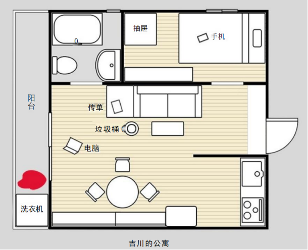
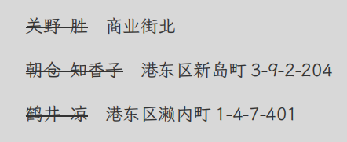
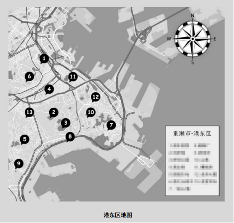
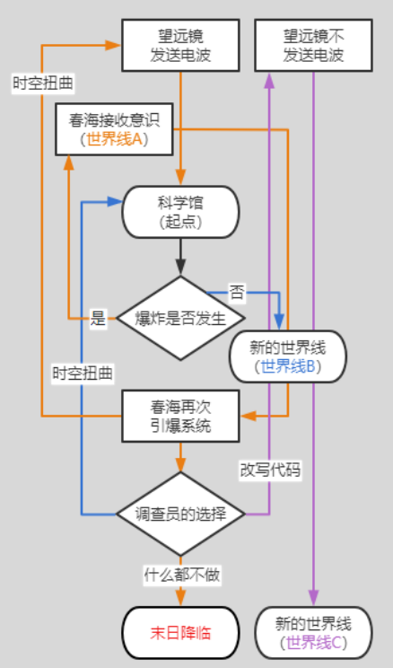
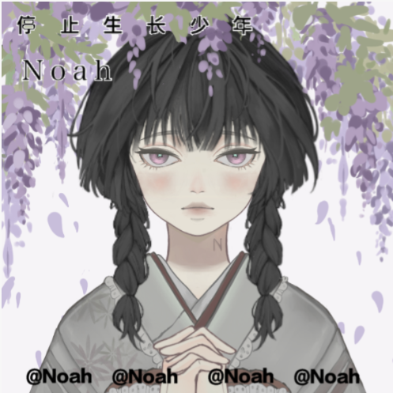

# 乌洛波洛斯的末日巡演

守秘人：酥皮　|　调查员：宇见一角（HO3，文月）、伊藤月（HO1）、望月冥（HO2）　|　舞台：重濑市港东区，2012 年冬

**体例**：正文为戏内叙事与对白；`反引号` 为检定记录；`> ` 为保留的场外批注；`::: 文件` 为戏内出现的文件与结局卡；`【全员】【宇见线】【密谈】` 标出场景与在场人物。

**来源**：主群、「ho3日落」小群（宇见线）、「星日聚聚」（密谈）三份 QQ 导出，按时间合并。

---

## 第一幕 · HO3开场 · 日落　二月九日

【宇见线】

**酥皮**
今天是2012年12月14日（星期五），宇见一角，近期发生的事件太多了，你忙碌于各种信息的查找和搜集，难得有了短暂的闲暇时间。但你并闲不下来，你沉默地打开了近几年来很受欢迎的「重濑ANTEN」论坛，开始反复播放那个你已经看了不知道多少次的视频。

寒风凛冽，夹杂着海水特有的腥气穿过街道，融化在熙熙攘攘的人群间。港东区夜晚的商业街热闹非凡，才刚进入 12 月，店铺就已经准备好迎来圣诞，整座商业街沉浸在流光溢彩之中。

“喂，你站住。”在这人来人往的街头，一名拿着手机的年轻男性忽然被叫住。他回头看去，按住他肩膀的是一名染着茶色头发、身上戴满装饰的小混混，虽然男人也不过只是大学生的年龄，但小混混看起来才不过高中。“刚才你手机界面上出现的那个标志……你这家伙是「SDW」吧？！”小混混咄咄逼人地问道。

男人沉默着，似乎不打算否认也不打算回答，只是甩开小混混的手想要离开。
“哈？你这是什么意思，看不起人吗？！我们「银岚」最近可是一直受到你们的照顾啊……给我揍他！要从他嘴里问出「SDW」那帮家伙的信息！”小混混一挥手，旁边另外几个像是小混混模样的人也围了上来，男人紧张地退后了一步，闹市街头似乎即将发生一场冲突，但却没人敢出声阻止——谁都明白，招惹「银岚」不会有什么好下场。

就在暴力一触即发时，几个身影忽然走上前来，挡在了男人和小混混之间……这些人有年轻的学生，也有中年男性，甚至还有女性。从外表看来，他们之间没有任何共通之处，唯一相同的是他们都举着自己的手机，在那上方是一模一样黑底白纹的标志——
“S……D……W……！”小混混们怔在了原地，虽然这些人看上去都只是普通市民，但人数上却是压倒性的优势，他们不敢贸然动手。

就在双方僵持的时候，一声奇怪的低吟打破了沉默的空气。“末日要来临了……没有人能逃得过……”就像机械一般，属于男性的声音中听不出任何感情。
接着——“啪嗒”。什么东西从天桥的围栏边坠落到人群之中，绽放出血红的花朵。人们都因为这突如其来的变故屏住了呼吸，三秒钟后，意识到发生了什么的人群开始骚动，完全忘记了刚才的对峙。

“末日……末日……”仿佛受到这诡异氛围的感染，之前拿着手机的男人也忽然低沉地复诵起来，接着猛然扑向眼前的小混混，随着这再次被点燃的导火索，人群打成一团，现场混乱无比。
不知什么人趁机报了警，没过多久，警笛声响起，几名警察匆匆赶到现场，但聚众斗殴的几人早已逃走，只剩下那具血泊中的尸体。

更令人感到毛骨悚然的是，在事件发生的同时，人群后方巨大的广告屏幕上忽然出现了雪花，原本的广告变成了一段古怪的视频。视频的最开始一片漆黑，持续了一会，屏幕中央泛起了漆黑的涟漪，逐渐凝聚成一圈又一圈的旋涡。仿佛磁带失真倒放的尖锐摩擦音毫无规律地响起，旋涡像是要从屏幕中凸出，插入观看者的双眼，又猛地凹陷下去，仿佛将观看者的大脑也吸入、捣碎、抛入无尽的漆黑深渊，化作深渊中遍布着的五彩斑斓的碎块。

之后，在接下来的几天内，这种怪异的癔症便开始迅速扩散，人们将其称之为“末日病”。关于末日病的成因众说纷纭，然而它毫无疑问地让港东区被卷入了混乱之中。

你观看了这段奇怪的视频，需要进行sc0/1

`宇见一角　理智检定　12/70　极难成功`

**宇见一角** SAN62 HP11/11 DEX70
实话说，这段视频让人头皮发麻。但既然是线上的内容，就一定有上传者。既然如此，不如先试试看顺藤摸瓜，看看是谁发布的视频？

**酥皮**
你看到这个视频发布时间大概在一周前，热度在这周一直居高不下。发布者是一个名叫【秀一】的普通用户。

**宇见一角** SAN62 HP11/11 DEX70
不对劲。一角眯眼，翻看评论区混乱的评论和发布者的主页。一个普通用户是怎么让视频登上广告巨幕的？开始寻找评论区和主页有无线索。也许可以动用一些手段，查一下发布者的IP地址和个人信息？

**酥皮**
你发现这个视频的发布人只是个普通的网民，一夜爆火带来的巨大流量让他喜形于色，甚至在版面中努力渲染“世界末日就要到来”的气氛。

下方的留言大多都是惶恐的人们不知所谓的感叹，唯一引起你注意的就是有很多人在说这个视频是【诅咒】，据说看过一次视频后就会像受了诅咒一样，就算关掉了窗口或者删掉了文件，设备上也会不知何时忽然开始播放这个视频，看到过 7 次视频的人就会死掉。

但实际上这种说法有没有根据还是未知的，更多人猜测视频只是无聊的人趁世界末日之际放出来引发恐慌的产物。

`宇见一角　计算机使用　62/55　失败`

**酥皮**
那你学艺不精，只能从公开的信息中得知至少这个黑色的奇怪的视频不在原本的播放计划内。

**宇见一角** SAN62 HP11/11 DEX70
宇见从未如此痛恨过自己计算机没好好上……好在公开信息里说明了事件发生的地点。这件事发生在哪里？看看相关的新闻报道和采访有没有相关人员和地点的信息。

如果公开的信息不理想，可能就要去找一些作为“虎鲸”认识的人打听了，尽管宇见暂时还不想这么做。

**酥皮**
你可以轻易地认出这是港东区很有名的商业街，周末和假期的人流量都很大。相关的报道大多集中在对“世界末日”的辟谣上。

**宇见一角** SAN62 HP11/11 DEX70
直接搜索相关信息吧，看看有没有什么“有意思”的人和事

**酥皮**
你一边逛着论坛，一边回忆起自己之所以对这个视频如此关注的原因。这段时间城市内怪异的死亡案似乎开始显著增多，比如猝死、自杀、被卷入事故、无法找到凶手的袭击案与凶杀案等等，但又不像是有什么特别的联系。

每当有类似案件被曝光，网路上都会传闻是最近相当活跃的「SDW」或「虎鲸」所为，因为这两个势力诡秘的行迹总是会和都市传说被联系在一起。

`宇见一角　幸运　8/75　极难成功`

**酥皮**
那么你留意到一篇发表于 11 月份的奇怪帖子，发帖人的 ID是“cazbpavvsfodw”，看起来像一串乱码，没有头像，简直就像是在键盘上随便按出来的东西一样。而帖子内的好几条回复也全都是帖主自己发的，起初是同样一长串乱码般的字母，后面则变成了一些意味不明的数字，唯一能辨认的话语只有发帖人的签名“The key is in the ring”。

`宇见一角　知识　100/80　大失败`

**酥皮**
宇见你觉得这篇帖子有问题，但又抓耳挠腮地想不出来为什么。就在这时你听到门铃响了。

**宇见一角** SAN62 HP11/11 DEX70
这幢公寓可不常有客人来。从猫眼往外看。

**酥皮**
你透过猫眼发现来人正是很久不见的春海。

**宇见一角** SAN62 HP11/11 DEX70
！赶紧把他迎进来。他不是应该在修养吗？怎么会自己跑过来？

**酥皮**
春海抱着几份文件和笔记本，有些害羞地垂下眼睑，“宇见君，打扰了，好久不见。我忘带钥匙了，这次来是有一些令人在意的事情想和你谈谈。”

春海现在正在大学攻读社科相关的专业，你们两人已经有一段时间没有联系过了。你仍然能回忆起那一天——自己得知了春海苏醒的消息，赶往医院探望他时，听到的却只是一句冷淡的“你是谁？”。虽然之后在你的努力下，春海似乎逐渐回想起了当年的事，但两人之间仍然产生了莫名的疏离。

**宇见一角** SAN62 HP11/11 DEX70
给春海倒一杯热茶。听听他想说什么。如果能让他特意赶过来，一定是什么重要的事。

**酥皮**
春海自从车祸之后，手脚有些不便，你看到他有些吃力将文件抱进来，因为怕冷，衣服裹得里三层外三层，遮掩住他瘦削的身躯。

春海将东西放在茶几上，慢慢脱下了外套，暖气让他的脸上浮现出一些红晕，显得整个人健康不少。“我想先给你看个东西。”他拿出准备好的资料，你发现正是你刚刚百思不得其解的奇怪论坛帖子。

“我留意这个帖子有一段时间了，结合发帖人的签名，这些字母很有可能是维吉尼亚密码。但我们在不确定密钥的情况下也无法掌握他的内容。这些数字代表的是坐标，全都是重濑市内的地址。”

春海接着说出了自己的分析：他仔细调查过那些坐标，在坐标的位置似乎全都发生过怪异、不明原因的死亡案，并且发帖的时间远比媒体公布消息的时间要早，不知帖主究竟是什么身份。虽然也有向帖主发过私信，但对方完全没有回复。

**宇见一角** SAN62 HP11/11 DEX70
“不愧是春海啊。”翻阅纸张的手不知何时已经放慢下来。明明自己才是在时间上领先的人，坐在春海身边的时候，却觉得自己还是跟在他身边的“华生”。

一角振作起精神，询问春海：“也许我们有办法查出帖主的身份，或者评论区有没有什么有意思的评论？没道理只有我们发现了。”

**酥皮**
春海端着热茶的手指被晕出一层红色，有些挫败地摇摇头“我好像没有在评论区发现什么不对的地方，大家似乎都以为这是个没有意义的帖子。宇见君有什么好办法吗？”

**宇见一角** SAN62 HP11/11 DEX70
两个方向。要么从发帖人的身份入手，要么从这些案件入手。

港东的图书馆里或许会有这些案件的记录。如果能统一对比，也许能发现一些共通之处？不会是什么邪恶仪式吧……

又或者，再赌一次自己的计算机能力。广告视频难查，论坛总行了吧？一角把自己的想法告诉春海。

**酥皮**
春海很乖巧地坐在沙发上，边听你的推断边点头。这样熟悉的氛围仿佛回到了过去你们两人一起冒险推理的时光，春海夸奖道“不愧是宇见君，今天太晚了，我们先试试看从发帖人的身份入手吧。”

**宇见一角** SAN62 HP11/11 DEX70
听到春海的话，一角点了点头，看看外面的夜色，邀请留宿的话终究还是没说出口，只是沉默的把春海送到门口。

“档案留在我这吧，明天我们继续。”一角说。

支开春海也有别的理由……一角打开电脑，还有没调查完的事，比方说，发帖人的身份。作为「虎鲸」，手段不止这些

`宇见一角　计算机使用　71/55　失败`

**酥皮**
你将发帖人的ID输入登录界面查找，却发现这个账号根本不存在。

`宇见一角　理智检定　10/70　极难成功`

**酥皮**
尽管在发帖人这边断了线索，你在论坛界面闲逛时仍然注意到一些值得留意的事情。

14 日傍晚（今晚），6 名港之丘高中的高中生集体在地铁跳轨自杀，听说在自杀前，他们都嘴里喃喃低语着“末日要来了……”之类的话语。网路上开始纷纷猜测这看似是「末日病」导致的结果是否是什么邪教的洗脑。

万众瞩目的港东新科学馆将于 15 日上午开放，因为科学馆的外观就像一座巨大的舰艇，许多都市传说爱好者谣传它就是政府用来应对末日洪水的“方舟”。在开幕式上，馆长东义夫似乎要发表对「末日病」看法的演说。

**宇见一角** SAN62 HP11/11 DEX70
搜索一下东义夫的背景。他是什么人？以及科学馆的建设背景。

**酥皮**
你通过网络查找到这座科学馆是由政府出资建造的，历时三年才终于竣工。前身是天文研究所，随着周围的土地被开发逐渐失去了作用，因此改为了科学馆。东义夫曾经也在天文研究所工作，现在担任馆长。

**宇见一角** SAN62 HP11/11 DEX70
表面上看似乎没什么特别的。但这个人为什么会对“末日病”有需要演说的看法？仔细再查一下他的背景。图书馆或者网络上是否会有他过去的记录？

趁着空档再搜一下跳轨自杀的报道。那些高中生死前有没有什么特别的事，比如说看了那个“视频”，或者……和SDW有牵连？

**酥皮**
你暂时没有在网络上找到更多关于东义夫的信息，因为大家对于末日病的关注，近期各个“专家”都在发表自己的猜测，热度持续不下。可以预见明天的演讲应该也会有很多观众。

因为是今晚刚刚发生的事情所以并没有太多的线索传出来，但你敏锐地发现了另一件事。就在一周前，同样在港之丘高中，刚发生过一起学生从楼梯上跌落身亡的事故。一名学生在课间走动时忽然从楼梯最高处跌落，送往医院后因抢救无效死亡。虽然已经经由多名目击者和警方调查确认是意外，但有人称其就像是“被看不见的力量忽然推下去了一样”，一时间沦为怪谈。

**宇见一角** SAN62 HP11/11 DEX70
明天是周末，作为时间最近的案发地点，也许去港之丘高中直接看看是个不错的选择。希望警方还没完全封锁……如果封锁，大概也有办法进去？

不管了！最后看看能不能灵光一闪吧！

`宇见一角　灵感　16/80　极难成功`

**酥皮**
那你在查找信息的时候意识到除了SDW，银岚这个组织也很值得注意。你转而查找了些这个组织最近的动向。

最近夜里，在商业街北区和隧道东站等偏僻的街头经常发生不明的袭击事件。被害者其实都没怎么受伤，反而是精神不太稳定。由于证词很模糊，警方在周围也没什么发现，于是都不了了之了。警方怀疑是流浪者所为，提醒市民夜间尽可能减少外出、避免靠近此类地点。但是网络上传闻是「银岚」成员所为的可能性更大。

**宇见一角** SAN62 HP11/11 DEX70
虽然现在有这些信息了，但也暂时没什么新的线索。先睡觉吧，明天看看能否找到相关人士。

**酥皮**
那么你今晚已经接受了太多的信息，你沉沉地睡下了。

现在是早上八点，你一夜无梦，醒来后发现春海两个小时前就给你发了消息。

::: 文件　春海发来的短信
宇见君，你的调查进展如何了？

那个帖子有更新了，又有新的坐标出现了。
:::

**宇见一角** SAN62 HP11/11 DEX70
告诉春海东义夫和港之丘高中的事件，以及对银岚的怀疑。询问他最新的坐标是什么

**酥皮**
春海回复了你一个地址，坐标是港东区东侧的一座公寓楼。过了一会儿似乎梳理完你查到的信息，春海直接一个电话打了过来。

“宇见君，你找到的信息都很有用！你果然，很厉害！”春海的语气有些激动，然后有些迟疑地邀请你“那个地址我总是很在意，你可以陪我去看看吗？我们之后可以顺带去调查宇见君在意的那个开幕式。”

**宇见一角** SAN62 HP11/11 DEX70
“当然没问题。”一角点点头。不如说，能一起去才更加放心——毕竟，心底有一个声音说着：绝对不想让春海独自行动。

和春海约好在距离那个地点最近的地铁站见面。

**酥皮**
你简单收拾了一下，来到了约好的地铁站。春海已经先到了，你一眼就注意到他的脸色不太好，本就苍白的皮肤上黑眼圈显得格外的引人注意。

**宇见一角** SAN62 HP11/11 DEX70
递给他一瓶水，装作不经意地拉过春海的手，走在他前面。一起往那个坐标前进。

**酥皮**
春海被你拉住手有些不自在的缩了缩，但并没有挣脱，因为车祸，他的左手和左脚都留下了残疾，走得格外慢些。“宇见君，拜托你陪我一起，真是不好意思。”

**宇见一角** SAN62 HP11/11 DEX70
“我们总是一块的。”一角心里有一处拧了起来，补充道，“我们以前总是一块探案的。”

放慢脚步，一起走吧。转移话题聊一聊那个坐标。

**酥皮**
春海沉默了一会儿，“嗯，一角，我可以这样叫你吗？你知道的，自从……那件事之后我已经很久没有参与到这么好玩的谜题中去了。”他的笑容有些苦涩，但又萦绕着虚幻的月光般的温柔，“你说得对，我们原来，应该一起解决过很多有趣的谜题吧……”

**宇见一角** SAN62 HP11/11 DEX70
“没关系的，我们还能有很多很多个案子，我们会一起去看的。”一角攥紧了春海的手。“你看，现在眼前不就有一个？”

**酥皮**
春海腼腆地点点头，你们手拉着手乘坐地铁来到了那个地址。一路上你们手拉着手显得十分亲密，路过的人都向你们露出善意的笑容。春海脸都涨红了，但并没有提出松手。

但是看到那座公寓的刹那，春海的脸色再次变得难看起来。

**宇见一角** SAN62 HP11/11 DEX70
“怎么了吗？”一角瞬间紧张起来，转头问道。

**酥皮**
春海第一时间摇了摇头表示自己没事，但似乎是刚刚在路上与你敞开了心扉，迟疑了一会儿解释道“其实我昨晚没睡太好，我梦见自己似乎在旁观着什么人争吵，但忽然间，其中一个人身后出现了巨大的黑色旋涡，瞬间就将我扭曲吞没了。”

“刚刚看到公寓的时候，我突然又回想起了那个噩梦，感觉有些不详。”春海不自觉动了动被你握紧的手。

**宇见一角** SAN62 HP11/11 DEX70
一角沉默了一会儿。“那要不要你在外面等我，我进去？这样有一个人在外面看着，就算有什么情况也可以找别人。”她补充道。“而且，虽然我也想和你一起调查，但我更不希望你再出意外。”

**酥皮**
“没关系，侦探可不会畏惧谜题。”春海信任地看向你，“和一角在一起调查，这样久违的回忆我可是要好好珍惜的。”

---

## 第二幕 · 吉川公寓　二月十日

【全员】

**酥皮**
你们一大早都朝着自己的目的地出发了。这是位于港东区东侧一栋普通的 8 层公寓，公寓的管理人管理松散，并不会留意每个出入的人。所以你们几人很容易就混了进去，来到了在7 楼尽头的 706 号房间。

最先到的是一个戴着口罩身材高挑的男性，他身边跟着一个粉色双马尾的可爱女生，两人看起来十分亲密。

紧接着一个穿着长款大衣，粉色蛋糕裙，戴着口罩的女性匆匆赶来

最后来的也是一男一女，男生看起来身体不太好，行走也不太方便，和身边的年轻女性手牵着手。

**望月冥**
走到706的门口，先仔细查看一下门牌上是否有写明姓氏，察觉到后面来的三人后将莉子护在身后，并警惕地观察他们，“几位是？”清了清嗓子开口道

**宇见一角**
这么多人在这个公寓门口相会，实在是巧的有点可疑。谨慎地打个招呼：“你们好，我是宇见，这是我的朋友。我们找住在这的朋友有点事，你们是？”同时示意春海先研究下公寓门口

**酥皮**
跟着22的小野莉子

〔图：小野莉子　原图未能找回〕

**酥皮**
跟着33的荻野目春海

**伊藤月**
我看了看周围环境，跟他们交谈，“我也是哦？我朋友好像在这里，我联系不上她，所以来找她了，但我们说的大概不是同一个人……”

**望月冥**
“叫我望月就可以，这位是小野，你们要找的人，姓吉川吗？”

【宇见线】

**酥皮**
你注意到这个叫望月冥的男生说话的声音比较纤细。

【全员】

**伊藤月**
我摇了摇头，“我找的大概是你说的那位的……一个朋友？！你说的那位吉川，现在是联系不上了吗？”

【宇见线】

**宇见一角** SAN62 HP11/11 DEX70
奇怪，但可以先放一放。询问春海有没有注意到公寓门口的情况，上面有名牌吗？望月似乎知道名字，但不知道是不是套话。

【全员】

**酥皮**
这里是来往出入人员很多的群居型公寓，门前并没有标注姓氏。小野莉子和荻野目春海都向你们简单做了自我介绍，春海试探着敲了敲门，却发现门是虚掩着的。

**望月冥**
点了点头，“所以只能到他的公寓来找他了”

**宇见一角**
“既然如此，不如我们都先进去看看吧。”望向虚掩的门。“说不定我们要找的几个人是室友呢。”

**伊藤月**
“可以是可以啦……”我拿出手机，“介意我录个入室的视频吗……以防万一……”

“因为我们这做的事像私闯民宅！”

**望月冥**
那么看到伊藤拿出手机录像后，我推开了门

**宇见一角**
“当然没问题，我也正有此意。”拿出手机，示意春海一起殿后。

**酥皮**
随着门被打开，你们都闻到了一股淡淡的血腥味飘荡在空中。

**伊藤月**
“有血腥味……”我开着手机视频录制，跟在望月身后，“啊……有不妙的预感……要叫警察吗？”

**望月冥**
“先看看情况吧”迈步走入房间当中，寻找血腥味的来源

**酥皮**
吉川公寓

**宇见一角**
谨慎的把门带上，但留了一条缝，如果有人进门，动静应该足够被警觉。依然殿后。

**伊藤月**
没说什么，缩在望月背后，开着相机录制，步步跟着。

**酥皮**
一进房间你们就听到了洗衣机仍然在运转的声音。

公寓是 1DK，公寓的主人看上去虽然经济条件还算可以，但不怎么爱好打理，东西随意地摆放，桌面和垃圾桶里到处是烟头和啤酒的空罐，还有 2 人份的便利店食物包装。

> 酥皮：就算看不到也能很轻松闻着血腥味找到，因为房间不大

**望月冥**
放轻自己的脚步慢慢走入客厅，尽量避免踩到地上的垃圾“应该有两个人住在这”

**宇见一角**
“先往前走吧。”查看沙发上的传单和电脑屏幕

**伊藤月**
进门我四处环顾了下，心里毛毛的，先去找灯的开关，去把灯打开。

“嗯，大概是我朋友……和你朋友一起住？”

**酥皮**
伊藤你试着按了下开关，灯被你打开了，但是好像坏了一个，照明并没有那么清晰。

**望月冥**
在客厅环视一圈后，把地上的电脑捡起来放到桌上，试试看还能不能开机

**伊藤月**
“打不开……好吧。”我转过来看到宇见在看什么，也过来凑一起看。

**酥皮**
宇见拿起了桌上的传单，伊藤凑过去一起看。上面是黑色的底和一个巨大的标志——一颗镶嵌着巨大眼睛的红色星球，并配有一行宣传语： 
末日将至，倾听深红天体之音，引导人类 迈向救赎——「深红之星」在此静候

**宇见一角**
反复翻看传单，寻找上面有没有什么联系方式之类的信息，示意春海在网上搜一下“深红之星”

**伊藤月**
“深红之星……这是什么？你们听过这个东西吗？”我凑在他身边，“不过这个眼球好惊悚啊……”

我也打开手机，搜索“深红之星、眼球、末日”相关的内容。

**酥皮**
望月冥捡起电脑，发现电脑最后的界面停留在一个叫做「重濑ANTEN」的论坛界面。这是最近很受欢迎的论坛。但奇怪的是，这个界面和望月了解到的论坛似乎不太一样。

**望月冥**
也凑过去看了眼传单，“没听说过，感觉也是类似邪教的东西吧，最近不是还有个什么SDW？都是类似的组织吧”

点击论坛看一下最新的热门头条是什么内容

**酥皮**
这个论坛在大家的印象中大多讨论的是重濑市内的各种事件、传闻及日常。论坛的登录人数超过14万，用户以年轻人为主，在场的各位都是他的用户。

电脑停留的使用界面上这个账号的使用者只在昨天晚上11点左右发了一个帖子，内容只有三个字“救救我。”

**望月冥**
能看到账号使用者的名字吗，或者他的网络ID

**伊藤月**
“诶，SDW？和……这个深红之星一样吗？这个电脑上，有看到什么特别的东西吗。”我又到望月身边一起看。

**酥皮**
传单上并没有什么其他信息。春海简单搜索了一下，发现了今天早上刚刚更新在「重濑 ANTEN」论坛的热门帖子。

深红血雨洗涤新城，末日号角奏响救赎

**望月冥**
“我也不是很了解，不过那群人不是和所谓‘末日病’有关系吗？都是宣扬着什么末日要来临了”把屏幕转向伊藤，然后拿出纸巾擦了擦留在电脑上的指纹“应该或多或少有联系吧”

**酥皮**
发帖人的 ID 是「末日倾听者」，头像是一颗镶嵌着巨大眼睛的红色星球，宇见立刻认出它正是传单上的图标。帖子本身并没有更多额外的内容，下面倒是有了一些回复——无聊的用户们正兴致勃勃地探讨这张帖子是否是什么犯罪预告、又或是借末日预言的噱头博眼球的玩意。

你看到发送“救救我”这条帖子的ID是【迎接幸福】，头像是一朵紫色的小花。

**伊藤月**
“这个帖子和看起来那个大眼球很有关啊？但是什么末日不末日的……”我说着转头看了旁边的垃圾桶，会有什么奇怪的东西吗。

`宇见一角　知识　2/0　大成功`

【宇见线】

`宇见一角　知识　45/80　成功`

**宇见一角** SAN70 HP11/11 DEX70
尝试私下搜索一下末日倾听者id的ip地址和个人信息

`宇见一角　计算机使用　63/55　失败`

【全员】

**酥皮**
你们几人看了帖子都联想到末日号角的概念来自《圣经·启示录》，帖子中提到的“血雨”似乎正对应第一天使的号角，如此推算，第七天使的号角会在 12 月21 日那天响起，而 2012 年 12 月 21 日正是玛雅历法中第五太阳纪的终结，也是另一个著名的末日预言。

**伊藤月**
“今天是12月15日……还有一周，就是12月21日了……嗯，这乱七八糟的说的是什么啊？”我站起来，“要不要去别的房间看看？我一个人不行……”

**宇见一角**
“我和你一起吧。”和伊藤一起去房间，寻找是否有房主个人信息的物品

**望月冥**
“末日阴谋论啊……说真的还以为只有小学生会比较信这个”

**伊藤月**
“一起吧一起吧。”我鼻子轻轻嗅了嗅，有点皱起眉头，“看看这个血腥味到底哪里来的？”

**酥皮**
那伊藤和宇见准备进卧室看看，突然听到望月踢到了垃圾桶。

望月尴尬地朝你们笑了笑，春海突然开口说“和望月君一起来的那位女性好像进卧室很久了呢。”

**望月冥**
“血腥味的话应该是阳台传来的吧”装作什么都没发生的样子，指了指阳台

**伊藤月**
我转过头，“干嘛踢垃圾桶？有什么东西吗？卧室又有什么东西？”

【宇见线】

**酥皮**
你注意到春海在你的手上轻轻地写下：女。他的视线却看向的是望月冥。

**宇见一角** SAN70 HP11/11 DEX70
对春海微微点头，把信息先放在心里。也许之后有用呢？

【全员】

**酥皮**
你们几人看了帖子都联想到末日号角的概念来自《圣经·启示录》，帖子中提到的“血雨”似乎正对应第一天使的号角，如此推算，第七天使的号角会在 12 月21 日那天响起，而 2012 年 12 月 21 日正是玛雅历法中第五太阳纪的终结，也是另一个著名的末日预言。

::: 文件　七天使的号角（摘自《圣经·启示录》）
第一位天使吹号，就有冰雹和混杂着血的火，投在地上。地的三分之一烧掉了，树的三分之一烧掉了，所有的青草也烧掉了。

第二位天使吹号，就有一座好像燃烧着的大山，投在海里。海的三分之一变成了血，海里受造的活物死了三分之一，船只也毁坏了三分之一。

第三位天使吹号，就有一颗燃烧着的大星，好像火把一样，从天上落下来，落在江河的三分之一上，和众水的泉源上。这星名叫“苦堇”。众水的三分之一变为“苦堇”，因水变苦，就有许多人死了。

第四位天使吹号，太阳的三分之一、月亮的三分之一、星辰的三分之一，就都受到击打，以致日月星的三分之一都变黑了，白天的三分之一没有光，夜晚也是这样。

第五位天使吹号，我就看见一颗星从天上落到地上，有无底坑的钥匙赐给它。它开了无底坑，就有烟从坑里冒出来，好像大火炉的烟，太阳和天空因这坑的烟就都变黑了。

第六位天使吹号，我听见有一个声音从神面前金坛的四角发出来，对拿着号筒的第六位天使说：“把捆绑在幼发拉底大河的那四个使者放了吧！”那四个使者就被释放了，他们已经预备好，要在某年某月某日某时杀害人类的三分之一。

第七位天使吹号，天上就有大声音说：“世上的国成了我们的主和他所立的基督的国，他要作王，直到永永远远！”
:::

**望月冥**
“不小心动到了，毕竟这房间里到处都是垃圾”装作无奈摆了摆手“说起来洗衣机不是还在运转吗？你们都不好奇阳台发生了什么？”

【宇见线】

**宇见一角** SAN70 HP11/11 DEX70
和春海偷偷商量：“要不你先去房间，看看那个粉头发女孩有没有什么发现？我去看下望月踢倒的垃圾桶。”查看垃圾桶，感觉望月的动作有点可疑。

【全员】

**伊藤月**
“不……你心里有鬼，为什么不说卧室？”我躲在宇见旁边，颇有些不满地说。

**宇见一角**
“要不望月君先去看看吧，我们几个去房间找找房主的个人信息。”摆手，“不然万一有人进来，我们都圆不出一个答案，不就坐实了非法入室？”

【宇见线】

**酥皮**
春海略有些调皮地眨了眨眼，小声说：“看我的。”

**宇见一角** SAN70 HP11/11 DEX70
给春海比一个大拇指，一边给望月二人当和事佬，让春海趁着几人争论的机会先进去。

【全员】

**酥皮**
就在你们三人在客厅僵住角力的时候，春海直接打开了卧室门，你们看到小野莉子正蹲在床边捣鼓着一个手机。

小野莉子看到门开了被吓了一大跳，迅速整理了下被自己挠得乱糟糟的头发，超级理直气壮地吼道“突然推门吓死我了！”

**望月冥**
“倒不如说含糊其辞的是几位吧，除了我似乎没有人说出这里住的人是谁”毫不客气地说道“要这么说我这可算不上非法入室”

**酥皮**
春海将门抵住，你们能将卧室里看得清清楚楚，他温和地道歉“吓到你不好意思，小野小姐。我是看望月君有些着急，以为他急着找你，才推门看看的。你有发现什么线索可以和大家分享的吗？”

**伊藤月**
“你只知道一个人的信息，我知道另一个人的哦？不要太得意！知道主人信息又怎么样！”我还是躲在宇见背后大声嚷嚷

**宇见一角**
“那就奇怪了，既然你认识这里的房客，不应该更关心那人的死活吗？”

“反正我们都在担心这两位室友的情况，先问问小野同学有什么发现吧？有这么多人在场，信息交换也会快一点，时间不等人。”

**酥皮**
小野莉子注意到你们似乎在针对望月冥，也没心思和春海吵架。一个弹射冲出来，娇小的身体像团火焰站到了望月的面前“干什么干什么！你们是要欺负姐姐吗！”

**伊藤月**
我瞄到小野手里的手机，指了指，“手机里肯定有信息！”

**望月冥**
叹了口气“我又不是来陪你们玩侦探游戏的……很明显我们几人都是带着各自目的来的，那么有什么必要信任一同来到凶案现场的陌生人呢？”又看了一眼阳台 “如果你们有需要的情报，我可以接受相互交易”

**伊藤月**
“诶……姐姐……？”我看了看小野莉子，又看了看望月，愣愣重复了一遍，“姐姐。”

**望月冥**
把小野一把拉过来，弹了她一个脑瓜崩，“不是说了在外面不要这么喊”

**酥皮**
“你们这群混蛋，有本事就来打一架！”莉子看起来义愤填膺，说出的话和她的外表完全南辕北辙。

**宇见一角**
“不是的，莉子。我和我的朋友没有恶意，在来这里之前，我们也没想到你和姐姐会来。”决定选择性忽略里面提到的性别问题。“我想，起码在调查这间公寓发生了什么这个问题上，我们目标是一致的。”看向望月，“你接受交易，我们怎么确定你手上真的有筹码？总得表示一些诚意吧。”

**望月冥**
“这个不就是吗？”指了指小野手里的手机

**伊藤月**
“就算没有必要信任对方，可现场的信息，摆在明面上的的共享一下，这是基本的善意和礼貌吧？”

**酥皮**
结果被望月冥一拉瞬间偃旗息鼓，气鼓鼓又安静地站在一边，把手机递给了望月冥。

**伊藤月**
“太狡猾了太没礼貌了……用这种的方式独占信息，那一开始倒不如我们一人抱一件东西跑了算了！”

【宇见线】

**宇见一角** SAN70 HP11/11 DEX70
暗示春海先查看垃圾桶。

【全员】

**望月冥**
“起码，我想知道你们说的吉川的朋友，以及你们对于吉川本人的情报”调整了一下口罩的位置“只需要提供这些，手机的情报我是会跟你们分享的”

【宇见线】

**宇见一角** SAN70 HP11/11 DEX70
试图从望月表情中看出端倪。她真的认识这个叫吉川的家伙吗？

`宇见一角　心理学　96/60　失败`

**酥皮**
垃圾桶被望月踢翻后一览无余，你看到里面都是些烟头和啤酒的易拉罐。总之没什么需要注意的。

你觉得望月冥心机深沉看不出真实意图。

【全员】

**伊藤月**
“讨厌这种……明明是平等地共享，为什么非要藏着掖着，变成交易一样？这些信息你正常询问，不一样可以吗？”小声冒出来这么一堆话

**宇见一角**
“看来你是不会松口了。虽然我很怀疑你是否真的认识一个名叫‘吉川’的人。”把春海往背后掩了一点。“我和春海是来找铃木的，他是我们大学导师的毕业生，已经一年没联系了。最近导师联系不上他，担心他出事，这是他最后的地址，他朋友最后一次联系上他的时候，他似乎正在自己的公寓里，精神不太正常。”

**望月冥**
“起码伊藤小姐从一开始对于吉川朋友的问题就一直有些含糊吧”叹了口气“实话实说，我只是受人所托来调查的，确实我并不认识吉川，所以希望多了解一些关于吉川的情报”

**伊藤月**
“铃木……吉川……看来你们两个人中有一个人在说谎。”我把目光投向望月，显然更怀疑望月一点。“因为我的朋友姓……鹤井。”

【宇见线】

**宇见一角** SAN70 HP11/11 DEX70
仔细打量伊藤，看起来委屈巴巴的，不知道心里怎么想？

`宇见一角　心理学　77/60　失败`

【全员】

**伊藤月**
“所以那个手机里有什么？我要看那个手机。”我又紧接着追问。

**望月冥**
“难道说他用了化名？”顿了一下“好吧，我相信你们说的”把手机递给宇见“手机交给你们了，小野没有看过里面的内容”

【宇见线】

`宇见一角　计算机使用　21/55　困难成功`

【全员】

**酥皮**
你们顺利解锁了手机。

【宇见线】

**酥皮**
你看到这部手机的主人应该是个混黑道的，看到的信息都是他让某个小混混去威胁什么人的。

手机的主人确实叫吉川。

【全员】

**望月冥**
“不过……”又看了一眼阳台“你们也不担心自己来找的人吗？明明这么重的血腥味，加上洗衣机还在运转的声音……本来我是想自己先看一下阳台到底什么情况的”

【宇见线】

**酥皮**
你还留意到手机里有两条信息。

一条是三天前发来的信息。

::: 文件　三天前发来的信息
「方舟会」打算在科学馆开幕式时实施计划，你们做好自己该做的事。还有，**东**那个家伙好像掌握着什么不该知道的事，要格外注意他的行动。
:::

**酥皮**
发信箱中还能看到一条没发出去的短信。

::: 文件　没发出去的短信
那个叫做「神谕」的药物似乎是从某个叫做「深红之星」的组织中流出的，我在街头收到了他们的传单，不过还没能掌握他们的具体信息……
:::

【全员】

**望月冥**
“对我来说找吉川是委托人的要求，所以无所谓，你们口中的鹤井和铃木不应该是朋友或者学长吗？”

【宇见线】

**酥皮**
那个叫做「神谕」的药物似乎是从某个叫做「深红之星」的组织中流出的，我在街头收到了他们的传单，不过还没能掌握他们的具体信息……

【全员】

**伊藤月**
“一起去吧，我很担心……”我有点害怕又有点担心。

**酥皮**
“在这之前，你们是不是也该我们说一说手机里到底有什么信息啊？”小野莉子小声嘀咕。

**伊藤月**
“诶，刚刚是信息交换哦～我拿鹤井的信息和你们交换的手机。”

**望月冥**
“里面有和吉川相关的情报吗？有的话我们也可以继续交易”

**宇见一角**
“多说无益。既然你接到的委托是吉川的，你认识一个叫‘东’的人吗？”

**望月冥**
摇了摇头“没听说过这个人”

**宇见一角**
“吉川似乎是黑道上的，但具体是哪边的我们也不清楚。他觉得这个‘东’有问题。”我说，“你的委托人和吉川是什么关系？”

**酥皮**
春海这个时候将自己的手机递过来，屏幕上停留在论坛界面“那个东先生，应该是今天开幕的科学馆馆长吧。”

**望月冥**
“对于委托人的信息需要保密……虽然我想这么说，但这种委托都是通过中间商告诉我们的，对于具体的动机我们并不清楚，不过吉川应该是知道什么对于我们委托人来说很重要的信息”

**酥皮**
你们看到论坛上被热烈讨论的帖子。

万众瞩目的港东新科学馆将于 15 日上午开放，因为科学馆的外观就像一座巨大的舰艇，许多都市传说爱好者谣传它就是政府用来应对末日洪水的“方舟”。在开幕式上，馆长东义夫似乎要发表对「末日病」看法的演说。

**伊藤月**
“哇哦，你们说这个东不会就是这个东义夫吧！末日病！方舟！要素齐全。”

**望月冥**
“15号是今天吧”打开手机看一眼日期

**伊藤月**
“不对，阳台还没去……阳台，阳台……一起去阳台吧……”声音越来越小

**宇见一角**
“这么一个小混混竟然会认识馆长，看来也不简单啊。”随意地说。“要不要去凑凑热闹？不过在这之前，”指向阳台，“一起去看看吧。”

**望月冥**
看他们畏畏缩缩的样子，一马当先走在前面，看看阳台到底什么情况

**酥皮**
你们来到了阳台，这里并不怎么宽敞，摆放了些杂物。一个滚筒洗衣机正在运转，你们能感受到血腥气正是从阳台传来的。

**伊藤月**
“里面……是衣服……还是尸体……”血味越来越浓了，我跟在后面，乱说话自己吓自己

**望月冥**
皱了皱眉头，打开阳台门以后先观察一下地上的血迹，尽量避开不踩到的情况下直接拉掉洗衣机的电源

【宇见线】

**宇见一角** SAN70 HP11/11 DEX70
再搜查一下手机里的信息，能否找出吉川是哪个势力的人？

【全员】

**宇见一角**
观察地上的血迹，尝试判断形状的来源和时间。

**酥皮**
洗衣机停止了运转。

**望月冥**
“我来？”指了指洗衣机的盖子“不过我劝你们还是先不要往里面看比较好，如果有什么我会告诉你们的”

**酥皮**
地上的血迹不多，只是渗出来的滴滴答答的，看起来至少并不新鲜。

**伊藤月**
蹑手蹑脚跟在望月后面，胆子太小，只能立在旁边点了点头

**酥皮**
洗衣机的机门是锁住的，想要打开请过力量。

【宇见线】

**酥皮**
看起来他算不上什么重要人物，你并找不到其他有用的信息。

【全员】

`酥皮（NPC）　17/60　困难成功`

**酥皮**
那么望月冥看起来没办法以一己之力打开机门。

**宇见一角**
“我也来帮忙吧。”

**伊藤月**
“要我帮忙吗……”听着好像没有打开，我捂住眼睛说。

**望月冥**
用力拽了一下门，打不开以后找看看有没有拖把之类的棍状物，尝试撬开

【宇见线】

`宇见一角　力量　14/60　困难成功`

【全员】

**酥皮**
那么望月和宇见合力，伊藤也用小拇指远远搭了把力气，你们成功把机门打开了。

**望月冥**
“呼，没想到还有给洗衣机上锁的”往洗衣机里面看去

**酥皮**
洗衣机内扑面而来的是一股恶臭味，映入你们眼中的只有血水和吉川扭曲得面目全非的尸体。

目睹这一切的你们SC 0/1D4

【宇见线】

`宇见一角　理智检定　29/70　困难成功`

【全员】

**酥皮**
小野莉子低声尖叫了一下，远远地避开了。

**伊藤月**
我看完立马又捂住眼睛，开始自言自语，“警察……警察先生……”

`酥皮（NPC）　94/60　失败`

**望月冥**
忍着想吐出来的心情，掏出手机拍了一张照片“啧，虽然料想到了是这种情况……”

**酥皮**
那么伊藤和宇见也不知道是经历过什么看到这一幕竟然面不改色，只有望月冥声音都变得似乎颤抖了几分。

**宇见一角**
挡住春海的视线。“……这……应该调查不出什么吧？”看回地上的血迹，“现在更奇怪的也许是……这滩血迹？这是哪里来的？他是尸体后被处理，还是丢进去之后才……”

**望月冥**
“宇见桑的意思是，地上的血不是他的吗？”

**伊藤月**
“等下，你们不报警吗……？这肯定是凶杀案啊？！”

**宇见一角**
“现在报警的话，我还行，你们俩不太好解释吧？”摇摇手机，“吉川的租房合同是两个月前开始的，我和春海这次来算是扑空了，望月如果有调查资质证明的话应该没事……但伊藤你怎么办？”

【宇见线】

**宇见一角** SAN70 HP11/11 DEX70
示意春海装作给导师汇报情况，出去打电话，先去公寓门外

【全员】

**伊藤月**
“嗯？我会配合警察调查？难道会把我抓走吗，总不会吧……”

**望月冥**
“起码做个一天笔录是要的，毕竟死了人”

【宇见线】

**酥皮**
春海虽然不理解为什么但还是点点头同意了，走之前对你指了指卧室里面，提醒你里面还没去过。

【全员】

**宇见一角**
“那也没办法。不过望月，刚才提到的科学馆今天开幕，如果要调查的话，你会不会来不及？”

**伊藤月**
“诶……那也没办法，我朋友也丢了。等下，我还想去那个科学馆，你们要去吗？”

**宇见一角**
“我和春海本来就计划要去参观的。不过，走之前再看下卧室吧？虽然小野同学进去过了，但我们也可以再检查一下，以防万一。”

**酥皮**
望月和莉子两个人蔫蔫地依靠在一起，显然刚刚那一幕带来的冲击十分巨大。春海也表示自己身体不太舒服，想在门外透透气顺便替你们守门，于是走出了公寓门外。

**望月冥**
“报警的话对我来说也有点头疼，我会跟委托人那边说的，说不定他会来帮忙处理”和小野两个人靠在一边“毕竟是跟吉川相关，我应该会沿着这个线索继续过去一趟”

**宇见一角**
“那就一起吧。”说着离开阳台，扫视客厅一圈，决定再进卧室看一眼。“小野同学，你刚才在里面又看到什么别的值得注意的东西吗？”

**望月冥**
“方便的话我们交换一下联系方式？我对你们调查的内容没有太大兴趣，但是情报交换是可以的，我可以用我这边的渠道帮你们看看”

【宇见线】

> 宇见一角：作为虎鲸我可以有备用机号码吗

【全员】

**望月冥**
“莉子刚刚都在琢磨怎么破解那个手机密码了……”把莉子护在身后

**酥皮**
小野莉子虽然声音听起来很虚弱，但是说的话可不好听“你们都不给我们看手机，为什么要告诉你略略略”

**伊藤月**
“交换下联系方式吧，网上聊。”我听到这个探头凑过去

**望月冥**
“不过果然还是需要专业的人来做这种事情”

【宇见线】

**宇见一角** SAN70 HP11/11 DEX70
给望月热插拔副卡的电话号码

【全员】

**伊藤月**
“呵呵，三秒破解密码不在话下！”我伸出手比了个耶

**宇见一角**
“嗯。”报出自己的手机号码。

【宇见线】

**宇见一角** SAN70 HP11/11 DEX70
趁着小野和伊藤说话的功夫走进房间，再调查一次

【全员】

**伊藤月**
我也分享出自己的电话号码，又靠过去，“望月，你的呢？”

**酥皮**
那么你们拥有了各自的联系方式。

**望月冥**
告诉两个人自己的电话号码“有需要的话给我发短信或者打电话都可以”

【宇见线】

**宇见一角** SAN70 HP11/11 DEX70
调查房间的柜子、书架，看看有没有纸质文件和重要的物品

【全员】

**酥皮**
宇见一个人率先走进去翻看了起来。

**望月冥**
那在交换完联系方式以后，我拉着莉子也去门口透透气

**伊藤月**
我还是有点在意，去看看望月当时踢的垃圾桶里有没有什么东西。

【宇见线】

**酥皮**
显然吉川不是什么爱读书的人，书架上空空如也，几本杂志零散地放在那里。

在床头的抽屉里倒是发现了一些管制刀具。

下面压着一张名单，不知道为什么上面的名字都被划了一道线。

【全员】

**伊藤月**
翻完垃圾桶，我也一起进了卧室。

【宇见线】

**宇见一角** SAN70 HP11/11 DEX70
把名单悄悄收起来。

【密谈】

**酥皮**
伊藤月注意到蹲在床头柜的宇见，也靠过去，拍了拍他的肩膀，“这里有什么东西吗？”

**宇见一角** SAN69 HP11/11 DEX70
悄声问到：“伊藤同学，你看这份名单，这是你要找的人吗？”名单上，鹤井空的名字被划去了。“ta的地址不是这里。看在我给你这份名单的诚意上，能告诉我……你是怎么找到这所公寓的吗？”

**酥皮**
那么伊藤你也看到了这份名单

**伊藤月** SAN55 HP7/12 DEX70
“诶，让我看看……”我接过这份名单，“吉田……鹤井……”

**宇见一角** SAN69 HP11/11 DEX70
拿出手机给名单拍照。“最后这个名字，就是你要找的人吧？但这个地址离这里可有些远呢。你是怎么找到这里来的？”

**伊藤月** SAN55 HP7/12 DEX70
“这是什么暗杀名单吗……啊，我不想骗你，大概就是那天朋友很不对劲，我和朋友分别后，跟踪了朋友，看到她和另一个人来这里了，所以……”

“有所隐瞒，但是大概就是这样！”

**宇见一角** SAN69 HP11/11 DEX70
“明白了，能说说她的不对劲具体表现吗？在这之前，她有没有遇到什么奇怪的事，或者提起一些奇怪的名词？我和春海小时候经常一起解密探险，说不定能帮上忙。”出示钱包上锃亮的徽章，“瞧，这是我俩的侦探俱乐部。”

【全员】

**宇见一角**
看伊藤还在翻垃圾桶，决定在看到什么不对劲的东西之前赶紧跑，于是也出门透气，和春海准备走了。“望月，我们准备走了，剩下的处理就拜托你了。”

【密谈】

**宇见一角** SAN69 HP11/11 DEX70
“你如果还想告诉我什么事，就电话联系吧，这里不宜久留！”跑出房间

**伊藤月** SAN55 HP7/12 DEX70
“好……”我大脑在运转中也出了房间

【全员】

**伊藤月**
“要去科学馆了！这位好心的望月姐姐，一起去吗？”

**酥皮**
那么你们走出公寓，看到望月和春海正聊得开心。

**宇见一角**
“春海，你们聊得还开心吗？”看看望月，“既然都聊上了，要不要一起去科学馆？”

**望月冥**
点了点头“可以的，不然吉川的线索就断在这里了”

**伊藤月**
“去吧去吧……走啦！”我知道望月是女生后，干脆去挽她的胳膊。

【宇见线】

**宇见一角** SAN70 HP11/11 DEX70
悄悄询问春海：“她没逼问你吧？你们聊得还好吗？”

【全员】

**酥皮**
春海笑着过来牵宇见的手，“望月君对我们的过往很感兴趣，简单聊了聊。公寓里没有线索的话，要不要问问管理员，毕竟伊藤似乎还没找到自己的朋友。”

【宇见线】

**酥皮**
春海给了你一个安心的眼神。

【全员】

**宇见一角**
“也是哦。”若有所思，“管理员说不定也知道一点吉川的信息。进门打不打招呼总是知道的。”

**伊藤月**
“望月姐姐，这么厉害啊？”长得很高但是模仿小鸟依人的样子蹭了蹭她，“那一起去问吧。”

**酥皮**
小野莉子看到伊藤自来熟地凑过来，脸都气红了，扒拉了好几下“你谁啊，怎么这么没有边界感啊啊。不要随便碰姐姐！”

**望月冥**
看见伊藤靠过来本能缩了缩，然后看了眼莉子“那个……”把手从伊藤那边抽了出来“不好意思，我并不是那种倾向”

**酥皮**
你们下楼走向公寓入口，想找管理员询问一些线索。莉子和望月走在最后，你们还能听到莉子小声在问“姐姐更喜欢谁？绝对是莉子比较可爱吧”之类的话。

**望月冥**
“我们还是听荻野目君说的，先去问一问管理员关于伊藤小姐朋友的事情吧”

**宇见一角**
“嗯，他一直都是天生的侦探哦。”语气里带上几分自豪。“伊藤君，如果你要牵的话，我，嗯，还有另外一只手……”

**望月冥**
用很微妙的表情看了一眼春海，然后对他点了点头

**酥皮**
春海只是淡淡地笑着，没有说什么。

你们来到了管理室，里面是一个五十岁左右的大叔。你们进去的时候他正在看球赛，看到你们进来，懒懒地问“有事吗？”

> 伊藤月：我一直以为春海是女生，我的天呢我一直躲在另一个体型比我小的女生背后

**宇见一角**
听到伊藤的话，有那么一瞬间，对自己性别的怀疑响彻大脑。但感受到马尾在脖子后面刺挠，一下子又清醒了。自己的风衣就遮得这么严实吗？

“您好，我们是706住户吉川君的朋友。”示意伊藤询问她的朋友的事。

**伊藤月**
“叔叔好！最近706号有带一个女孩子过来吗？我朋友来找他，后来就找不到了捏……”

**望月冥**
趁他们在问的时候看看有没有公寓访客名册或者入住名册，虽然我们自己进来的时候都没写

**宇见一角**
打量管理员的电脑屏幕和桌面，寻找有没有能查档案的地方。也许可以尝试把他支开？

**酥皮**
“那个混小子干什么坏事了？哎天天神出鬼没的，见了面都不知道和长辈打招呼。”管理员似乎对吉川也没太多印象，听到伊藤的话叹了口气“你朋友一个女孩子怎么跟这种小混混搞在一起了，还是要自爱一点。这天天来往这么多人我哪里能注意到呢。”

望月能看到桌上有访客名册，但是你想想自己进来的时候都没有登记，可见这里的登记名册只是形同虚设。

宇见倒是注意到了这里有监视录像，或许可以拜托一下或者支开管理员试试。

**宇见一角**
仗着自己长得乖给管理员说点好话。“叔，我们真的很担心。我们朋友她也是不小心卷进他们圈子的，能不能帮忙查一下？很快的，我们就想看看他们进楼道的监控。小月，你知道日期和具体时间的对吧？”给她使眼色

【宇见线】

`宇见一角　取悦　97/70　失败`

【全员】

**望月冥**
那我和小野在外面望风

**伊藤月**
“就是昨天晚上啦，那会儿已经天黑了……叔叔能让我们看下吗，拜托拜托，是我很重要的朋友……”

**酥皮**
那么从前面的话你们已经看出来这个管理员“爹味”很重，看到宇见放低姿态反而气焰嚣张了起来“现在的小女生哦就是自私，这个监控是你想看就看的吗？侵犯住户隐私怎么办？”

**宇见一角**
好不容易摆出来的乖巧瞬间垮了。出门找望月。“望月君，那个大叔不吃软哦，你要不试试和他沟通一下？”

**酥皮**
春海皱着眉轻轻半捂住宇见的耳朵，“这位先生，说话稍微尊重一点。你知道如果真的出了事，你这个管理员也摆脱不了责任吧。”

管理员本来洋洋得意被春海说得一愣，撇了撇嘴，看到伊藤确实真挚的眼神还是同意了你们的要求。

**伊藤月**
“yes！”低声给自己加了一把劲，凑过去看监控屏幕，把时间调到昨晚十点左右

**酥皮**
那么你们通过监控录像发现，昨天晚上大概十一点左右吉川和鹤井一起进入了公寓。大概在凌晨12点多的时候，像是出了什么故障闪烁了几秒，画面上全是噪点，接着鹤井行色匆匆地从公寓里跑了出去。

**伊藤月**
“诶，小凉跑出去了……小凉……哪能去哪里啊。”

**望月冥**
“你有去她家里看过吗？”

**伊藤月**
“去了，没有人哦。”

“不过说到这里，是不是真的该去科学馆了啊！再不去能赶得上吗？”

**宇见一角**
“起码能确定鹤井小姐跑出去了。也算是放心了不少吧。”点头，“我们走。”

---

## 第三幕 · 科学馆　二月十一日

【全员】

**酥皮**
上午十一点的样子，你们五个人一起来到了科学馆。

科学馆坐落于山丘之上，由政府出资建造，历经 3 年后终于竣工。前身是天文研究所，随着周围的土地被开发逐渐失去了作用，因此改为了科学馆。主馆是由金属立面构成的方形几何体，在阳光下如同一座巨大的金属船舰。馆内最大能容纳约 600 人，常设展厅一层，共四个主题展区，分别是：水展区、电子展区、工业展区和天文区。

新开放的馆内人头簇拥。你们几个一进入馆内，就被工作人员发放了一副耳机，工作人员说佩戴好就可以听取解说。

**宇见一角**
询问工作人员：“请问开幕式在哪个区域进行？”

**望月冥**
平时基本不怎么来这种地方，拉着莉子的手四处逛逛，看看有没有宣传手册一类的东西可以拿，顺带观察一下场馆内部的逃生通道

**伊藤月**
去找馆内各个区域的位置分布图看，“唔……那个馆长演讲是还要一会儿才开始吗？要不去看看电子……呃，不对天文展区吧？会有那个什么红色星球吗？”

**酥皮**
工作人员亲切地告知你们开幕式大概会在半小时后就在一楼举行，你们还可以逛一会儿。看到你们没有戴上耳机，工作人员善意地提醒戴上之后才能听到讲解。

望月冥能看到开放的一楼区域四个展厅的指示牌和符合消防规定的逃生通道。

**伊藤月**
把耳机扣上，“你们要去哪个展厅呢？有要去天文和电子的吗，带上我嘛。”

【宇见线】

**宇见一角** SAN70 HP11/11 DEX70
询问春海：“春海，你想先去哪个馆？”

【全员】

**望月冥**
“小心别走散了”把耳机戴好，顺手搭在莉子肩上，将她往怀里靠了靠，替她挡住人群的推搡“那我们先去天文展区看看？”

**宇见一角**
“我也觉得天文比较有意思，问问春海吧。”

**伊藤月**
“去天文区吧，凭我超级无敌厉害的直觉，那里可能也会有红色星星——”

**酥皮**
莉子轻轻搂着望月的腰“姐姐去哪里我就去哪里！”春海静静地打量着四周涌动的人潮“如果有时间我们可以四个展区都逛逛看，我都还挺感兴趣的。”

那么你们意见统一决定先去天文区。

你们刚刚走进天文区就看到了一台看起来十分高科技的望远镜，耳机响起了介绍：这是馆内的射电式天文望远镜，据说这台望远镜曾经在天文研究所内服役，如今已经退役，仅供游客参观。

此时，你们忽然感觉到一股颤栗顺着脑髓蔓延至全身，伴随着刺耳的电波声，眼前的景象仿佛被搅成了一个巨大的旋涡，旋涡汇聚成深红色的巨眼，缓慢地张开。

【宇见线】

`宇见一角　理智检定　68/70　成功`

【全员】

**望月冥**
身子一软靠在莉子身上，面色苍白小声咒骂道“妈的这又什么东西”

**伊藤月**
“诶……刚刚那是什么？有些超现实了吧……？”我感到有些眩晕，摘下耳机，又把耳机凑到耳边听了听是不是又故障

**宇见一角**
也算是有点心理准备了。“大家没事吧？再仔细看一眼，这里只是天文馆而已……”

**酥皮**
伊藤仔细看了看耳机，耳机外表看起来像骨传导式的，但根据刚刚工作人员的说明，它并不是使用的骨传导，而是一种更加新型的技术——可以直接通过耳机将信息输入进大脑。

现在一切又恢复了正常，似乎刚刚一切都是幻觉。

莉子似乎也不太舒服，但还是努力地撑住望月的身体，“这什么破地方，还是换个地方看看吧。”

**伊藤月**
“你们感受到了吧？刚刚！”把耳机又戴上，有些提心吊胆的。

**酥皮**
春海的脸色更加苍白了些，站着缓了好一会儿迟疑道“可能……是新技术还不够成熟？”

**宇见一角**
犹豫了一下，“先进去看看吧……”带头走在前面

**伊藤月**
“去看看那个望远镜吗？”歪着脑袋思考，“不会更直面那个红星星吧？”

**望月冥**
缓了一下恢复了过来，甩了甩头，“我觉得这东西很诡异……我就不去看了”

**宇见一角**
“那望月先休息一下，我和伊藤去看看望远镜吧。”凑近望远镜

**伊藤月**
“唔……不能用，但是去看一眼吧。然后去电子区？”

**宇见一角**
“那也没办法，我们去电子区吧。”往电子区走去。

**伊藤月**
“啊……好。”趴在玻璃展柜上看了一眼那个望远镜，跟它挥手，“那byebye……”

**望月冥**
跟在她们后面“赶紧走吧，去电子区看看”

**酥皮**
你们挤在人群中看了个热闹，毕竟不是专业人士只能感叹一句不明觉厉。然后一起前往了电子区。

位于场馆正中央的是一根造型奇特的白色立柱直通天花板，上面有许多小窗口在闪着光。你们的耳机里介绍了一些尖端的科技产品。

**望月冥**
想到了刚才的经历，只敢带着莉子远远观察闪光的小窗口，怕靠近又看到什么奇怪的幻觉

**宇见一角**
“这根柱子的设计挺有意思，有什么用？”尝试搜索场馆设计的信息。“如果有工作人员解说就好了，耳机还是省略了很多东西啊。”

**伊藤月**
跑到那个奇怪的白色立柱旁边，看那些小窗口是什么，一边点头一边听耳机里的介绍。

**酥皮**
那些窗口比你们任何人都要高，好像没办法看到具体显示了什么内容。旁边也没有任何说明性文字，看起来只是摆设。听到你的疑问，一边的工作人员也并不清楚它的具体用途的样子。

**伊藤月**
“好奇怪哦，但我好想知道上面显示了什么。”眼睛扫了扫在场的几个人的个子，“望月姐姐，要不我抱你起来，你看看能不能看得到呢？”

**望月冥**
摇了摇头“我拒绝，大庭广众之下太显眼了这样”

**宇见一角**
“伊藤啊，你身高最高了吧？帮忙看看嘛。”笑眯眯地说

**望月冥**
“或者你们有带自拍杆之类的？拿手机拍看看”

**酥皮**
莉子缩在望月怀里听到你的称呼瞪大了眼睛“你叫谁姐姐呢！还有姐姐为什么要抱你啊！”

**伊藤月**
“是吗？有谁会在意呢！那宇见呢？我好像看不到啊……”

“是说我抱她啦！因为我个子高，当然是我抱她！”

**宇见一角**
“我比你矮啊伊藤……算了，你把我抱起来吧。”

**伊藤月**
“对啊，我更高所以我抱你呀！”说着我把宇见抱起来，抬高一些。

**酥皮**
春海看你们几个闹作一团，有些尴尬地摸了摸鼻子“我觉得……工作人员可能不会允许我们这么做的吧？如果是我们能看的就不会这么设计了……”

“你抱姐姐！凭什么！要抱也是我来抱！”莉子接着呛声。

**伊藤月**
“要有挑战不可能的精神！”话是这么说，我慢慢把宇见放下来。

“诶……那你也抱。”我在胸前用手指跟她比了个心，表示没有那个意思

**望月冥**
点点头赞同春海的观点“荻野目君说得没错，我们毕竟主要目的不是参观这个，还是不要做一些吸引注意的事情为好”

**宇见一角**
落在地上，假装很忙地整理自己的风衣……

**酥皮**
那么因为你们放弃得很快，工作人员奇怪地打量了你们几眼并没有说什么。

**宇见一角**
咳嗽两声。“既然如此，这一块我们也算看完了，大家有看到什么值得在意的产品吗？”

**酥皮**
莉子好像因为伊藤的动作更生气了。

**望月冥**
转过身掐住她的脸颊往两侧扯了扯“胡说什么呢，不要被带偏了啊”

**伊藤月**
“好像没有呢……那还有水……工业……”

**望月冥**
“我们还是前往其他展区看看吧，开幕式应该快开始了，抓紧时间，接下来去工业展区？”

**宇见一角**
“那一起走吧。”跟上望月

**伊藤月**
“赞成——”挽起宇见的胳膊，“走啦走啦。”

**酥皮**
春海看到伊藤挽起宇见的胳膊，轻轻松开了手，似乎害怕自己走的速度拖累了别人。

**宇见一角**
回头抓住春海的手，轻柔地拉一下伊藤，示意她也慢一点点。

**伊藤月**
“好，慢慢走，慢慢走。”我踩着跟宇见一样的步伐慢慢走

**酥皮**
那春海腼腆地冲着伊藤也笑了笑。

你们来到了工业展区，这里除了有着关于港东区最近新工业产业的介绍之外，还介绍了港东区近年来对近海的开发，以及横穿海底的地下铁这一重大的工程。但据你们所知，地下铁的施工并没有完成，在隧道东往后的站点因为什么缘故停止了施工，就这样搁置了好多年。

**望月冥**
“啧，我看是施工用的款项进了某些人的钱包吧”小小声吐槽道

**伊藤月**
“嗯……嗯……”站在展台前支着下巴，“有点无聊哎……”

**望月冥**
四处观察一下，如果没什么值得在意的内容就快速前往水展区了

**酥皮**
春海仔细看完了介绍，“望月君说得有道理，这个地下铁停止施工确实很突然，或许网络上有什么小道消息。”

**望月冥**
那我掏出手机查一下相关的新闻

**伊藤月**
也拿出手机搜索这个相关的内容

**宇见一角**
拿出手机搜索关键词

【宇见线】

`宇见一角　图书馆使用　50/45　失败`

【全员】

`酥皮（NPC）　75/60　失败`

**伊藤月**
“嗯……我搜到了……很多都市怪谈！”眯着眼睛认真盯着手机，“什么施工工人无故生病，什么轨道最深处有幽灵……真的假的？！”

**宇见一角**
“那要么是因为灵异事件被迫停工，要么是用灵异的借口掩盖施工进度卡顿吧？”

**酥皮**
伊藤很积极地向你们分享了自己查到的线索。

**伊藤月**
“谁知道呢，毕竟我们刚刚也看到一些很奇怪的东西。”

**酥皮**
根据新闻记载，14 年前港东区开发的时候就已经在修建地铁了，但中途忽然因为不明原因停止了施工，并且废弃的一直搁置在那里。网络上因此诞生了不少都市传说，传说那里曾发生过怪异的事件，比如忽然移动的物体和无人时不知从什么地方传来的响动、一些工人在工作时忽然感到头痛或精神不振，更有说法认为那片海域在古时曾是使许多人葬身的坟场。还有传闻表示，从作为终点站的隧道东站的铁轨下去，沿着铁轨继续走，就能看到本不该存在的幽灵站台……等等。

**望月冥**
“感觉是在掩盖什么，果然钱还是都被大人物们给吞了吧”

**伊藤月**
“望月姐姐经常接触‘大人物’吗？”

**酥皮**
莉子在一边猛猛点头，虽然看起来并像是听懂了的样子，但用行动在表示着对望月的支持。

**望月冥**
“我说的算是一种代指吧，不作为的政府官员啊，或者盘踞的黑帮啊，港东区最不缺这些了吧”

**伊藤月**
“那些黑帮那么厉害吗？”摆出一副求知的表情

**宇见一角**
“银岚之类的一直很猖狂呢，最近好像还有SDW。”叹一口气，“如果能知道吉川是哪个势力的就好了。”

**望月冥**
“这个”转头看了看四周的人群“我觉得并不是适合聊这些的场景”

**酥皮**
莉子不耐烦地把望月扯走“姐姐你理她们做什么？赶紧把最后一个展区逛完我们就离开。”

**望月冥**
那跟着莉子去水展区了

**伊藤月**
“莉莉子，我们是一起的嘛，干嘛这样！”

**宇见一角**
一时无语……和春海点点头，跟着一行人去水展区

**伊藤月**
“宇见，我们一起去吧，还有春海。”

**酥皮**
你们一行人最后兜兜转转来到了水展区，这里除了有着关于流体特性和海洋方面的知识科普外，在角落的一行小贴士中写着：《龙神的传说与重濑市的水文》。

古时的重濑地区崇拜着名为“龙神”的存在，人们认为龙神能带来雨水，因为重濑地区的降雨丰富、又常年受到海浪侵袭。古时的住民还认为，龙神的愤怒会引发地震和疾病，但从科学的角度来说，地震的主要原因是板块的碰撞，重濑地区正和日本多数地方一样位于板块的交界处。另外，重濑近海似乎有着风貌独特的海底洞穴，尚未知它的成因是人为还是天然的，在传说中，它被认为是龙神所居住的龙宫。

看到这些文字，从小在港东区长大的你们想起了市区内有一座名叫【龙宫神社】的小神社，专门供奉龙神。

【宇见线】

`宇见一角　神秘学　24/5　失败`

【全员】

`酥皮（NPC）　60/60　成功`

**酥皮**
你们三个人在水展区看着贴士的内容陷入了沉思，还是春海打破了沉默，“这个龙神的传说，我好像在网上看到过？”

春海拿出手机摆弄了一阵，“你们看，这里有关于龙神传说的部分记载。”

**望月冥**
挠了挠头“我就记得有个龙宫神社，不过我应该也没去过”

**酥皮**
在很久很久的过去，这片土地是一座小渔村。有一位每天都勤恳打渔的渔夫在一次海难中翻了船，龙宫的公主对男人一见钟情，救下了他，并带他前往了龙宫。男人在龙宫中受到了热情的款待，见识了龙宫中各种各样的宝物，在男人临走前，公主还赠送给他了一个玉手箱，告诉他有任何愿望都可以向玉手箱许愿，但绝不能破坏它。

之后，男人回到了地面上，并向玉手箱许愿，玉手箱中涌出了数不尽的财富，让男人过上了富足的生活。然而，男人的遭遇引起了周围村民的不满，村民开始排挤他、孤立他，甚至有人想要谋害他，男人开始变得夜不能寐。终于，男人受够了这一切，他对玉手箱许愿道：让这些人都消失吧！

这个瞬间，玉手箱冒出了黑烟，炸裂开来，一条巨龙升上天空，随后潜入了大海。黑烟让整个渔村都陷入了疫病，村民们一夜之间衰老和死去。最终，巨龙掀起了猛烈的海啸，将整片渔村都吞没了。 
男人……也没能幸存下来吧，没人知道他最后怎么样了，他的愿望算是得到了满足吗？

**伊藤月**
听完总结，“听起来，这个故事也算是召唤末日吧？”

**宇见一角**
“黑暗版浦岛太郎呢。说不定我们城市也有人有个玉手箱？”

**伊藤月**
“玉手箱，许愿箱吗？”认真想了想，“大概真有？”

**望月冥**
“说起疫病的话，最近网络上那个末日病不是很火吗？而且「重濑ANTEN」论坛里版也有说过类似许愿的事情”

“什么，伊藤小姐是见过类似的东西吗？”

**酥皮**
你们还想讨论些什么，却听到广播中传来开幕式即将举行的通知，工作人员开始请各位游客移步至中庭。

**伊藤月**
“如果见过的话，我现在应该对玉手箱说，拜托拜托，请问我的朋友在哪里？”我说着双手合十，虚空拜了拜

**望月冥**
“而且我印象里，论坛里版的不少愿望是能和港东区发生过的一些案件对应起来的，不过也可能是网站管理员刻意造势”

那赶紧去看看开幕式吧

**伊藤月**
“走啦。”开开心心又挽着宇见。“听听看那个老爷爷会说什么。”

**酥皮**
那么你们随着大批的游客一起向中庭走去。开幕式前期的环节很快过去了，重头戏明显是今天科学馆的馆长东义夫发表的演讲。

东义夫红光满面地站上了讲台，开始对末日病款款而谈。

……在动物的世界中存在着一些奇妙的现象，比如著名的旅鼠迁徙和羚羊自杀，虽然科学尚未能准确地解释这一行为，但所展现出来的事实是——在一个区域内的群体繁殖达到饱和时，它们就会本能地进行自我毁灭。又比如蚂蚁，它们会因为某些异常的原因排列成一个圆环，并不停地在原地打转，直至死亡为止，这种可能是由于信息素被破坏导致的现象也被称之为“死亡旋涡”。

而我认为「末日病」的成因，恰好就是这一现象出现在了人类身上。

或许在各位看来，把能独立思考的人类与动物群体比较是一件很可笑的事，但从神经科学的角度来说，人类所拥有的意识不过只是神经元产生的电信号和化学反应而已，ʻ意识’本身并不存在于人体内的任何地方，正是连续性的记忆以及与社会的交互，让意识得以完善和形成。

即是说，人类的意识在保留了本能的同时也离不开社会性，而在末日即将到来之际，是否有什么潜在的因素影响了这复杂的运算，让人类也产生了共同进行自我毁灭的冲动呢？这并非没有可能……就像被引力吸引落入黑洞之中的宇宙飞船，如果将ʻ死亡’这一现象看作一个黑洞，是什么导致了人类社会的飞船偏离航向、又该如何修正这轨道……？

**伊藤月**
掏出手机搜这个老头的履历

**宇见一角**
总觉得他说的话让人有点不舒服，摘下耳机，挪到人群边缘

**望月冥**
感觉这老头神神叨叨的，先退到人群边缘看看情况

**伊藤月**
“这老头以前也是搞天文的，难怪说话这么多什么宇宙飞船黑洞……”说着发现熟悉的几个人都退来了，挤到宇见旁边，“诶，怎么了嘛？”

**酥皮**
东的演讲十分慷慨激昂，观众们也听得专心致志。进行到一半时，你们的头顶突然响起一阵震耳欲聋的轰鸣。

【宇见线】

`宇见一角　敏捷　75/70　失败`

【全员】

**望月冥**
提前做好了可能会有突发情况的准备，推着莉子往紧急出口的方向赶紧跑去，然后看到腿脚行动不便的春海，也用力拉了他一把避免他受伤

**伊藤月**
“诶，那我呢？”指了指自己，拉着宇见一起跟着望月跑。

**酥皮**
那么你们意识中最后的印象是天花板掉落下的巨大石块，你们都伴随着这剧烈的震动失去了意识。

【宇见线】

**酥皮**
你来不及闪避被石头砸到了，hp-1d3

`宇见一角　HP 11→8（1d3=3）`

【全员】

**酥皮**
那么你们再次醒来的时候已经是16日的凌晨了，你们从床上醒来，窗外还下着连绵的小雨。你们发现自己正躺在病床上，随身物品放置在床头柜里。

你们都听到了床头柜里传来了一阵微小的杂音。

**望月冥**
“又来？？”马上坐起身检查一下身上有没有伤口

**宇见一角**
头疼欲裂，紧张的环视四周，寻找春海的身影

**伊藤月**
晕乎乎起来，检查身上的状况，环视周围又是这几个不熟悉的熟人。“我们怎么在这里啊？”

**望月冥**
“我记得……好像是天花板塌了？”一边从床上下来一边寻找莉子的身影

**酥皮**
你们身上都是一些小伤口，已经被仔细处理过了。

**伊藤月**
没有可找的人，注意到那个微弱的声音，去扒自己的床头柜

**酥皮**
病房里只有你们三个人。

**望月冥**
“莉子呢？”开始有些慌了，一把扯开床头柜拿自己的随身物品

**宇见一角**
强按住不安和烦躁，探头和伊藤一起调查床头柜，说不定个人物品也在里面

**酥皮**
你们都打开了床头柜，发现这个声音来自你们的手机。此时此刻，手机上正亮着幽暗的光芒，诡异的黑色旋涡的视频在画面中不停地旋转。

**伊藤月**
“这是什么东西……”我晃了晃手机，按手机上的按钮，尝试调换界面

**酥皮**
那在你拿起手机的瞬间，画面就消失了。

**望月冥**
“很奇怪啊现在，按理说我们被砸晕了也不应该是现在这个情况，而且一下子就从前一天中午到了第二天的上午”一边拿出手机尝试点掉奇怪的画面解锁手机

**酥皮**
手机现在看起来一切正常。

**伊藤月**
“我们为什么在这里。”打开手机定位，查看现在地址

**望月冥**
“我想问一下你们14号晚上有遇到过类似的情况吗？也是因为某种原因晕倒之后第二天在一个自己没有印象的地方醒来”发现手机能正常使用马上给莉子打电话

**宇见一角**
“没有。”摇头，尝试打开房间门，查看外面的情况。

**伊藤月**
“没有哦？”

【宇见线】

`宇见一角　极难意志　21/14　失败`

**酥皮**
宇见你失去意识后，做了一个噩梦。你似乎站在高处，周围一片漆黑，耳畔只有呼呼作响的风。回过身去，身后是一片覆盖了整片天空的巨大的黑色旋涡，几乎要将自身吞噬。正当你想要逃离时，却发现去路已经被无数人影围住，人影们的姿态各不相同，但却都没有脸孔，取而代之的是一团扭曲的旋涡长在脸部，从原本应该是嘴位置的空洞不断发出“末日……末日将至……”的声音。人影们逐渐逼近，就当你快要被逼到旋涡边缘时，你惊醒了过来。

`酥皮　理智检定　45/0　失败　理智归零`

`宇见一角　理智检定　79/70　失败　SAN 70→68（1d4=2）`

【全员】

**酥皮**
你们可以轻松通过自己身上的病服判断自己身处港东医院，望月的电话没有人接。

**伊藤月**
“港东医院，那是谁送我们来的……”我把个人物品拿回来后，搜索网上新闻，是否有那个科学馆的事件

**望月冥**
“妈的……”忍住心里的烦躁，先掌握一下目前的状况，上网查看一下港东新科学馆的新闻报道

**宇见一角**
“你们先看看，我去走廊看一下。”尝试拉开病房的门。

【宇见线】

**酥皮**
你打开病房门，外边是安静的带着一些寒意的医院走廊。

**宇见一角** SAN68 HP8/11 DEX70
试探着巡视走廊，一边呼唤护士，一边尝试打开最近的病房门。

【全员】

**伊藤月**
“好像是科学馆发生爆炸了，二楼爆炸的，我们还算幸运的。”看完手机，头还隐隐作痛

【宇见线】

**酥皮**
护士看到你走出来连忙扶住你，“这位病人请不要乱走动，科学馆刚刚发生了爆炸事故，所有的受害者都还在观察中。”

**宇见一角** SAN68 HP8/11 DEX70
“请问您有看到一个头发青绿色，身体比较瘦弱的男生吗？他叫荻野目春海。”询问护士，“还有一个叫小野莉子的粉发女生。他们都是我重要的朋友。”

【全员】

**伊藤月**
“你说的是哪个？我好像当时在地铁上看了一个，什么末日病的？”

“你手机上出现了？诶？但是这和那个有关吗？”

“望月姐姐，你之前说那个什么，晕倒又是怎么回事？”

【宇见线】

**酥皮**
护士有些为难“我能理解您的担心，但这场事故的受伤人员太多了，分散在各个病房，我并不能马上确定。”

**宇见一角** SAN68 HP8/11 DEX70
“那请您留意一下吧，我的朋友身体不太好，我真的很担心。”向护士深鞠一躬，返回自己的病房。

【全员】

**望月冥**
收拾好东西马上去隔壁病房看看莉子在不在

**宇见一角**
“我回来了，”推开房门，“门外护士说很多人都收容在这里，她也不确定春海和小野同学在不在。”

“科学馆是什么情况？”

**伊藤月**
“爆炸了。二楼。”简单回答

**望月冥**
“说是现在闭馆调查中，伤者都送来医院了，所以莉子和荻野目君应该也在才对”

**伊藤月**
“我们算是被收容了吧。哎。没找到春海和莉子吗？”

**望月冥**
“但是我刚刚打莉子电话没打通……”

**伊藤月**
“那望月姐姐，你之前说那个晕倒是怎么回事呢”

**宇见一角**
“没有。”摇头，“我把他们两个的特征告诉护士了，她没有印象，希望之后能遇到。”

---

## 第四幕 · 留言板与地铁　二月十二日

【全员】

**酥皮**
你们几人还在病房里讨论着爆炸事故和刚刚看到的奇怪视频，外面本来安静的走廊却突然传来了嘈杂忙碌的脚步声。你们听到这些人似乎前往了隔壁病房。

**伊藤月**
“望月姐姐，没打通电话可能是她还没醒，放心啦。嗯？外面好像有很多人？”听到脚步声，在这种不熟的地方，有些很警惕，站在原地盯着门外。

**望月冥**
带好随身物品，偷偷探头往外观察

**宇见一角**
拉开一点门缝，尝试听隔壁病房那边的动静

**伊藤月**
“诶……”有点害怕自己一个人，就跟在他们背后……

**酥皮**
你们看到一群医生护士朝着隔壁病房去了。

**望月冥**
“但愿是吧……”

那么轻手轻脚打开门，跟在医护人员的后面

**宇见一角**
一块跟进隔壁病房查看情况

**伊藤月**
跟随中……跟随中。

**酥皮**
那么你们循着声音去到了隔壁病房，你们看到几名医护人员正严严实实围在一张靠窗的病床边，旁边是各种急救的器械，所有医护人员都努力地想要留住床上人的最后一点生机。

**伊藤月**
尝试看清楚那个人是谁。

**望月冥**
探头看一下躺在床上的是谁

**宇见一角**
紧张地看床上是谁

**酥皮**
你们凑上去，在一片的白大褂中粉色的头发显得格外的鲜艳。小野莉子躺在病床上眼睛半张着，脸色青白，手指蜷曲，仿佛被什么可怕的东西惊吓到了。医护人员正对她进行急救。

但时间一点一点流逝，医护人员最终也无力回天，宣布了小野莉子的死亡。

**宇见一角**
“怎么会这样…….望月，冷静。”虽然还不知道望月的反应，但扶住望月的肩膀，“先别看”

**伊藤月**
“望月姐姐……”叹了口气，在她背后轻轻拍了拍，不知道还能说什么。

**望月冥**
“莉子……？”一时之间没有办法反应过来医生刚刚说了什么，抓着医生的手质问道“医生你刚刚是开玩笑的吧？是骗人的吧？这怎么可能呢？”

**酥皮**
小野莉子的马尾辫已经凌乱地散开，鲜艳的唇彩遮掩不住干涸苍白的唇瓣，她的脸色惨白，被合上的双眼最后还带着惊恐的神色。

医护人员看到你这么激动纷纷上前拦住你，“这位病人，请问你是死者的家属吗？”

**伊藤月**
“望月姐姐……”轻轻叫了她一声，在她袖边拉了一下，但是又感受到她的情绪，没再阻拦，跟医生艰难对话，“这个……这个人是怎么了？不像是被砸到的？”

**望月冥**
甩开医生的手，趴在莉子身上尝试听她的心跳，测她的脉搏“你们愣着干什么？抢救啊，为什么不送ICU？”转头对医生吼道“我是她家属，需要手术同意书的话我来签，你们快安排手术！！”

**宇见一角**
扶住望月的肩，用询问的眼神看着医生和护士，等待他们的回应

**酥皮**
那么医护人员的表情显得也很惊慌，一边安抚着望月的情绪，一边解释着突发情况。据他们所说小野也是昨天一起被从科学馆送来医院的，因为他只是昏迷但没受什么伤，就将他安置在了病房内，护士在熄灯前还来检查过一次，当时他的健康状况没有任何问题。但就在刚才突然出现了异常，经检查死因是急性心肌梗塞。

**宇见一角**
想起了醒来时手机上的怪圈：“莉子的手机在吗？我们刚醒来手机上的东西，会不会她也看到了……”

**伊藤月**
“可能是……但是我们几个人没什么反应啊？”

问旁边的医护人员，“你好，我想问下，你有听说或者看到……从科学馆从来这些人，苏醒时手机上会显示奇怪的圆圈图案吗？”

**酥皮**
宇见你想到自己醒来时随身物品就放在床头柜上，也发现了小野莉子的随身物品。小野的随身物品只有一个随身背包和一部手机。你们望过去的时候手机上正亮着幽暗的光芒，诡异的黑色旋涡的视频在画面中不停地旋转。

很快手机又恢复了正常。

医护人员摇了摇头，表示他们都是有职业道德的，不会随便动病人的随身物品。

目睹了这一系列疑似诅咒的情况，sc0/1d3，望月因为亲自目睹了小野的死亡，sc1/1d4

**望月冥**
“为什么……”认命了一般抵着莉子已经停止跳动的胸腔开始小声抽泣起来“都怪我，都是我的错，如果没有带你出来的话……”

**伊藤月**
“我有一点担心春海先生了……”

【宇见线】

`宇见一角　理智检定　61/68　成功`

【全员】

**宇见一角**
“可恶……到底怎么回事……”尝试在手机里搜索“科学馆”“手机”“怪圈”等关键词

**酥皮**
那么你们终于想到了最后的第五个人，伊藤在病房内靠里的病床发现了春海。他正安静地熟睡着。

【宇见线】

**酥皮**
你首先查到了关于今天科学馆爆炸的新闻。

【全员】

**宇见一角**
“春海……！”意快步走到病床边，一时间也不敢叫醒他，赶紧搜查床头柜，想把他的手机先收起来。

【宇见线】

**酥皮**
热搜全是科学馆发生了爆炸事故，现在正在闭馆调查中，现场受伤的参观者都被送到了医院。

【全员】

**伊藤月**
“还好……还好。”在胸口拍拍，安心一点了。

【宇见线】

**酥皮**
网络上开始流行起关于「诅咒视频」的传说，据说存在着某个古怪的视频，只要看过一次就会像受了诅咒一样，就算关掉了窗口或者删掉了文件，设备上也会不知何时忽然开始播放这个视频，看到过 7 次视频的人就会死掉。

【全员】

**望月冥**
双手颤抖着把莉子轻轻从床上抱起来，“我要带她回去……”转向伊藤和宇见“抱歉，没有办法和你们一起继续调查了”

**伊藤月**
“望月姐姐……没事的，没事的……有的事总是更重要的。”

出去找其他的医护人员，“请问……那个科学馆的馆长，东义夫先生，他有被送过来吗？”

**酥皮**
看到你的动作，医务人员赶紧上前阻拦。“这位女士请节哀，如果想带走你的家人请先证明你们之间的关系，我们也是按流程办事，请您理解。”

东义夫显然是个重要人物，医护人员对他很有印象，“东先生没有大碍，现在应该还在病房里休息。”

**伊藤月**
“诶，诶，可以问下在哪个病房吗？”

**酥皮**
医护人员有些为难“这是病人的隐私，抱歉。而且外面舆论不太好，我们也是为了病人的安全着想。”

**望月冥**
从床头柜把莉子的手机塞进背包里，整理好莉子的衣服，转头恶狠狠地看向医护人员“妈的，救人的时候怎么你们没这么积极？别逼我在这里动手，快滚”

【宇见线】

**宇见一角** SAN67 HP8/11 DEX70
在论坛里继续搜索信息

**酥皮**
关于事故的消息也已经在网路上流传开了，「重濑 ANTEN」上自然也不例外。帖子中有不少当时位于馆内或附近的人描述了事故的经过：在参观过程中，似乎是二层发生了严重的爆炸。场馆上半部分全都被炸飞了，碎片伴随着人类的血肉飞溅出来，洒落在周围的街道上，爆炸的火花点燃了周围的绿化带，场面惨不忍睹，所幸在下层的参观者们没受到什么严重影响。帖子里还附带有人从外部拍下的视频，虽然视频比较模糊，但能看出飞散出来的大量血肉，将科学馆银色的外墙染成了鲜红。

`宇见一角　理智检定　83/68　失败　SAN 68→67（1=1）`

【全员】

**望月冥**
“呵，什么舆论？他妈的天天勾结来勾结去的，我看是这馆长就没啥事吧，啊？是不是这事情就是他一手策划的？”

**酥皮**
医护人员一边安抚着说“女士，我们都理解您的心情。这些随身物品可以先带走，但人确实不能就这么带走啊。”你们能感受到医护人员说最后一句的时候很认真，如果想就这样强行带走小野可能会引来保安。

那你发现了春海的随身物品，趁着望月那边吸引了注意力先收起来了。

**伊藤月**
“望月姐姐……”被她的强势有点吓到，轻轻拉了她的手一下，“医院的人只是为了避免人被不是亲属的人带走嘛，你想想，如果随便一个人就能带走莉子，你会不会也很生气？”

**望月冥**
“妈的……”听了伊藤的话稍微冷静了一点，把小野平放回床上，准备去打电话

【宇见线】

**宇见一角** SAN67 HP8/11 DEX70
趁这几人纠缠，悄悄打开春海的手机锁屏，看看会不会有那个漩涡

【全员】

**望月冥**
那收手机的时候顺带查看一下包里有什么东西

【宇见线】

**酥皮**
现在手机看起来很正常，但你们刚刚都被小野吸引了全部注意力，不知道是不是同时触发的。

【全员】

**望月冥**
那我扒拉一下

**宇见一角**
有点担心望月，还是打算和望月一起看，等着她打开

**伊藤月**
那我在旁边看看

**酥皮**
你们打开了小野莉子的随身背包，这个包上镶满了各种漂亮的水晶贴钻，还挂着一个毛茸茸的粉色吊坠，只是从爆炸现场拿出来已经被弄得脏兮兮的。

你们看到包里面有一些女生常用的化妆品，发绳；几封信件和一罐喷漆，里层放着一些违禁药品和各种居酒屋拉面店的优惠券。

**望月冥**
把挂坠从包上取下来收好，左右看了一眼确认没有医务人员注意点时候把违禁药品塞进自己口袋里

**伊藤月**
首先看到违禁药物，但是看望月的面色也不敢开口说话。

**宇见一角**
看到违禁药品，担忧地看了看望月，等待她下一步动作

**望月冥**
“非常抱歉，刚刚是我太激动了……”打完电话回来以后冷静下来“我已经联系了她父亲，今天会过来……麻烦你们了”不忍再看到小野死前的表情，从医院床头柜找了一块毛巾盖在她的脸上

**伊藤月**
“信件和喷漆……好奇怪哦……”在旁边小声嘀咕……

**宇见一角**
也看到了信件，但不方便提，带着询问的眼神等待望月。

**望月冥**
把信件从包里取出，看了一旁担忧着的伊藤和宇见一眼“抱歉二位，我想自己先看一下信的内容，如果里面有和调查相关的情报，我会展示给你们的”

**伊藤月**
“好。”尊重她的做法，毕竟现在的状况……

**酥皮**
医护人员似乎也不是第一次遇到这种情况了，看起来对你们冷静下来很感激，开始替小野简单地整理遗容，稍后应该会先送到太平间等待她的父亲。

【密谈】

**宇见一角** SAN69 HP11/11 DEX70
“也是没办法的事。”无奈地摇头，心中也有些压抑。“伊藤，你现在怎么想？”

**伊藤月** SAN55 HP7/12 DEX70
“宇见……嗯，就是那个……你还要继续调查吗，馆长东义夫也住在这里哦，我知道他住在哪里。只是我一个人不太敢去啦，而且也不一定进得去，是vip房间。”

**宇见一角** SAN69 HP11/11 DEX70
“没问题。”扬起眉毛，“不过方便问一句，你是怎么找到的吗？”回头望向春海，“春海也还没醒，我不放心他一个人。”

“我们先去把他叫醒吧，万一醒来时我们不在，他也会不安的。”

**伊藤月** SAN55 HP7/12 DEX70
“嗯，女孩子都有一点小秘密的。把春海先生也叫起来吧，我们三个人一起好像更安心呢。”

【全员】

**酥皮**
你们还沉浸在失去小野的悲伤中，一旁的伊藤和宇见发现春海悠悠转醒。

**望月冥**
把信件折好“抱歉，内容不能给二位看，不过”用手指了指信封上面的地址：港东区新岛町 3-9-2-204，“这个地址是朝仓知香子的地址，我不知道你们在吉川家的柜子上有没有看见那个名单”

**伊藤月**
“看到是看到了，这个人……和这件事有什么关系吗？”

**宇见一角**
“看是看到了，但我们没有这个人的信息。她为什么联系莉子？”

**伊藤月**
“春海先生——你没事真是太好了。”看到春海先生很热情地

**宇见一角**
见春海醒了，赶紧走过去：“春海，你感觉还好吗？”把他的随身物品还给他。

“先别看手机，有些事……得和你说明一下。”看向望月。

**酥皮**
春海睁开眼睛的一瞬间有些茫然，但看到宇见之后逐渐想起了什么，“我这是……？”春海抓住宇见的手，“大家都没事吧？一角你呢？”

**望月冥**
“这个和我们的委托有关，是莉子去联系她的。莉子的死……太过于突然了，我觉得跟这个人脱不开干系，我打算去这个地址看看”

**宇见一角**
“我没事。”攥紧春海的手。“但是莉子……”示意他隔壁的病床。

**望月冥**
“什么事？”感觉也不会听到更坏的消息了

【宇见线】

**宇见一角** SAN67 HP8/11 DEX70
趁着望月解释的功夫，在网上尝试搜索朝仓知香子这个名字。

【全员】

**伊藤月**
“什么事？”

**酥皮**
春海很听话地将东西放好，视线投向了望月。“小野小姐她……”春海垂下眼，“这也太突然了，望月小姐你节哀。”

**宇见一角**
“莉子的事……还是望月你来解释吧，以及我们下一站。”

【密谈】

**宇见一角** SAN69 HP11/11 DEX70
凑近伊藤：“那我们去东的病房，要带上望月吗？”

【宇见线】

**酥皮**
你没有搜到有用的信息，这个名字还是太常见了。

【密谈】

**伊藤月** SAN55 HP7/12 DEX70
“我觉得可以告诉她，也不一定能进去，你觉得呢？”

**宇见一角** SAN69 HP11/11 DEX70
“好的，那你待会儿和她说明吧，麻烦了。”

【全员】

**望月冥**
“我已经冷静下来了，谢谢……呵”自嘲的笑了一声“成年人也许就是这种时候恢复的特别快吧”

**酥皮**
医务人员看到春海醒来了，赶过来检查，把你们三人隔开了。

**伊藤月**
“嗯，望月姐姐，你要去看看东义夫馆长吗，他也在这个医院哦？”

**酥皮**
医务人员看到你们等在旁边，好心地告知春海因为之前受过伤，这次需要住院观察一天。春海无奈地耸了耸肩。

**望月冥**
“他和吉川有关系对吧，吉川的手机里是怎么说的？”

**伊藤月**
“诶，不是哦，只是觉得馆长很诡异啊？！你不觉得吗？”

**宇见一角**
“事到如今，我们还是多交换一些信息吧。”站起身，“吉川认为东有问题，但他也不知道是什么情况，我们也不清楚吉川和东的关系。”

“所以这条信息有没有，现在都没什么价值。”看向望月，“除非你那边也有什么线索能拼上？”

**望月冥**
点点头表示赞同“既然这样还是有必要去见他一面，不过”看了一眼忙碌的医务人员，拉着她们两到角落小声道“我可以告诉你们一些关于吉川的信息，只要你们保证能够不说出去”

**伊藤月**
“确实，这么一说我想起来了，吉川有觉得东不对劲的地方，但是没有其他有效信息。”我思考了一小会儿。

**宇见一角**
点头。事到如今大家都是一条船上的人了。

**伊藤月**
“是什么呀？望月姐姐。”歪着脑袋听

**望月冥**
“最近黑市上流通了一种名叫【神谕】的迷幻药物，我接受的委托就是找到这种药物相关的线索”

“而吉川是掌握了这个药物情报的线人，可惜……”

**伊藤月**
“神谕啊，和深红之星有关哦，就是那个大眼睛星星吧，吉川手机里这么说的。”

**宇见一角**
“那条信息他没来得及发出去。”摇头，“恐怕是查到真的了。”

**望月冥**
“除此之外我也不清楚其他关于吉川的情报了，但如果手机里这么写的话，说不定东也知道这种药物，杀了他灭口”

“能让我看一下短信原文吗”

**宇见一角**
给望月看手机里的信息照片

**伊藤月**
“看来这个方舟会，也是一个组织。”若有所思

**望月冥**
“所以科学馆的事是方舟会干的？妈的，别让我找到这群人”

**伊藤月**
“不一定吧，望月姐姐。不是在谁的地方上，就是谁做的坏事啊！”

**酥皮**
你们正在核对着信息，注意到一个像是负责人的医务人员接起了电话，急匆匆跑到窗边看了几眼，对电话对面的说“这还要来问我！安保部的人呢让他们拦住了！”

然后他眼睛瞪大了，小声的吩咐着对面什么。

【宇见线】

`宇见一角　聆听　6/55　极难成功`

【全员】

**望月冥**
“唉，我已经昏头了”按了按自己的太阳穴“说起来你们最近有见过，额，面部像旋涡一样的怪人吗？”

**酥皮**
你们耳聪目明，听到他说“什么叫走了！外面这么多记者都在堵他，他跑什么！净给人添乱！”

**伊藤月**
“诶……听起来就好吓人啊！漩涡脸……”缩了缩手。“那边说的是谁，不会是东义夫馆长吧……”

**望月冥**
“感觉是”看了她们俩一眼“我们走？”

**宇见一角**
“漩涡？”皱眉，“没有印象。你最近收到了这样的委托吗？”

**伊藤月**
“等下……那个旋涡脸，我好像梦到过。”

“走吧，先走。过去看看。”有点不想回忆的样子

**宇见一角**
“这么说来，我也做过这个梦，春海也和我说过……”点头，“要不要去东的病房看一下？那边的人大概不愿意我们知道这件事。”

【宇见线】

`宇见一角　灵感　15/80　极难成功`

【全员】

**伊藤月**
“我去哪里都可以啦。”看看宇见，又看看望月，有点茫然无措

**望月冥**
“我当面见过……”

**宇见一角**
“老天。能说下具体的情况吗？”

**酥皮**
你们大胆猜测医务人员口中的人正是东义夫，那么他现在肯定不在病房里了。而医务人员一直频频看向窗外也很让人在意。

**望月冥**
“去了医院后门之类的地方？”

**宇见一角**
走到窗边，往外看。

**望月冥**
“你们应该是刚刚做梦的时候，因为我也在梦里又看到了一次”

**伊藤月**
“又……望月姐姐，就算我们都只是一样的梦，这都很吓人了！脑电波同频吗？你在什么时候见到那种人的？”

**酥皮**
你们看到医院大门一群人拿着长枪短炮吵闹着，应该是媒体记者们想要对爆炸事故的当事人进行采访，安保部努力维持着秩序。

**望月冥**
“前天晚上我回家路上当面遇上了，还没来得及反应就被人用药迷晕了”有些茫然地甩了甩头，想回忆起更多的细节“第二天早上我却什么事都没有”

【宇见线】

`宇见一角　侦查　13/75　极难成功`

【全员】

**伊藤月**
“什么事都没有也是好事啦，但是第二天早上，你在什么地方醒的呢？”

**酥皮**
那么你们视力很好，注意到了一个有点熟悉的鬼鬼祟祟的身影正在朝侧门的围栏走去。

**望月冥**
“街道附近的长椅上，伊藤小姐有头绪吗？”

**伊藤月**
“那个人……不会是馆长吧？！”话说一半，抬手指了下，飞速往那个侧门的位置跑去

**望月冥**
那跟着跑过去，边跑边聊

**宇见一角**
听着两人说话，先一步往人影冲去。

**酥皮**
那么你们来不及办理出院手续猛地冲了出去，来到侧门的围栏你们发现那个人影正是科学馆馆长东义夫。他身形笨重，努力了好几次憋红了脸也没能上得去。

**望月冥**
一个箭步冲上去把他从围栏上拉了下来

**酥皮**
他看到你们直冲他而来之后吓得摔了下来，慌乱地请求你们不要大声说话招来记者。

**望月冥**
“你想跑去哪？”

**伊藤月**
“馆长……馆长……果然是你！你那个科学馆修得……呃，安保太差了，怎么会爆炸啊……”

**酥皮**
东被望月揪到一边，看起来还有些发抖，拼命想让你们压低说话的声音，“和我没关系啊，我不知道啊，小声些小声些！”

**宇见一角**
“找个隐蔽的地方吧，人多眼杂。”

**伊藤月**
“哼，你在哪里宣扬末日，就发生了爆炸，怎么可能没关系！”

“诶……好。”小声说话，思考，“但是去哪里呢？我们出得去吗？”

**酥皮**
东听了宇见的话拼命点头，邀请你们去他的家里详谈：“我会告诉你们末日预言的事情，只要你们不要把我交给记者。”

**伊藤月**
“对了，把他拉回他病房？”

“但是他的病房有安保吗，有的话就头疼了……”

**望月冥**
“好，我们跟你去你家，别搞什么花招”用力按了按噼啪作响的关节“不然我保证你今天就见到末日”

**宇见一角**
“去他家吧，他现在这样也耍不了什么花招。”对东说，“现在害怕暴露的是你，如果你敢做什么手脚，我们的手机随时都能打个电话。”

**伊藤月**
“嗯……对。你了，馆长，手机交给我！”学着用命令的语气说话

**酥皮**
东小心翼翼地说“当然，当然，你们说了算，你们说了算。”又苦着脸说“我的随身物品都在爆炸损毁了。”

**伊藤月**
“搜身！”说着也不是很避讳地摸他身上的口袋。

**酥皮**
东义夫和你们一样还穿着医院统一的病服，两手空空，确实藏不了什么东西。

**伊藤月**
“我们的东西都拿回来了，他怎么没有，好奇怪……那走吧。”瘪了下嘴，没再说什么。

**酥皮**
这时天色微微亮起，你们抓着东偷偷从侧门溜走去往他的家中。

东义夫住的宅邸算是富人区，尽管你们穿着有些奇怪，但通过刷脸你们还是成功地进入了他的家中。

**望月冥**
进门以后把门反锁好“你先说说你到底想干什么”

**伊藤月**
进门打量他房间里有什么物品

**酥皮**
东义夫回到家后将窗帘全部拉好，似乎松了口气，坐在了沙发上眼神放空“你们想知道什么，我都会说的。我说的都是真的，我没有撒谎。”

作为研究院，东义夫想来长期住在研究所，家中看起来比较干净没什么私人物品。

据东所说，他过去曾在天文研究所就职，大约 8 年前，射电望远镜接收到了一段诡异的电波，天文研究所的研究员们因此注意到了一颗奇怪的星体——这是一颗从未被发现过的行星，它能发出某种像生物一般有规律、却又无法解读的信号，并且逐渐在向太阳系迫近。通过运算它的轨迹，研究员发现它的运行周期与玛雅历一个太阳纪的周期惊人地吻合，并推测它距离地球最近的时期恰巧是白垩纪——三叠纪大灭绝的时期。

研究员们一时间陷入了恐慌，怀疑它是否就是为地球带来末日的存在，但根据计算，如果这颗行星按照原本的轨迹运行下去也不会进入太阳系内——然而就在 5 年前，研究所内的射电望远镜不知出于什么故障，自行向宇宙发送了一段信号，在信号发出后，望远镜便不断地收到诡异电波的干扰，天文研究所因此关闭。并且在这之后的几年内，各地都观测到那颗行星突然改变了轨迹，开始向着地球迫近。为了防止民众的恐慌，政府将其作为机密隐瞒着。

**伊藤月**
想到吉川短信里提到的内容，“方舟会是什么呢？”

**酥皮**
东开始变得惶恐，喃喃着“末日的到来是注定的……人类无法躲过这次劫难，因此才会出现「末日病」，这是这个种群在筛选不适格的个体……「方舟会」的目的就是帮助人类在末日中幸存下来，但……”

**望月冥**
“那你知道[神谕]吗？”

**伊藤月**
“但……？怎么筛选呢？”

**酥皮**
正当东要说到重要内容的时候，你们突然听到天花板上传来一阵嘈杂的噪音，屋内的电器忽明忽暗。紧接着，悬挂在头顶的吊扇忽然高速旋转并掉落了下来，将东的头部切断，血液飞溅得到处都是。

【宇见线】

`宇见一角　敏捷　25/70　困难成功`

【全员】

> 伊藤月：我有点受不了我是二次元萌妹天天这血呼啦的

**酥皮**
那你们都躲开了那些血液和肉体，目睹东的死亡要进行 SC 1/1D4

【宇见线】

`宇见一角　理智检定　65/67　成功　SAN 67→66（1=1）`

【全员】

**伊藤月**
躲得及时，到裙边溅到一点血，有点不知所措，摸自己的手机，“我们走到哪里都出事，这是有什么debuff吗？”

**望月冥**
“啊？”短时间内看见太多人死亡已经麻木了“什么情况这到底？”

【宇见线】

**宇见一角** SAN66 HP8/11 DEX70
用短信告知春海东的死和天文台关闭的真正原因，询问他是否有头绪。

【全员】

**望月冥**
检查一下房间内的电闸是否正常

**宇见一角**
“难以置信……”摇头，“姑且是知道眼前的危机了，现在还有什么头绪吗？”

**伊藤月**
起来小心翼翼避开有血肉的地方，找电扇的开关在哪里，看看有没有问题

“之前望月指的那个地址吧。”

**酥皮**
目前看起来一切十分正常。

**伊藤月**
“我们走到哪里都出事，好害怕警察把我们抓走啊……”有点发愁

**望月冥**
“继续调查下去……难得的线索就这么断了”

“我无法接受事情就这么不明不白的结束了，如果莉子也是一样的情况的话……肯定有什么人在背后捣鬼”

**伊藤月**
“那要去那个纸条上的地址吗？”

**宇见一角**
“那望月，我们一起去那个地址吧。”准备离开

【宇见线】

**酥皮**
春海对你发来的信息表示了惊讶，并且告诉了你他刚刚发现的新线索。

那张奇怪帖子中出现的坐标最早对应的事件为商业街的混乱事件（导入视频），其中出现在媒体上的事件还有港之丘高中的跌落事件和地铁站的跳轨自杀事件。剩下的则多是住宅内的不明原因猝死、自杀或奇怪的事故死，吉川的死也包含在内。不知道还会不会更新。

**宇见一角** SAN66 HP8/11 DEX70
脑子里想探索的地方一下多了很多，给春海发个猫猫感谢的表情。

【全员】

**宇见一角**
“那我先去一趟地铁站吧。”向两人致意，“之前停工的怪谈让我有点在意，最近还有跳轨事件。”

**伊藤月**
“嗯，好，拜拜，可以随时联系。”跟他挥了挥手，“望月姐姐，要一起去之前你说的那个地方吗？”

**望月冥**
“有事手机联系”晃了晃手里的手机“尸体应该……一时没人管吧，走的时候把门锁好”看了一眼地上血肉横飞的尸体

点了点头“我不介意，但我不一定有余力能保护好你……”不自觉地捏了捏包里的粉色挂坠

**伊藤月**
“诶，那里很危险吗。”刚从一堆血肉呼啦的地方走出来，已经对危险无感了

**望月冥**
“可能吧”摸了摸口袋，没忍住掏出一根烟点了起来“唉……”伴随着叹气吐出一条白色的烟雾

“还蛮有可能看见尸体之类的”

**伊藤月**
“带上我吧，旅途不会无聊——”

“刚刚那个不叫……尸体吗？”

“嗯……洗衣机里的也叫尸体吧！”

【宇见线】

**宇见一角** SAN66 HP8/11 DEX70
虽然刚才是和他们说了去地铁站，但仔细一想也没头绪，还是先去高中看一看吧

**酥皮**
你来到了目的地。港之丘高中是港东区一所有名的私立高校，校史虽然并不长，整体建筑风格却十分高雅且具有年代感。因为是在周末白天，只有少数参加社团活动的学生在学校里。

**宇见一角** SAN66 HP8/11 DEX70
从校门大方的走进去，反正是周末，不穿校服也是应该的。

**酥皮**
周末确实排查得不太严格，但你发现大多数学生都聚集在校外一家看起来很有人气的咖啡店中闲聊。

**宇见一角** SAN66 HP8/11 DEX70
装作轻松地走进咖啡店，点一杯抹茶拿铁，在人多的地方坐下，听他们在讲什么内容

`宇见一角　聆听　97/55　大失败`

**酥皮**
那你想装作不经意间听一听学生们的聊天内容，却不小心将拿铁弄翻了手被烫了一下，hp-1

`宇见一角　HP 8→7（1=1）`

**酥皮**
你闹出来的动静也引起了学生们的注意，他们停下了讨论的话题“你是哪个年级的学生呀，怎么好像没见过你？”

---

## 第五幕 · 高校调查　二月十三日

【宇见线】

**宇见一角** SAN70 HP11/11 DEX70
“我是毕业生哦，马上要工作，今天来收发室拿下证明文件。”笑咪咪地对他们说，“这家咖啡馆还是这么热闹呀。最近大家过的怎么样？”

**酥皮**
那学生们没有丝毫的怀疑，“原来是这样，那我们应该称呼你为学姐了，学姐看起来超酷的。学姐有听说最近最近学校发生的事吗？”

**宇见一角** SAN70 HP11/11 DEX70
“好像发生了一些不太好的事……六个同学……”作犹豫的表情，“是最近学业压力太大了吗？大家一定要多休息啊……”

**酥皮**
“自杀原因，谁知道呢。1A的花井，2A 的小田切和石原， 2B的青木，3B的加藤和3C的过，他们相互之间都不熟或者根本没有交集。看性格的话，有的人很内向，在班级里是受到欺凌的对象、有的是都市传说的爱好者、还有完全不起眼的普通人。”学生A小声地八卦。

学生B神秘地凑过来“我倒是有个小道消息。我听说他们唯一的共同点似乎是都在使用「重濑ANTEN」这个论坛，并且曾经听其中的某个人说过他能够进入传说中的「重濑ANTEN」的里版，但怎么问他方法他都不肯说，只说”是得到邀请的特别的人才能进去的“。”

学生A显然不同意这种怪谈的说法，“但是在他们自杀之前，都说其中一些人的状态已经不太对劲了，格外躁郁或是疲惫，有人干脆就几天没来上学，但没人知道具体原因。”

学生B立刻不服气地反驳“那上周那个突然从楼梯上摔下来的你怎么解释？虽然因为他是带头挑起欺凌的「银岚」的成员，我们也不敢说什么。但跌落事件发生时还有很多学生在旁边，的确没有人推他。是他自己忽然就以不自然的动作跌落了下去。这就是有神秘力量插手了！”

**宇见一角** SAN70 HP11/11 DEX70
打量几个说话的同学，试图找出不对劲的地方和另有隐情的人

`宇见一角　侦查　77/75　失败`

**酥皮**
那么你听到这几个学生继续在叽叽喳喳，没有再提到什么有用的信息了。

**宇见一角** SAN70 HP11/11 DEX70
趁着几个学生还在叽叽喳喳，悄悄离开，走进教学楼，寻找1A教室花井的座位——希望能有信息

**酥皮**
这几个学生的东西已经清空了。

**宇见一角** SAN70 HP11/11 DEX70
论坛的里版……打开手机论坛，搜搜看有没有人在讨论里版的事。

**酥皮**
那么你想到了一个传闻，通过某种特殊的方式可以进入论坛的匿名里版，里面都是一些不能在光天化日之下谈论的话题。

你想到当时在吉川的公寓里看到的电脑界面。论坛界面里面满满都是匿名许下的“愿望”，从希望自己变得有钱起来到希望讨厌的人消失、从希望能获得想要的工作到希望世界毁灭，并且大多数愿望下方的留言都表明这些愿望已被“回应”，细心一点观察，还能将这些愿望与城市中发生过的一些案件对应起来。

**宇见一角** SAN70 HP11/11 DEX70
“也就是说望月点开的吉川的电脑，就是在里版……这些学生是在里版发了愿望，或者被其他人的愿望选中，才死亡的吗？”

“差不多了，先吃点东西再考虑接下来去哪吧。”回头，“等下，我的抹茶拿铁呢？？”于是决定在咖啡馆吃个中饭

> 酥皮：另外其实从医院出来一直没换衣服

> 酥皮：学妹：学姐这么穿一定有她的想法！好酷！

**宇见一角** SAN66 HP7/11 DEX70
从随身物品里扒出风衣穿上，找机会换好了衣服。趁着吃饭的功夫给春海发消息，告诉他论坛里版和高中学生的情况。

**酥皮**
春海过了一会儿才回复你：刚刚在吃午饭，真厉害啊一角！或许我们离真相越来越近了。你有考虑去银岚的地盘或者调查一下那几个奇怪的地址吗？这些地点都是人烟稀少之处且没有住宅，会“居住”在这里的应当都是些无家可归的流浪者。我有些在意。

**宇见一角** SAN66 HP7/11 DEX70
给春海回一个猫猫ok的表情。重新看了眼名单。“吉田淳一，隧道吗……”

决定从第一个名字入手，去隧道。

`宇见一角　灵感　5/80　大成功`

**酥皮**
关于流浪者你想到了一些信息。港东区虽然设有专门的流浪者收容和自立支持中心，但仍然有些人流落街头，这片现代化的城区中如今有着上百名流浪者，他们主要露宿在商业街边缘、车站以及隧道附近等远离人群的地方，靠翻垃圾为生。

曾经野泽游乐园也是他们的地盘，但自从「银岚」占据了那里之后，他们就被迫搬走了。其中也有一些找到了工作、生活稍微得到了改善的人会搬去廉租房。他们的年龄平均在 40～50 岁，九成以上是男性，基本上都没受过什么教育。流浪的理由五花八门，大多数是慕名来到了这片充满活力的新兴城区，却被社会无情地淘汰了，还有一部分则是精神病患者或残疾之人，其中甚至有几名会声称自己在“体验生活”。

你来到了隧道。这条位于城区西边的废弃隧道横穿了山丘，被山林所包围，大约有着100多米的长度，另一头已经被封闭，其中没有通电，就像一张漆黑的巨口。通道中不时能看到一些破旧的布团和扔得到处都是的食品包装，几个流浪汉零零散散地或坐或躺在地面上。

**宇见一角** SAN66 HP7/11 DEX70
把头发弄乱，风衣作皱，作成失意的下班社畜的样子。打量四周，寻找看起来能说话的人搭话

---

## 第六幕 · 探访　二月十七日

【宇见线】

`宇见一角　幸运　82/75　失败`

**酥皮**
那你发现几个流浪汉对你显得很警惕，不太愿意和你聊天。

**宇见一角** SAN70 HP11/11 DEX70
从钱包里掏出一些现金：“几位，我有件事想问问你们，不会让你们牵扯其中，我也保证我们从未见过彼此。是否能帮忙想一想，有没有一个叫吉田淳一的人来过？”

`宇见一角　话术　78/65　失败`

`酥皮　D100=51`

**酥皮**
那么这一个小时你没有什么收获。

`宇见一角　幸运　5/75　大成功`

**酥皮**
流浪者们向你解释之所以大家都很警惕是因为最近频发的失踪案件。

失踪事件是从最近两周开始的，失踪者连一声招呼都没打，也不在收容中心，因为互相没有固定的联系方式，也无法判断人究竟去了哪里。已经有约 8～10 人这样失踪了，所以流浪者们都对此感到不安。

当被询问道失踪事件相关的事情时，他们吐露了自己的观察结果。最近看见过穿着西装的人与流浪者交谈，随后流浪者上了一辆黑色的轿车，怀疑是搞“贫困商业”的。

贫困商业：以私人名义提供收容所及雇用律师，帮助流浪者申请生活保障资金，然后又抽走其中的大部分，以此赚一大笔钱的商业行为。

也有人说看见过有染着头发、混混打扮的人与一名疑似失踪流浪者的人交谈。

另一个人说入夜后有看到一名疑似失踪流浪者的人在街上游荡，像是精神失常了，还差点向自己扑过来。

**宇见一角** SAN70 HP11/11 DEX70
询问他们带走人的轿车有没有什么势力标识，或者能够辨别的特殊之处。

---

## 第七幕 · 水产公司　四月五日

【全员】

`望月冥　D100=78`

【宇见线】

**酥皮**
他们只记得是黑色轿车，没有什么特别的标识。

**宇见一角** SAN70 HP11/11 DEX70
和流浪者们告别，准备去最开始视频投放的商业街看一看。

**酥皮**
你没走出多远，突然感受到了一阵微弱的摇晃。你注意到路灯有轻微的晃动，周围的人也熟练地抱头找遮蔽物蹲下。这阵晃动持续了一阵儿就停下了。

**宇见一角** SAN70 HP11/11 DEX70
“奇怪，又是地震吗？”一边继续往商业街走，一边在手机上搜索有没有地震的通知。

**酥皮**
你一打开手机就收到了地震消息的推送。 
……今日18 时 04 分，港东区近海一带发生了持续约 13 分钟的地震，所造成的山体滑坡导致一座船舶厂内大量船只被毁坏，幸无人员伤亡。专家表示这一灾害是由海底火山活动引发的，地震不仅引起了海边的山体滑坡，还造成了近海的赤潮现象，有关部门提醒广大市民近期不要靠近海边。

**宇见一角** SAN70 HP11/11 DEX70
发消息给望月：你们在哪？刚刚有地震晃动，希望你们没在塌了的船舶厂附近……我在去商业街的路上，如果你们有空可以一起。

**酥皮**
你收到了望月的回复：不好意思，我现在有急事，和伊藤先分开行动了，你自己注意安全

**宇见一角** SAN70 HP11/11 DEX70
有点担心，但想到望月的作风和武力，决定还是不多问了。

**酥皮**
商业街北区是一片人烟稀少的区域，一条宽敞的水沟隔开了两岸，对面能看到商业街繁华的霓虹灯招牌。这里大部分的区域都是树木、灌木丛以及齐腰高的芦苇丛，街灯稀少，夜晚鲜少有人经过。

**宇见一角** SAN70 HP11/11 DEX70
考虑到这里有过袭击事件，聆听周围，看看有没有什么不对劲的动静。

`宇见一角　聆听　66/55　失败`

`宇见一角　聆听　18/55　困难成功`

**酥皮**
你听到了一条小巷中传来了悉悉索索的声响。

**宇见一角** SAN70 HP11/11 DEX70
把手机调成静音，小心地跟着声响走到巷子边，观察里面的情况。

**酥皮**
在深沉的夜色下，你从背影判断看到好像是个流浪者正在垃圾桶里翻找些什么。

**宇见一角** SAN70 HP11/11 DEX70
不动声色地走近流浪者，在他不远处停下：“您好，有点事想问您。问完就走，不会找您麻烦。”从口袋里拿出几张现金，在月光下晃一晃。

**酥皮**
你开口的瞬间，这个人影突然转过脸来，你看到一个头部肿胀，面部如漩涡般扭曲，难以辨认五官的怪物。

`宇见一角　理智检定　42/70　成功　SAN 70→69（1=1）`

**酥皮**
这个人影猛的向你扑过来，然后与你擦肩而过，啪地摔倒在了地面。

**宇见一角** SAN69 HP11/11 DEX70
“什么……”往旁边后退两步，掏出口袋里的枪对准怪物，往巷口撤离。难道那些袭击事件都是这些东西造成的？

`酥皮　斗殴　72/60　失败`

`酥皮　斗殴　10/60　极难成功`

**酥皮**
你警惕地向后退，耳旁突然刮过一阵风，眼前的怪物被迅速制服了，你这才发现狭窄的巷中多了两个人。

一个人正控制着怪物，一个人堵住了你的退路。

**宇见一角** SAN69 HP11/11 DEX70
一时不清楚二人的来意，姑且把枪放下，但依然拿着，打开保险栓。“多谢两位出手，不过看样子是不打算放我走了？”

**酥皮**
制服怪物的人不知怎么将他弄晕了，另一个人开口对你说“我们对你没有恶意。他很危险，你最好离他远一点。”

**宇见一角** SAN69 HP11/11 DEX70
听那人的话再后退两步。仔细打量两个人的相貌。起码得知道是男是女吧？虽然有望月女扮男装在前，这事倒也不一定……

`酥皮　d2=2`

**酥皮**
那你看到这两位都是成年女性。

**宇见一角** SAN69 HP11/11 DEX70
“我是宇见，宇见一角，在调查最近科学馆爆炸和漩涡录像的事情。我一位朋友的妹妹就是因为这种漩涡图案死去的。二位是谁，为什么会出现在这里？”无论如何，毕竟她们出手帮忙，表达诚意为先。

**酥皮**
两人对你的问话显得有些迟疑，“请你节哀。”你看到其中一个人拿出手机似乎接收到了什么信息，对你露出了友好的笑容。

“宇见小姐你好，我们是深红之星的信徒，如果你想知道更多的线索，请到这个地址来吧。”

你得到了一个地址。

**宇见一角** SAN69 HP11/11 DEX70
接下线索。“看来你们不打算直接带我去。那么现在我可以走了吗？”

**酥皮**
两人带着那个怪物上车离开了。

**宇见一角** SAN69 HP11/11 DEX70
“怪事……”那两人如果是深红之星的信徒，反倒像是在阻止和那些怪物。把枪仔细收好，前往地址指向的地方。

【全员】

**酥皮**
伊藤第一个来到地址附近，只能看到一面褐色砖墙，上面是霓虹灯组成的“Brugmansia”几个字。

墙面一侧放置着一座大理石雕像，雕像状似一名从头到脚被薄纱覆盖的女性，以俯身的姿态悬在台座上，背生双翼，双手持一把小号。台座则是巨大的球体，表面凹凸不平、纵横起伏，看似一颗星球，但上面却镶嵌着一只巨眼。

**伊藤月**
“嗯？怎么只有一面墙？”我走过来被大理石像吸引，靠近去看“她”的外形，尤其是手持的小号和台座下的那只巨眼，用手尝试触碰。

**酥皮**
你摸摸碰碰，在转动小号的时候咔嚓一声，墙壁缓缓移动开，露出了一条通道。

这时宇见也根据地址来到了这里。

**伊藤月**
“这种店真的会有人吗？”奇怪地嘀咕一声，走进通道里，走着不断注意周围。

**酥皮**
宇见你一来就看到伊藤在一个奇怪的雕像旁对着通道探头探脑。

**宇见一角**
“伊藤！”打量了几眼雕像决定还是不多看为妙。走到伊藤身边，一起探头看向通道。“你怎么也在这？”

聆听通道里的动静，跟着伊藤往下走。

**伊藤月**
见到宇见有些意外，但看旁边通道开了，歪着脑袋往里探，“说来话长……总之就是也跟着线索，找到这里了！”

**酥皮**
这个时候你们听到远处传来了摩托车的轰鸣声。

三辆摩托车停在了通道面前，伊藤和宇见你们见到望月从为首的那辆摩托车上下来。另外两辆摩托车后面有一个麻袋。

为首的那位看起来像是领导的人取下了头盔，这是一名男性青年，几绺头发被挑染成红色，打扮时髦，具有不可思议的氛围和感染力。

**望月冥**
“哟”看到二人简单打了个招呼

“你们怎么也跑来这里了”看了一眼边上的男人“你喊的？”

**伊藤月**
看着那名男性，有点不知道说什么：“嗯？望月姐姐，一会儿不见，你就……不过看起来他挺合适来这个酒吧的，大概。”

**酥皮**
这个男人显得很自在，向伊藤和宇见挥了挥手，“你们也来了。我们还是进去再说吧。”

**宇见一角**
一时无语，对他们点点头。“后面那个麻袋是什么？”

**望月冥**
“那走呗”看了眼麻袋“你应该不会想看的，这位应该会帮我们说明吧”指了指男人

**伊藤月**
打头就往通道内走，不怎么来这种地方，很警惕留神周围的状况。

**酥皮**
男人首先迈了进去，另外两个手下拖着麻袋跟在后面。

你们进入了通道，通道被紫红色与蓝色交错的霓虹灯点亮，其间还闪烁着一些奇特的宗教符号，穿过去后，内部是一间只能容纳 20 余人的小酒吧。

不算大的内部空间由哥特式的束柱和放射形肋架撑起，一侧是黑色大理石的吧台，另一侧是沙发。墙壁上贴满了对比鲜艳的海报，微弱的霓虹灯光伴随着迷幻音乐不断变幻，与客人们低声私语的交谈混杂在一起，成为了这独特而奇异的氛围的一部分。

**望月冥**
皱了皱眉，坐到沙发上观察墙壁贴的有没有深红之星的符号“所以你们和玉桥组怎么回事？”向男人搭话道

**伊藤月**
被周围的音乐吵到，跟望月一起先坐在沙发上，向周围的墙壁和吧台的方向观望。

**酥皮**
你们发现店内一角放置着一身宇航服，墙上的海报是酒吧Brugmansia的名字和一些意义不明的符号。

`伊藤月　神秘学　47/5　失败`

`宇见一角　神秘学　64/5　失败`

`望月冥　神秘学　58/5　失败`

**酥皮**
男人眨了眨眼，对着望月做了个嘘的手势，男人和店内的一些人熟悉地打了招呼后，带着手下悄无声息地拖着麻袋走向了酒吧深处一扇不起眼的门后。

**伊藤月**
看望月是否要跟上，她要是跟了也一起跟。

**宇见一角**
跟随望月和伊藤。感觉怪怪的，跟在最后。

**酥皮**
你们跟着一起进入了储藏室，里面的空间甚至比酒吧内部还要宽敞，石质的内壁前整齐地并列着一排排酒架和箱子，烛台造型的壁灯用昏暗的灯光照亮了周围，空气中弥漫着一股古朴醇厚的香薰味。水泥地面上用红色的涂料绘制着一些复杂的花纹。在正对门最深处的墙壁上，喷着直径长达2m 的「深红之星」的标志，前方是一座木制讲经台。

`伊藤月　困难知识　64/0　失败`

【宇见线】

`宇见一角　困难知识　96/40　失败`

【全员】

`望月冥　30　13/30　困难成功`

**望月冥**
不自觉握紧了手里的武器

**酥皮**
看到你们几人都进来之后，男人示意手下把暗门合好。微微鞠了一躬，向你们自我介绍道“非常抱歉与各位仓促地见面了，自我介绍一下，我是伊波圣一，【深红之星】的首领。”

**望月冥**
点了点头，示意他继续“能确保我的人安全我不会插手你们这边的事情”

**酥皮**
你们注意到先前的麻袋被打开了，一具女性的尸体被放在中间。放置在一旁柜子上的电脑中播放着一种比迷幻音乐更加嘈杂、无序、刺耳的声音。环绕在女性尸体周围的怪物一共有七个，他们身披红色长袍，头部怪异地肿胀着，长着恶心的肉瘤，正围绕着讲经台前的空地机械地转圈。

“不管我们是从哪里认识的，但我相信你们不是【玉桥组】的成员，所以才有现在的对话。”伊波圣一示意你们坐下，并给你们倒了几杯柃檬水。

**伊藤月**
目光被那个怪物黏住一般，“这……这是什么？”直到被伊波的话语打断，跟随者一起坐下，端起面前的柠檬水大口喝下，“玉桥组，他们做了什么吗？”

**望月冥**
舔了舔嘴唇，回想起前几天的经历还是不要喝这里的水比较好“所以”指了指哪些怪物“这是你们搞出来的？”

**宇见一角**
顺着伊波的话坐下，接过柠檬水握在手心，但出于谨慎，完全没有想喝的意思。“我对你们，以及你说的玉桥组都毫不知情。不如先说一说，现在这里在发生什么？”

**酥皮**
“其实这些变异者曾经是街头的流浪者，似乎是经由「玉桥组」的手被做了什么才变成了这样，逐渐开始变异并凶暴化。我想这是因为他们的思维与”神明“连接了，却听不到神明的启示，所以将他们聚集在这里，让他们聆听”神明的声音“以安抚他们。”

“「玉桥组」曾与我们组织有过一些关于地盘的矛盾，现在算是姑且没起什么更大的冲突、但双方互相看不顺眼的状态。我偶然发现了「玉桥组」把街头的流浪者带走一事，但并不知道他们具体做了什么。虽然「深红之星」基本上是不作为的组织，但「玉桥组」所做的事也让我觉得有些不爽，如果你们想要和「玉桥组」对抗，我会在可能的范畴尽量提供帮助。”

**望月冥**
“玉桥组的部分我可以简单介绍，总的来说他们是重濑市势力最大的黑帮团伙，不过行事低调，普通市民没听说过也很正常，至于他们想干什么我也不清楚”看向伊波

**宇见一角**
对望月点点头，“谢谢。”

**望月冥**
“那这些怪物，和名为「神谕」药物之间，是否存在什么关系？是让他们听到神明的启示吗？”

“或者用更好理解的说法就是，让这些怪物能安静下来”

**酥皮**
“啊，神谕。原来你知道这个东西。”伊波看向你，“神谕是一种我制造出来的类似迷幻剂的药物，虽然这么说，实际上的成分只有一些香料和我本人的血而已。「深红之星」的成员对外出售这种药物以招募更多的信徒。如果你们需要的话我也可以卖给你们，但是建议每天只服用一次哦。”

**望月冥**
“也就是单纯的安慰剂一类的东西吧，其实玉桥组委托过我调查这个，那吉川是被你们处理掉了？”

**宇见一角**
“原来如此。我在隧道听流浪者说有势力带走了很多人，就是被他们抓走的吧。”

**酥皮**
“吉川？”伊波显得有些疑惑，摇了摇头“我们不会主动向任何人施暴。毕竟我们只想安静迎接必然的毁灭。”

**望月冥**
“那SDW那群疯子是你们这边的，还是说也是玉桥组搞出来的，或者第三方势力？”

**伊藤月**
“那你知道一个代号是「末日倾听者」的人，是什么身份吗？”

**酥皮**
伊波对望月和伊藤笑得很温柔，“两位小姐不认识我了吗？我们并非是第一次见面呢。”对伊藤的目光甚至有些慈爱“你难道不是来加入我们的吗？”

“SDW吗？我也听说过这个组织，但他们与玉桥组似乎没什么关系。”

**望月冥**
“占卜师吗？”

**伊藤月**
“原来就是你这家伙啊，那个占卜师。”情理之中，只是这么感叹了一句，“为什么说我们是来加入你们的啊？！”

**望月冥**
“那你知道玉桥组的目的吗？袭击银岚也是他们自导自演吧”

**酥皮**
伊波点了点头承认了自己的兼职，“毕竟是你主动来找我的呢。”

**宇见一角**
“等一下，我们一直在说线下的事，但我最开始是从线上论坛开始调查的。有一个内网帖子传说许愿的事都能够实现，许愿者包括六名高中女生，后来都死了。这件事你听说过吗？”

**伊藤月**
“完全是你在那里给我下套吧！”避开这个红发男人的目光，“宇见说的就是SDW，我只能说SDW和玉桥组没关系。”

**酥皮**
“毕竟他们势力强大，我们只是想帮助那些需要帮助的人。袭击银岚？我似乎没有听说过。”

**望月冥**
“好吧，那关于玉桥组你还知道什么吗？就算我们打算和他们对抗也不可能一群人冲过去和他们开始械斗吧”

**伊藤月**
“好好，那问问伊波先生，你对末日病这件事怎么看呢？”

**酥皮**
“除了金山港之外，【玉桥组】的成员还经常出入于‘迷迭香’俱乐部和玉桥水产。这几处应该都是他们的势力范围。”

“末日病，虽然外界取了这个名字，但我并不喜欢。末日不应该是令人恐慌、带来混乱的存在。或许是一个与【深红之星】不同的强大主宰导致了这一切。”

**望月冥**
“金山港我去过了，感觉单纯就是放高利贷的地方”

“关于论坛上的末日号角，这个和你们有关系吗？”

**伊藤月**
“迷迭香我听说过，玉桥水产还是第一次听说。说到这里，伊波先生知道朝仓知香子吗？”

**酥皮**
“那或许只是他们明面上的业务，要深入其中或许需要些伪装。”

**望月冥**
“她在那”指了指麻袋

**酥皮**
伊波点点头，指了指伊藤“我与这位小姐就是通过论坛私信认识的。我在论坛上发出的帖子就是我最近倾听到的末日预兆，末日会降临在 2012 年 12 月31 日。这种毁灭是必然的，「深红之星」的成员只需要等待，我们唯一要做的就是通过各种手段强化自己与神明的联系，倾听祂的启示。”

伊波圣一看向你，“是的小姐。我见过朝仓小姐一面，她曾经路过这里，我向她宣扬了神的教义，但似乎很不幸，她在决定加入之前就遇难了。”

**望月冥**
“那你们执着于，把她的尸体带过来是为什么？”

**伊藤月**
“你能倾听到末日预兆？服用神谕来强化和神明的联系吗……”

**酥皮**
“那让我来向你们介绍一下【深红之星】和我们伟大的全知全能的神明吧。”

“「深红之星」是一个崇拜着某颗深红星球的教团。我曾于6 年前在梦中梦见祂，祂是毁灭的先驱，是末日的征兆，祂注定会降临，并且那个时刻就快来了。这种毁灭对人类来说是一种救赎，人类不再需要痛苦，不再需要纷争，因为他们都会成为全知全能的深红之星的一部分。”

**望月冥**
“东义夫也是属于深红之星的人吧，说起来我前几天被他们袭击过”指了指怪物“然后晕了一晚上，这件事和你们没有关系吧”

**酥皮**
“东义夫，啊是那位科学馆的馆长吧。他并不是我们的成员，教团的成员都是自愿加入的。他们多半都曾是无家可归、颠沛流离的人，信仰给他们带来了慰藉和希望。不过科学馆的爆炸，不正是末日号角奏响这一预言显现的征兆吗？！”

“如果你遇到了这些变异人，那我想或许是我们组织的人为了你的安全将你迷晕了。”伊波带着歉意看向你。

**伊藤月**
总觉得这种说法似曾相识，大概在很多教派中都有类似的说法，“说到末日号角——第二位天使吹号，就有一座好像燃烧着的大山，投在海里。我在银岚的那个游乐场旁边的海边，也看到了和这个类似的景象。”

**酥皮**
“没错！这都是末日的征兆！是祂马上降临的显化！”伊波的情绪狂热了起来。

**望月冥**
“……那你们身手还挺好的，所以你们希望我们帮你们阻止玉桥组继续制造出更多，额”指了指怪物“这样的人吗？”

**酥皮**
“当然，我希望我们可以合作！玉桥组的势力过于庞大，正面抗衡是不可能的，我们只能寻找证据再曝光他们。”

**伊藤月**
“诶？”没想到他忽然这样狂热，“我终于明白你就是个彻头彻尾的狂信者了，那根据你先前说的，末日病是另一个【深红之星】不同的力量造成的，那伊波先生认为，末日病是和哪个势力有关的可能性最大？”

**酥皮**
“我只虔诚地信仰我的神明，其他的便与我无关了。”

**伊藤月**
“我可以和大家说下我这边的情况，但我也没得到什么线索。我去占卜了，占卜师就是面前这位先生。又去找了朝仓知香子小姐，就是麻袋里那位小姐。然后我接到小凉的电话，去了游乐场，一无所获，除了被女高中生打了一棍子，差点昏死过去……”

**望月冥**
“其实”挠了挠头“银岚是我负责的组织，所以我能保证鹤井的事和我们没关系，不过伊藤小姐最后还是跑去了就是……”无奈地叹了口气“我们最近也一直遭到不明势力的袭击，组织里未成年人居多，所以让大家都带好武器尽可能保护自己”

“除了伊藤今天也还有两个不知道什么人跑去袭击了我们组织”

**伊藤月**
“哇……难怪望月姐姐不让我去！竟然银岚是你负责的组织。你说的两个人里，其中一个是加藤的朋友，就是打我一棍子那个人哦。加藤原来跳轨自杀了，她的朋友认为一定是和银岚有关。但是望月姐姐，你调查这些事的原因是什么啊？我只是想找到我的的朋友。”

**望月冥**
“我们只是被嫁祸的，加上我们最近一直被袭击，我想找到到底是谁在背后搞鬼”摸了摸下巴“目前来说应该就是玉桥组的问题了”

**伊藤月**
“可能银岚本身也有一点，呃……管束上的问题吧。比如霸凌别人……但是说到这里，望月姐姐你也很辛苦了，管理其他人是很困难的事吧。”

**望月冥**
“也许吧，但这个世界总归是弱肉强食的”掏出一根烟点了起来“本身我们接纳的就是一些已经被社会排挤，离家出走的，难以在社会上获得立足点的未成年人”深深吸了一口，然后吐出烟圈“大家也只是想存活下去而已，不这么做的话就无法继续生存，不管是我还是莉子都是这么想的”

**宇见一角**
静静地听完情报交换后，站起身。“既然大家都说了这么多，我也说说我这边今天的情况吧。”

和各位分开后，我先去了高中调查几个同学接连死亡的事件。他们的同学认为，他们找到了重濑ANTEN里版的许愿帖。传说中，这个帖子里的愿望都会被实现，其中一些和这座城市里的案件已经能直接关联上了。

之后我去调查了隧道，那里的流浪者表示，最近经常有不明的大人物带走那里的流浪者。现在看伊波的说法，大概就是玉桥组的作为。

“在那之后，我打算去调查发生过类似袭击案件的商业街北区，迎面遇上了被转化的流浪者，深红之星的两位信徒在我之前解决了它，给了我这个地址，这就是我来这里的原因了。”

**伊藤月**
“谢谢你，宇见。那现在的重点就是……要查探玉桥组到底是什么东西，背后又隐藏着什么动机。既然金山港还看不出什么，我们不如去那个迷迭香和玉桥水产探探。”

**宇见一角**
叹一口气。“赞成。最好结伴一起。这些事牵扯出来的脉络已经远超我的预期了。起初我和春海只是想再一起试着调查，像小时候那样做侦探游戏而已。”

**望月冥**
“这样明天还是一起行动吧，金山港那边我没深入去调查，说不定也有点东西”

**宇见一角**
点头。转向望月，“以及……事到如今，我觉得坦诚也是一种尊重。我就是你提到的‘虎鲸’。”

**伊藤月**
“诶？虎鲸是什么，做了什么事吗？”挠了挠脑袋，不大理解。

**宇见一角**
“我不知道你听说的故事是怎样的，但这个身份与这一系列事件没有关联。正如我所说，对我来说，一切的开始只是我想和春海再一起调查一次而已。”向他们点头，“我平时居住在东京，最近也是因为春海从病中苏醒才回来，现在来说，我手上的信息可能是最少的。”

**望月冥**
“关于虎鲸的内容也都是在调查袭击犯人中获得的，说是会在现场留下自己的标记之类的”

**宇见一角**
“嗯，都是些业余的工作而已。我对出手有分寸。”对望月微笑，“也谢谢你愿意这么坦诚。”

**伊藤月**
“听起来像嚣张的作案凶手一样。”我仰头看看天花板，“那我是不是也没什么好隐瞒的，虽然大概猜到望月姐姐为什么说SDW是疯狗，但是SDW的创立者没有那个意思，因为……SDW的创立者就是我。”

**宇见一角**
“那看来我们都交底了。现在有三个地点……迷迭香，玉桥，金山港。一起的话怕时间紧迫，不太够。sdw创始人小姐伊藤，你想怎么行动？”询问伊藤。

**伊藤月**
“之所以跟望月姐姐说管理其他人很辛苦啊，是因为我也完全理解啊……”一副要哭的表情，“我管不着他们！”

“要不然这次宇见小姐陪我一起呢。”亲昵地挽着她的胳膊。

**望月冥**
点点头“主要我看到的SDW的成员都是喊着什么末日啊什么的然后开始无差别袭击人群的怪人，如果没有约束确实很容易受到有心人诱导变成这样……”

**宇见一角**
“行，那我们明天约个时间碰头吧。”对伊藤说。“顺便聊聊你的组织到底出了什么问题……”

**伊藤月**
“网络论坛算什么组织，我只是想建立一个同龄人可以自由聊天的地方，后来因为各种原因做了这个可以许愿的里版……所以我对他们没有约束力，也是理所当然的。”耸耸肩回答。

**望月冥**
“那今天先这样？明天我去迷迭香看看，晚上回去路上注意安全，说不定你们也已经被玉桥组盯上了”

**伊藤月**
“好，那我们就去那个玉桥水产吧。望月姐姐，随时联系哦~那我们就回去休息吧。”

**望月冥**
“嗯，鹤井的事我其实私下让银岚去调查过了，不过实在没有她的线索”

“希望明天能获得有用的消息吧，拜拜”

`伊藤月　意志　18/60　困难成功`

`宇见一角　意志　34/70　困难成功`

【宇见线】

**酥皮**
宇见你到家后倒头就睡，但睡得并不太安稳。你又做了噩梦，你仍然站在高处，周围一片漆黑，耳畔只有呼呼作响的风。回过身去，身后是一片覆盖了整片天空的巨大的黑色旋涡，几乎要将自身吞噬。正当你想要逃离时，却发现去路已经被无数人影围住，人影们的姿态各不相同，但却都没有脸孔，取而代之的是一团扭曲的旋涡长在脸部，从原本应该是嘴位置的空洞不断发出“末日……末日将至……”的声音。人影们逐渐从边缘坠下，落入旋涡之中。

【全员】

**酥皮**
伊波和你们交换了联系方式，你们各自回家了。

【宇见线】

**酥皮**
你一觉睡到了第二天九点。

**宇见一角** SAN69 HP11/11 DEX70
想到春海还在住院，还是觉得不放心，给他发消息：“春海，你今天感觉怎么样？医院批准出院了吗？”

**酥皮**
那你消息发过去了，春海和你调笑了两句，然后说今天上午还有一点最后的检查，让你自己先调查着，不要因为他耽误了。

**宇见一角** SAN67 HP11/11 DEX70
叮嘱春海出院一定要和我说，然后出门准备和伊藤汇合。

【密谈】

**酥皮**
玉桥水产是坐落在码头附近的一家中小型水产公司。你们来到门口发现门口有监控摄像头，里面除了前台外有三个看着像保安的人正在巡逻。

**伊藤月** SAN55 HP7/12 DEX70
跟宇见咬耳朵，“宇见姐姐，你看我们怎么混进去好，你有什么想法吗？”说着拿出手机，毫不避讳，尝试入侵这个地方的摄像头网络。

**宇见一角** SAN69 HP11/11 DEX70
“门口有监控，还有保安巡逻吗……先试试看把他们摄像头黑掉吧。”也拿出设备开始操作。“实在不行我们去死角敲他们闷棍。”

`宇见一角　计算机使用　88/55　失败`

`伊藤月　计算机　88/80　失败`

**酥皮**
那你们没有什么收获。

**伊藤月** SAN55 HP7/12 DEX70
放下手中的手机，“尝试入侵网络，但没有什么收获，不如我们捏造一个身份进去试试呢？”

**宇见一角** SAN69 HP11/11 DEX70
“也可以。这个地方是谁的地盘？”

“伊藤看着不像是会打架的样子……要不我扮成你的保镖。你想一个身份？”展示自己的手枪。

**伊藤月** SAN55 HP7/12 DEX70
看到手枪哇了一声，又陷入思索，“我想想，不如我当你的秘书，你当来谈水产生意的老板呢？”

**宇见一角** SAN69 HP11/11 DEX70
“唔……也可以。”整理风衣，“那你跟紧我，我们走吧。”把手枪收回衣袋。

**酥皮**
你们俩久久徘徊在门口的身影显然早就引起了保安的注意，看到你们过来，一位保安伸手拦住了你们。

“两位，我们公司仅限内部人员进入。”

**宇见一角** SAN69 HP11/11 DEX70
微微抬头，用赞许的眼神看着保安。“工作做得不错。”话锋一转，“不过，我正是‘内部人员，现在没功夫和你聊工作。我有重要情报要进去回报，有关伊波那小子的。开门吧。”

**酥皮**
听到你前半句内部人员保安显然并不相信，但听到伊波的名字时他们三个脸色一变，你们能看到其中一个人退后两步对着对讲机汇报着什么。

你们两个都收到了望月的求助：迷迭香需要个计算机高手。

**宇见一角** SAN69 HP11/11 DEX70
回复望月，让她给一下地址和相关信息，试试看能不能远程攻入。

`宇见一角　计算机使用　63/55　失败`

`伊藤月　计算机　80/80　成功`

**酥皮**
迷迭香俱乐部的监控显示：13日当晚知香子按时从前门进入店内上班，但再也没有出来过。而次日凌晨 4 点左右，一辆白色货车停在了后门处，2 名保安将一个人形大小的麻袋抬上了货车，随后货车就开走了。这是一辆事业用车，所属于一座轻工机械厂。工厂位于港东区西南边的郊区，但似乎已于5 年前废弃了。这座工厂曾经所属于龙泽集团名下，因为环保问题而荒废，但不知为何3年前似乎有人听到这一带传来了爆炸声，最后也不清楚究竟是怎么回事。

**宇见一角** SAN69 HP11/11 DEX70
整理风衣，询问保安：“如何？还需要我做更多的说明吗？”

`宇见一角　侦查　42/75　成功`

**酥皮**
那你们注意到对讲机那边传来了一些吩咐，那个保安手伸向了腰间，眼睛瞄向公司内部，似乎在等着什么时机。

**宇见一角** SAN69 HP11/11 DEX70
手在衣袋里握住手枪，不动声色地观察周围地形，随时准备撤离。

**酥皮**
外面道路宽广，要撤退或许现在就是最好的时机了。

望月给你们发消息，提出你们三个人一起去那个工厂看看。

**宇见一角** SAN69 HP11/11 DEX70
回复望月：“好，水产这边不太顺利，你如果伪装或者武力高，之后可以来试试。我们来工厂和你汇合。”

---

## 第八幕 · 《》的总部　四月六日

【全员】

**宇见一角**
站在远处，警惕地用手枪对准鹤井，等待伊藤行动。

**望月冥**
试图把鹤井从我身上推开

`伊藤月　力量　94/55　失败`

`望月冥　力量　59/65　成功`

`酥皮　力量　88/60　失败`

**酥皮**
那望月猛地挣脱开了这个变异人，她仍然在痛苦地嘶吼着。

**望月冥**
“直接把她打晕可以吗？”看向伊藤征求她的意见“现在这样看来是没办法沟通了，估计只能带去找伊波看看还有没有什么办法”

**伊藤月**
“就那么办吧。我也没有别的办法了……小凉，原谅我吧。”举起刀鞘就往鹤井凉脑后抽。

**酥皮**
她瘫倒在了伊藤的怀中。

**宇见一角**
趁着情况稳定下来，在实验室里走一圈，检查有没有什么资料和物件能解释这里发生的事情。

**酥皮**
你们从地上的这一幕回过神来，才注意到整个实验室的空间十分昏暗，只有一个高达 4 米的巨大电子屏是唯一的光源。上面是不断旋转的黑色旋涡，旋涡无序地旋转、翻涌、扩散，发出忽明忽暗的灰白色光亮。

办公桌位于屏幕下方，上面有好几台工作用的电脑。旁边还有几个看起来是医疗舱的机器。位于正中央的一台巨大座椅模样的仪器，上面有拘束带和连接着仪器的头罩。

角落里还有一间不知道用做什么的小房间。

**望月冥**
看不懂复杂的电子仪器，走过去去看看小房间，万一里面藏了人准备偷袭

**宇见一角**
走到屏幕下方检查几台电脑，看看有没有什么线索。

**伊藤月**
“屏幕上的漩涡，像梦里一样。”认为周围还有可以探究的内容，但鹤井凉也放心不下，用力把鹤井凉拖到那个巨大座椅上，绑上拘束带，“小凉，你在这里休息下，我去别的地方看看哦。”

顺理成章走到办公桌旁边，尝试随机打开一台电脑，看里面有什么东西。

**酥皮**
这里面没有照明一片漆黑，堆放着一些钢材，似乎是个杂物间。

**望月冥**
“你也做了类似的梦吗？天空中巨大的黑色漩涡，没有脸的人嘴里一直念叨着末日什么的”

打开手机的手电照明看看

**酥皮**
宇见和伊藤来到办公桌前，桌面上还放置着一张磁卡以及一把车钥匙，你们想到了停在后门处的一辆面包车。想要打开电脑过计算机。

`伊藤月　计算机　84/80　失败`

`宇见一角　计算机　8/55　极难成功`

`宇见一角　侦查　54/75　成功`

**伊藤月**
“是啊，就是那个梦嘛，也是末日病的一个征兆吧。”我没打开电脑，撇撇嘴，拿起桌面上的磁卡和车钥匙，检查那张磁卡有什么信息。

**酥皮**
伊藤你想到了正门口的门禁。

宇见没办法入侵于是静下心在桌上一大堆杂乱的文件里仔细分辨，找到了一本疑似实验日记的东西。

望月在微弱的灯光下看到几个麻布袋子。

实验日记的记录横跨了上十年，不过在 2000年～2007 年这段时期内中断了一段时间。从中大约能整理出如下有意义的片段：

**伊藤月**
“哇哦，一会儿我们可以从正门出去了。”在宇见面前晃晃磁卡，把磁卡和车钥匙放进口袋里，打不开电脑，只好去观察那边像是医疗舱的机器。

**酥皮**
1999年（最早的记录）
……在对海底避难所进行开发的过程中，我们发现了一片远古遗迹，从这片遗迹中残留的符号来看……这莫非也是穆帝国文明的一部分？不论如何，这个地方拥有不可思议的力量，我认为施工中发生的怪事也和这有关……
在遗迹中发现了一个金属匣子，这种金属很特殊，我们分析不出它到底是什么，它比地球上任何一种已知金属都坚固，同时是性能良好的导体。上面有一些奇怪的纹样，这是某种祭祀用品吗？不知道龙神的传说和它又有什么关系。
……对匣子进行了分析，真是太不可思议了……这个匣子拥有意识，或是说其中封印着什么拥有意识的存在，电波图上呈现出的是旋涡状的图案，这和任何一种已知生物的意识都不同……或许我们能尝试和它进行沟通？我们暂且将其命名为「乌洛波洛斯之匣」。

2007年
……我们发现，匣子能释放一种特殊的电波，这种电波被证实拥有与人类精神产生同调的能力，如果将其和脑电波技术结合，或许会诞生出前所未有的技术……不过，这种技术需要谨慎地使用，必须保证匣子处于完全无法接触外界的状态，否则后果会是不堪设想的。

〔图：实验日记（中间几页）　原图未能找回〕

::: 文件　实验日记（残页）
这才是拥有高等智慧的生命体本来的模样，必须还要收集更多的意识。
:::

**酥皮**
宇见发现这些笔记的落款是龙泽科技株式会社的龙泽铁雄。

附件中还有几张图片，分别是一个上面刻满了神秘古怪的图样的立方体金属匣子、以及几张被实验者的脑电波图。这些脑电波图呈现出古怪的旋涡状。

〔图：实验日记附件：金属匣子与脑电波图　原图未能找回〕

**望月冥**
“科学馆的实验体逃走了，难道说是我们帮忙从医院跑路的馆长？”从小房间拿了几个干净的麻袋，凑到宇见边上一起看笔记

**宇见一角**
“看来这一切都是龙泽推动的实验。但问题是，我们现在能做什么？”把笔记递给其他两人。

**伊藤月**
接过笔记读了一遍，“龙泽铁雄……这个工厂本来就是龙泽集团名下的。看来末日病、那些漩涡，就是有人想‘打开’这个被称作乌洛波洛斯之匣的东西。什么消除意识分层、让人类成为一个整体，像EVA把大家变成橙汁一样。”

**望月冥**
“说实话”用力抓了抓头发“不管是伊波那边深红之眼，还是玉桥组和龙泽公司的这帮人，怎么都这么言之凿凿的末日会到来呢？我从来都没有过对于这件事有过实感，一直都觉得只是一群神经病在发疯，但现在这样……你们觉得末日真的会来吗？”有些不安地看向两人

**宇见一角**
“没什么实感。”摇头，“我这两年在东京更多，这些信息量一下子轰炸过来……看来我的地下工作做的还是太浅薄。”握紧手中的枪，“这些年来的调查与揭露，到最后也没改变什么。”

**酥皮**
龙泽铁雄是个很有名的公众人物，你们几个人都听说过他的名字。

**伊藤月**
“嗯？要说的话，我未必完全不信啦。因为事实就在眼前？”看看屏幕上的漩涡，和满地的血肉泥，“我现在感觉SDW内部的混乱，也和这个末日病的泛滥有关，这个人还说想把意识转换成数据保存来着。这下我们应该比较清楚了，玉桥背地抓人进行的改造就是为了这个。”

**酥皮**
医疗舱总共总共 3 台，都是合拢的状态，无法看到内部。

**望月冥**
“想办法揭露他们的恶行，不能再让他们借着公众人物的名号背地里做人体实验了，不然迟早有一天我们亲近的人也会……”

**伊藤月**
“那我们接下来就顺着龙泽铁雄这条线走吗？”晃了晃手机，“我们现在有龙泽集团的地址，和龙泽铁雄家的地址哦。”

**宇见一角**
“先离开这里吧。现在要么公开证据，要么深入敌营。”

**伊藤月**
“唉，小凉，也不知道能不能恢复原状。”走回那个巨大座椅边，看看鹤井凉的情况，顺便检查下那个座椅上的头罩和连接的仪器。

**宇见一角**
“直接去见他家见他，说不定也是一种选择”

**望月冥**
点点头“这里应该也还有其他人在，走的时候小心点，刚刚开枪的人我们还没见到”

`宇见一角　聆听　25/55　困难成功`

`伊藤月　聆听　96/60　大失败`

`望月冥　聆听　22/60　困难成功`

**酥皮**
伊藤下一个惩罚骰，望月和宇见这时隐约听到正门方向传来一阵汽车引擎声。

**望月冥**
“正门那边有人来了”小声对两人道

**酥皮**
从下车的脚步声来看起码有五个人以上。

**伊藤月**
“啊？那我们带小凉一起走，从后门走！”急忙动手解开小凉身上的束缚带，“拜托拜托，望月姐姐，宇见姐姐，帮帮忙，我们一起把小凉抬出去……”

`伊藤月　力量　80/55（惩罚骰）　失败`

**望月冥**
上去帮忙

`望月冥　力量　25/65　困难成功`

**宇见一角**
拔枪，领着二人往后门走。

**酥皮**
那望月扛着麻袋，你们迅速跑向了后门。

**望月冥**
“我来扛着她走吧，离开要紧”

**伊藤月**
“后门有车，我们上车！”出了后门掏出兜里的车钥匙，冲向那辆面包车，打开车门。

**酥皮**
你们拿着钥匙就冲向后门，试图驾车离开。后门被你们进来后“谨慎”的关上了，开门的声音显然引起了追兵的注意。

你们这也刚刚发现，来的人一共有六人，其中一个似乎还带着枪。

**望月冥**
“对面有枪，先跑吧！”

`望月冥　驾驶　1/50　大成功`

**酥皮**
那望月车技了得直接把追兵甩得连你们长什么样子都没看清楚。

**望月冥**
“接下来我们去哪？”一手扶着方向盘向后面两人问道“先把鹤井带去伊波那边吗？”

**宇见一角**
“先和伊波交流看看吧？然后去找龙泽。”

**伊藤月**
“嗯……白天酒吧开门吗，我问下好了。”给伊波发送信息：伊波先生你好(〃'▽'〃)我是伊藤月，我们刚找到一个因玉桥受害的人，也是我的朋友，可以麻烦您那边暂时收容一下吗，非常感谢～

【宇见线】

`宇见一角　灵感　91/80　失败`

【全员】

**酥皮**
伊波回复伊藤：当然可以，我们愿意救助一切需要帮助的人。

**伊藤月**
“好哎，伊波先生同意了！我们先去酒吧，把小凉放下，再去别的地方吧？”

**望月冥**
“好”开着面包车前往Brugmansia

【宇见线】

**宇见一角** SAN67 HP11/11 DEX70
感觉哪里非常不对劲。这些信息乱成一片……一定有一个线索。隐约间觉得现在不想出来的话，之后一定会出大事。

`宇见一角　灵感　99/80　大失败`

**宇见一角** SAN67 HP11/11 DEX70
发个消息给春海，告知他目前得到的乌洛波罗斯的情报，询问他医院检查是否顺利。

**酥皮**
你意识到春海从这里开始就没有回复你。

你发过去的信息显示未读。

【全员】

**宇见一角**
“对了，大家能帮忙联系下春海吗？他从上午一直没回我消息。”看向望月，“你们之前交换了联系方式吧？如果春海能帮忙，很多信息线索也会方便很多。”

【宇见线】

**酥皮**
你在车上不断回想着实验笔记的内容，不知为何联想起了刚开始春海来找你调查的那张帖子。当时春海告诉你这张帖子采用了维吉尼亚密码加密，需要秘钥才能解答，现在你或许知道密钥是什么了。

【全员】

**望月冥**
“我试一下”掏出手机给春海发消息：春海先生身体有好点了吗？

**伊藤月**
“诶？宇见姐姐，你要不把春海先生的联系方式推荐给我，我帮你查一下看看。”

**宇见一角**
“嗯，麻烦了……他应该不会介意。”给伊藤春海的联系方式。

**酥皮**
望月你的消息显示未读。

你们一阵腾转挪移杀到了酒吧，把昏迷的凉交给了伊波。

**望月冥**
“我也联系不上，要不然我们先去医院看看情况？”

**伊藤月**
我通过春海先生的联系方式，尝试查询他所在位置地址。

在伊波的监督下，我拍了拍鹤井凉的脸，看她会不会醒来。

**宇见一角**
“嗯，我想先去看看他。以及……最开始、我和春海发现了一个神秘的帖子。它采用了维吉尼亚密码加密，需要秘钥才能解答，现在有这本实验笔记，或许我们能解开了。”打开手机，出示帖子。

**望月冥**
看看宇见出示的帖子

**宇见一角**
出示：发表于 11 月份的奇怪帖子，发帖人的 ID是“cazbpavvsfodw”，看起来像一串乱码，没有头像。而帖子内的好几条回复也全都是帖主自己发的，起初是同样一长串乱码般的字母，后面则变成了一些意味不明的数字，唯一能辨认的话语只有发帖人的签名“The key is in the ring”。

**伊藤月**
我也凑过去看看宇见的帖子，万一计算机技术能帮他解密呢。

**宇见一角**
“数字代表的是坐标。春海调查过，坐标的位置似乎全都发生过怪异、不明原因的死亡案，并且发帖的时间远比媒体公布消息的时间要早，不知帖主究竟是什么身份。虽然也有向帖主发过私信，但对方完全没有回复。”

**酥皮**
你留意到一篇发表于 11 月份的奇怪帖子，发帖人的 ID是“cazbpavvsfodw”，看起来像一串乱码，没有头像，简直就像是在键盘上随便按出来的东西一样。而帖子内的好几条回复也全都是帖主自己发的，起初是同样一长串乱码般的字母，后面则变成了一些意味不明的数字，唯一能辨认的话语只有发帖人的签名“The key is in the ring”。

他的手机似乎关机了。

**伊藤月**
“刚我们看到的笔记中一个重要的词语是‘乌洛波洛斯’，也就是咬尾蛇。笔记中说的永恒无限，指的应该是乌洛波洛斯之环，而乌洛波洛斯之环的英文是‘The Ring of Ulopoulos’，所以秘钥可能是Ulopoulos呢？”

**酥皮**
你们尝试用乌洛波洛斯解读帖子的内容“你已经发现了，这座城市里所发生的一切都与「乌洛波洛斯之匣」有关，再放任下去不管，整座城市乃至地球都会面临毁灭。「乌洛波洛斯之匣」的本体在位于地下的避难所中心，龙泽铁雄保管着地图，想办法去往那里，将系统破坏，匣子本身也无法再继续运行，这是唯一能阻止它的办法。”

**伊藤月**
“抱歉，我没有找到春城先生的线索。看到这条线索，我们要不要去完医院，去龙泽铁雄家呀，我在他家有联系人来着，在家等着我们。”

**望月冥**
“那我们的目标就很明确了？直接把这个盒子破坏掉就好了吧，为此要先找到龙泽的地图”

**宇见一角**
“嗯。那先去医院吧……龙泽那里有线人的话，那就方便了。”

**酥皮**
你们来到了熟悉的医院。

**伊藤月**
去护士站找护士询问：“请问之前因科学馆爆炸事件被送来的春城先生还在吗？”

**宇见一角**
走到前台询问：“您好，我是荻野目春海的朋友，他应该在这里住院，能帮忙联系他吗？”

**酥皮**
前台的护士查询了一会儿告诉你，春海在结束上午的检查后就自行离开了，还没有办理出院手续。

**宇见一角**
“……那就算了吧。如果他是自己离开的，应该能照顾好自己。”感觉心里沉甸甸的，更多的是失落。“我们这边也不能耽误，伊藤，带我们一块去龙泽家吧。”

**望月冥**
“既然这样也没有办法了，看来他是主动不想让我们联系他……”

“走吧抓紧时间去龙泽家”

**伊藤月**
“好，春海先生应没事的。”给他们两人看了下龙泽家的定位，一起去龙泽家。

**酥皮**
龙泽邸是一栋 2 层的别墅，位于港东区北部别墅区的山腰上，周围景色优美，开阔的视野恰好能俯瞰整座港东区和远处的海岸。这里的安保相较来说并不强，只有大门口的监控摄像头和 2 米多高的铁栅栏，里面是一片幽静的花园。

**伊藤月**
给线人打电话：“龙泽小姐，我和掌握线索的朋友来到你们家门口啦，能接我们一下吗？”

“龙泽小姐，就是之前我去游乐园，给我了一棍子的女高中生，也是加藤的朋友。”向身边的人解释。

**酥皮**
大门发出滴的一声，缓缓打开了。看来有人在里面给你们开了门。

**望月冥**
跟在伊藤后面，观察别墅里的情况

**酥皮**
你们进入了这栋豪宅，步入门厅两侧摆放着欧式风格的花台，打了蜡的红木地板一尘不染。一楼都是餐厅、厨房、起居室、会客厅、棋牌室、卫生间等的功能性房间，卧室和书房都位于二楼，一座旋转式楼梯可以通往楼上。

龙泽夏月站在门厅给你们开门，因为你们提前发了消息，她贴心地将佣人都遣散了。“这就是你的朋友们？”

“你们先来客厅坐下说吧。初次见面，我是龙泽夏月。”夏月将你们引进客厅。

**伊藤月**
“好，她们两人之后她们自己给你做介绍啦。”随龙泽夏月到客厅坐下。

**望月冥**
“初次见面，叫我望月就可以”对着龙泽点了点头，在伊藤边上坐下

**宇见一角**
点头致意，“我是宇见，”在她们身边坐下。

**酥皮**
“你们这次来，不是说查到了加藤相关的事情吗？”夏月和你们一一点头打招呼，直入主题。

**伊藤月**
“虽然可能龙泽小姐你不太相信，我个人认为加藤被银岚的人霸凌，不是最后加藤走向最后那个结局的主要原因，真正的原因应该是——末日病。龙泽小姐，最近有听说过末日病吗？我先前说的，龙泽公司、您的父亲背地里研究的，就是和末日病相关的东西哦？”

**望月冥**
在边上点头迎合“根据我们的调查龙泽公司在做一些消除人类意识之类的危险实验”

**酥皮**
“末日病？最近传得沸沸扬扬的我自然是听过，那个死老头子每天一回家就进了书房，我也不知道他到底都干了什么，如果加藤真的是因为他……该死！”很明显，夏月和他父亲关系并不好。

**宇见一角**
给夏月出示她父亲的实验笔记。“详细情况在这里。”

**伊藤月**
“那我们可以去书房看看吗，大概真有些线索在那里呢！”

**酥皮**
夏月浏览了你给出的资料，你们可以看出她现在十分愤怒。“当然，你们可以去二楼看看。”

**伊藤月**
选择先去夏月刚说的的书房看看。

**望月冥**
跟上跟上

**宇见一角**
收起笔记，跟着一块去书房。

**酥皮**
夏月带着你们上了二楼，进入了书房，里面有一套紫檀木的办公桌椅和一排有着玻璃门的大书柜，桌面上摆放着一台电脑。

**伊藤月**
“夏月小姐，那我就不客气了！”直奔桌上的电脑，尝试打开。

**酥皮**
进入电脑需要一个密码。

**宇见一角**
“试一下”乌洛波洛斯“的英文？”对其他几人说。

**望月冥**
“再试试乌洛波洛斯？”

**伊藤月**
试试输入“乌洛波洛斯”的英文。

**酥皮**
你们顺利打开了电脑。在电脑中能找到一份名为《末日避难计划》的计划书扫描件和一份叫做“名单”的表格。

计划书原件似乎已经有些旧了，上面满是斑驳的墨迹，封面上是用方正的明朝体打印的标题——末日避难计划·1999。

其中包含大量的图纸、以及读起来十分晦涩的建筑和科学方面的术语，能明白的事只有一件——为了应对 1999 年世界末日的到来，日本政府曾经在港东这片区域的地下填海建造了庞大的避难所，但计划于 2000 年暂时搁置了。

避难所的范围几乎涵盖了整片港东区西部一带，也包括工厂所在的位置。从图纸看来，设施其中两个入口的边缘分别连接着隧道东地铁站的尽头和龙泽科技大楼的地下。

而那份名单上面没有说明，不过能看到除了龙泽铁雄的名字在最前面之外，其中还有好几个眼熟的名字——包括防卫省大臣在内的众多财界和政界的高层人物，还有东义夫和玉桥源一郎。

**宇见一角**
“原来如此……这就是那里的地铁隧道暂停施工的原因。”

**伊藤月**
“这下找到了地下的避难所中心的入口，能去找匣子了。然后，这个玉桥源一郎应该是玉桥的重要人物。”看看电脑里还有什么重要信息，以及来往通讯记录。

**酥皮**
电脑里没什么有用信息了。

**望月冥**
“看来就是大人物们相互勾结，完全不顾其他人的死活啊，玉桥源一郎应该就是玉桥组的boss吧”

**伊藤月**
离开电脑，去旁边的玻璃大书柜里试图翻找线索。

**望月冥**
“方便看一下你父亲的卧室吗？说不定里面也藏了什么”对夏月搭话道

**宇见一角**
在办公桌椅附近搜查，看看有没有什么文书记录。

**酥皮**
书柜里书籍有数百本，都是些经济、工业和科学方面的书籍，其中也有不少属于生物科技的领域。

夏月耸耸肩任由你们探索，你们没有发现其他什么有用的信息了。

**伊藤月**
“对了……这个图纸还有用。”回到桌前，把电脑中的文件远程传输到自己的设备上，仔细查找图纸的避难所中心位置上是否有什么特殊标记。

**望月冥**
“隧道东地铁站的入口是不是进不去了，那就只能从龙泽大厦那边进了”

**宇见一角**
“之前我看的时候，那边已经正常运行了，除非地铁停运，应该没什么办法。”摇头，“龙泽大厦应该是最好的入口。”

**酥皮**
那你们一行人赶在关门前半小时抵达了龙宫神社，这是包裹在现代钢铁森林中的一座小神社，小而古朴，本体只有一间前方放置着塞钱箱的拜殿。

**望月冥**
看看塞钱箱的边上有没有放奉纳记录的册子

**伊藤月**
“进去看看吧。”我越过塞钱的箱子，走进那个拜殿，回想之前听过的传说，观察殿内的陈设。

**宇见一角**
走入拜殿，观察殿里供奉的雕像。

**酥皮**
进入了拜殿后，上方绘有与你所知道的龙神传说相关的木版画——但最后多出了一部分，似乎是神职打扮的人围绕在巨龙翻腾的海边，最终让巨龙重新回到了玉手箱中。

望月没有看到什么册子，殿内有一位神职人员正在打扫。

**望月冥**
“您好”和神职人员打了个招呼“能麻烦您帮忙介绍一下这里供奉的龙神吗？”

**伊藤月**
看着版画，想着先前的神话，见到旁边的神职人员，向他询问，“诶，上面的版画好像比原本的神话多了一节，是怎么有的啊？”

**宇见一角**
站在众人身旁，等待神职人员的回复。

**酥皮**
神职人员告诉你们其实完整的传说还有后半段，在渔村被吞没后，龙宫神社的祖先们镇压了龙神，将龙神重新封印回玉手箱中、沉入了海底。废墟上重新建立起了村落与这间神社，为了防止龙神再次作祟，至今神社内还保留着祭祀龙神的习俗。

**望月冥**
“那也就是说那个所谓的盒子是封印才对吧，把它重新封上就好了”小声对两人道

**伊藤月**
压低声音和旁边的两人说，“那个匣子就是从海底挖出来的，也曾被猜测是祭祀用品，和龙神的传说有关。一旦打开，恐怕会像玉手箱一样造成灾难。”

**宇见一角**
“果然还是要想办法找到盒子。会不会在龙泽大厦？”

`伊藤月　灵感　88/75　失败`

`宇见一角　灵感　95/80　失败`

**伊藤月**
“那传说中的玉手箱是什么样子的呢？”向神职人员询问。

`望月冥　灵感　18/60　困难成功`

**酥皮**
神职人员面色有些迟疑。

`伊藤月　话术　48/65　成功`

`宇见一角　取悦　31/70　困难成功`

**酥皮**
神职人员叹了口气，“这原本是内部人员才能知道的信息，看在你们如此虔诚的份上，我就与你们演示一通吧。”

你们看到神职人员从里间拿出了仪式用的玉手箱仿制品， 虽然只是单纯的仪式道具，但外表几乎和真品一模一样。你们都迅速辨认出这正是实验笔记中看到的那个匣子。

**伊藤月**
配合地露出期盼的表情，“谢谢神官大人！”

`伊藤月　困难智力　79/37　失败`

**望月冥**
“那假设现在有人重新把玉手箱找了出来，甚至试图解开封印，该怎么阻止龙神作祟比较好”

`望月冥　困难教育　24/30　成功`

**伊藤月**
看着那个和匣子一模一样的箱子思索，“让神官大人去把龙收掉吧！”

**酥皮**
望月看着这个匣子上的花纹，辨认出，匣子上的纹样不属于日本任何一个时期的文明，而更像是某种古老的史前文明。

你们得知神社每年会在 3 月份和 9 月份举行正式的祭祀仪式，前者是向龙神祈求降雨、 后者是向龙神祈求停止洪涝的灾害，这与古时的农耕文明密切相关。两种仪式上分别需要念诵不同的祝词。

神职人员听到望月的提问，很虔诚地在你面前把两种祝词念了一遍。

`伊藤月　智力　35/75　困难成功`

`望月冥　智力　90/60　失败`

**望月冥**
“原来是这样，谢谢您”虽然完全没听懂但是相信伊藤和宇见肯定能懂的

`伊藤月　困难意志　71/30　失败`

`宇见一角　智力　75/80　成功`

`宇见一角　困难意志　97/35　失败`

**酥皮**
那么望月完全无法记住这乱七八糟的咒语，伊藤虽然勉强记住了但似乎并不知道是什么意思。

只有宇见，学会了这两种咒文【龙神的唤醒】与【龙神的镇静】

神职人员要关门了，催你们离开。

**伊藤月**
“谢谢神官大人给我们讲了这么多美妙的故事！掰掰~”

**望月冥**
“拜拜拜拜”

**宇见一角**
向神官鞠躬：“多谢您帮忙～”一同离开。

**伊藤月**
“走吧，去龙泽大厦！”信心满满直指目标地，“是玉手箱的话，能把所有人都恢复原状就好了。”

**酥皮**
你们告别了龙宫神社，开着车赶往龙泽科技大厦。

正当你们经过街头的时候，注意到市中心区的街头似乎正在发生骚乱——上百名年龄、身份各异的人聚集在街道上，一边低语着“希望世界末日快点降临”之类的话，一边袭击路人、砸坏周围的设施，还有人正在通过各种手段结束自己的生命。所有人的手机屏幕上都出现了「重濑 ANTEN」里版的界面或是「SDW」的标志。

`宇见一角　侦查　69/75　成功`

**伊藤月**
“这群疯子！都是疯子！”生气地砸车窗，“那个老头肯定真的把什么意识上传到我的论坛上了。”

`伊藤月　侦查　41/75　成功`

**望月冥**
开着车瞥了一眼车外的状况“前几天在路上也看到过呢，这种集会一样的”

`望月冥　侦查　29/75　困难成功`

**酥皮**
你们都注意到今天的晚霞格外的美丽，天空被浸染成橙红色，远处仿佛还有流星划过。

**宇见一角**
同情地看一眼伊藤：“事情发展到这样，不是你的错，希望事情解决后你们论坛能恢复正常。”

**酥皮**
你们抵达了龙泽科技大楼。

龙泽科技株式会社所在的大楼，位于港东区东部的写字楼群中，这是一栋 20 层高的大楼，镜面的外墙颇具科技感。

因为本身就是尖端科技研发公司，这里的安保措施异常严格，你们注意到现在正是下班的时候，里面的工作人员都是用工牌加刷脸才被允许出来。

**望月冥**
那先在周围绕一圈看看有没有后门之类的吧

**酥皮**
这里只有一个安保严格的出入口。

**望月冥**
“或者我们等人都走完下班了把保安打晕强行混进去”小声道

`酥皮　d5+2=4`

**伊藤月**
思索着回答，“要不抓几个人，拿走他们的工牌和衣服呢。”

“看来这边行不通啦，我记得入口还有一个，就是隧道东地铁站的尽头，我们要不去那边看看呢？”

**宇见一角**
“那我们还是去地铁站看看吧。”准备前往地铁站。之前没有头绪的地方现在终于能去了。

**酥皮**
那望月开着车你们一路飞驰来到了隧道东地铁站，天色已经黑了下来，但是列车要一直运行到00:15，你们没办法在列车正在运行的时候调查。

`伊藤月　急救　84/50　失败`

`望月冥　急救　37/50　成功`

`宇见一角　急救　31/30　失败`

---

## 终幕 · 世界线 A　四月十七日

【全员】

**望月冥**
“先找个便利店坐会等到列车停运？”

**伊藤月**
“好啊，找个地方等停运吧。我记得传闻是说，从作为终点站的隧道东站的铁轨下去，沿着铁轨继续走，就能看到本不该存在的幽灵站台……现在我们是下不去铁轨的吧。”

**宇见一角**
“嗯，那我们先找个地方躲着吧，不然保安可能会来清退。”四处打量，寻找周围有没有能等待的隐蔽地。

**酥皮**
你们三个人鬼鬼祟祟找了个不引人注意的角落蹲到了凌晨，最后一班列车已经发出，站内只剩下最后值班的保安在清算人员。

`伊藤月　幸运　9/70　极难成功`

`宇见一角　幸运　47/75　成功`

`望月冥　幸运　6/45　极难成功`

**酥皮**
你们巧妙地躲过了清查的保安，来到了空荡的地铁通道。惨白的灯光照射着站台，黑漆漆的通道仿佛看不到尽头。

**望月冥**
先看一下方向，避免走反了“这个点应该不会再有地铁了吧……”

**酥皮**
隧道东地铁站是地铁的终点站，很方便你们辨认方向。

**宇见一角**
“应该不会吧？”边走边观察隧道的墙壁，看看有没有安全门和暗道。

**伊藤月**
翻到铁轨下，打开手机灯，试探着看路和周围脚下的东西，“先走走看？”

**酥皮**
通道顺着铁轨延伸，后方没有照明，黑暗而冗长。大约行走了 10 多分钟，前方的左侧才隐约出现一个 1 米多高的站台。

站台已经很老旧了，没有经过任何装饰，只是单调简陋的水泥台。站台上方，原本应该通往地面的台阶反而是通往更深暗的地下。

**望月冥**
轻巧地跳下站台，协助其他两人一起下来，往隧道东地铁站的方向走

**伊藤月**
向他们指左侧不远处的站台，“这应该就是传说中的幽灵站台。但既然是没修好的工程，可能是之前遗留的，我们去看看？”

**望月冥**
“看来应该是这里了”掏出手机打开闪光灯进行照明

**宇见一角**
借着光翻上废弃的站台，观察站台上的布局

**酥皮**
就在宇见试着翻上去的时候，你们忽然注意到脚下的地面开始微微摇晃，紧接着是在隧道中回响的轰鸣声由远及近，一辆地铁伴随着强大的气流轰然从你们身后擦身驶过。地铁上亮着惨白的灯光，内部却空无一人，取而代之的是每一片电子屏上都扭曲成漩涡状的画面——但你们清楚地知道这个时间点已经没有地铁发车了。

`伊藤月　理智检定　83/52　失败　SAN 52→51（1=1）`

`宇见一角　理智检定　48/67　成功`

**酥皮**
地铁离去后，你们可以听到微弱的、有节奏的海浪声从台阶下方传来。

**望月冥**
“水淹上来了？？”反应过来以后拉了宇见一把，拿出手电照向隧道的底部

**伊藤月**
听到海浪声，连忙翻上站台，再去看站台底下什么情况。

**酥皮**
宇见顺利翻了上去，这个小小的站台上只有一条通向地下的台阶。

**望月冥**
那我在下面协助她们两爬上去

**宇见一角**
“海浪声难道是从这里传来的？你们先上来，不安全。” 感觉哪里不对，帮助两人先上来调查。

**酥皮**
站台现在又恢复成一片漆黑的模样，仿佛你们刚刚看到的一切都是幻觉，只有微弱的时有时无的海浪声回响在这片寂静的空间。

**伊藤月**
到站台上，看向那条通向地下的台阶，侧耳去听里面的声响，会不会也有海浪声。

**望月冥**
甩了甩头“别等下海水真涌上来了”也跟在她们后面爬上了站台

“总之先下去吧”看了看又恢复漆黑一片的隧道，从背上把竹刀取了下来握紧

**伊藤月**
“我们找的东西可能就在这底下，走吧。”打开手机灯光，先进入台阶，扶着墙壁一步步向下，仔细听着里面声音的变化。

**宇见一角**
借着伊藤的光一起下台阶断后，手里握好枪

**酥皮**
你们小心沿着生锈的铁制扶手往下走，潮水的气味越来越浓烈，最终到达一扇需要磁卡验证的金属大门前。

**伊藤月**
想起之前在工厂拿到的磁卡，掏出来在磁卡验证的机器上扫下试试。

**酥皮**
随着磁卡滴的一声，这扇大门自动打开了，后方显然就是计划中提到过的避难所。

避难所内只点着微弱的灯光，四处都是四通八达的长廊，两侧布满了如同船舱内部一样紧闭的避难舱，通道的金属壁因为年份久远而有些磨损了。

按照你们之前看过的地图，有一大片圆形的区域是位于避难所中心的控制室，那里大概正是你们最后的目标。

**望月冥**
“之前提到过的末日避难计划的残骸吗？”凑近看了看那些紧闭的避难舱，拿出竹刀敲了敲

**宇见一角**
“唔，应该会有主控制台或者操作间之类的。”观察四周，寻找有没有纸质资料或者计算机

**伊藤月**
站在四通八达的岔路，回想之前看过的地图，思考要朝哪个方向去走。听到望月的话，敲了敲最近的避难仓的外壁，“可能是吧，接下来要往哪边走呢？”

**望月冥**
“看来计划搁置之后就没有什么人进行管理了，沿着灯光往前走？我们最终的目的是地图上标着的控制室吧”

**酥皮**
望月敲了敲避难舱模样的装置，扬起了一片灰尘，看来这么多年了质量还挺不错。除此之外这里显然是避难所的外围没有太多可以查看的东西。

**伊藤月**
“不管怎么说，先走走看。这边是外围，那就继续顺着下来的方向往里面走吧。”说着就顺着从阶梯下来的方向朝里走。

**望月冥**
总之先凭借着记忆往圆形区域走，一边警惕着周围可能突然袭来的敌人

**酥皮**
你们按照记忆中地图的方向警惕地前往控制室的方向，一路上除了惨白的灯光你们没有发现任何人的气息。控制室位于一扇金属电子门后，你们到的时候，门像是有感应一般自动打开了。

整个控制室是一片剧院般广大而黑暗的空间，四周如同座椅一样的是无数发着蓝色微光的实验舱。一根连通地面与天花板的巨大金属立柱位于正中央，上面还有着一些正在闪光的小窗口。

无数条电缆从金属立柱上延伸出去，最终连接到一个悬挂在天花板顶部的约有 1 立方米的金属匣子上。除此之外，和立柱与实验舱连接的还有许多台电脑和大型服务器。

一个瘦削高挑的人穿着蓝白相间的宽大病服背对着你们站在金属立柱前，仰视着它，他的脚下散落着人类四分五裂的血肉，暗红色的血迹正倒映着电子器械上的跳动的点点灯光。

察觉到你们的到来，这个身影缓缓转过身来，露出了你们熟悉的笑意，向你们表示欢迎：“……你们终于到了这里，来吧，现在是登上「方舟」的时刻了。”

你们惊讶地发现，这个人正是失联的荻野目春海。

**宇见一角**
“春……春海？”尽管先前已经有种不好的预感，但看到他站在这里还是心情难以言喻，握紧手中的枪，咬牙说：“为什么你会在这里？”

**望月冥**
“一切都是你在背后引导的吗？荻野目君”同时不动声色地离宇见远了一点

**酥皮**
“春海”搓了搓衣角不小心弄上的血迹，用略微有些抱怨的粘稠语气说道“你们来得好慢，从听到警报声开始我就在等你们了，还好你们赶上了呢。”

**伊藤月**
看着自动打开的门，“哇哦……这有点吓人了。”看着那些树立的立柱，想起在科学馆看到的莫名其妙的展区。怎么都找不到的春海先生在这里出现，真是意外，太意外了……我呆呆站在一边，不知道该问什么。

**宇见一角**
“……不，你不是他。”举起手中的枪，努力平稳指尖的颤抖。“你到底是谁？”

**酥皮**
“宇见，你好，我的朋友，我的搭档。”“春海”听到宇见的声音转过头来，那张苍白的没有血色的脸在惨白的灯光下显得甚至有些死寂。

**望月冥**
一边思考着宇见要是叛变了要不要把枪先缴了，一边观察周围是否还有春海的帮手

**酥皮**
“我在这里等待着你们，被选中的人类。末日即将来临了，人类这样愚昧而渺小的存在注定大多都会灭亡，只有经过筛选、融合了多数人类智慧的【高等人类】才能存活下去。只要将多数人类的意识输入你们的大脑，你们就能迎来进化。”

这里看起来没有其他活人了。

**伊藤月**
看着春海，人际模块暂时宕机，思索他说的话，“但是谁愚昧，谁智慧，不是春海先生你说的算吧？”

**宇见一角**
无视望月的警惕，手中的枪依然没有放下，“……在你做出更多邀请之前，我想先问你一个问题。”深吸一口气，“照你这么说，你是高等人类吗？你现在还算不算‘我的朋友’？”

**望月冥**
“所以就可以随意的抛弃掉那些，在你眼中愚昧而渺小的存在吗？甚至于你们都无法靠自身的力量存活，还需要借助你口中多数‘愚昧而渺小’的人的智慧和意识才能达成你那个狗屁进化”

**酥皮**
“春海”轻松地靠在仪器边上，“没错，宇见，不愧是我的朋友。你们拥有超出常人的智慧，是比这些垃圾更合适的成员。”他厌恶地踢了踢脚边的血水，“我是唯一的成功者，当然这还要感谢你们三位。”

“望月小姐说笑了，我当然很感谢你们，还有那个，对。”“春海”转向了伊藤，“鹤井凉，是你们让我得以站在这里。我只是不想接受那些肮脏的，劣等的思想。”

**伊藤月**
目光转向他脚边的血水，这是从什么地方来的……
看着春海先生问道，“什么融合多数人类智慧，你有把人类的思想上传网络？SDW失控的情况，末日病，是你在背后操纵？”

**宇见一角**
“最初你来找我一起调查的论坛帖子，那些密码、坐标……那个帖子的发帖人是谁？如果你没有来找我研究那个帖子，我不可能在这么短的时间里，被牵扯这么深。”

“我的朋友原来从来都没有回来吗。”

**望月冥**
眼神冷了下来，看来已经没有什么对话的必要了“你，真的很瞧不起人，和家里那帮子人渣是同一种类型”深吸一口气“只有符合你们价值观的才是所谓的优秀和上等，不合心意的其他人全都是劣等的，真正劣等的是你们这种思想狭隘而偏激的人才对吧！！！”举起手中的竹剑做好战斗的架势“多说无益”

**酥皮**
“不要急，我的朋友，你这样说春海可是会伤心的。”他的那双琥珀色的眼睛原本应该是清澈而温柔的，现在却显得深邃而冷漠。“你们想知道的事我都可以慢慢告诉你们，毕竟你们是我选中的人。我们应该是同伴才对。”

“望月小姐你误会了，我说的所谓的劣等人指的是那个所谓的【方舟会】呀。这些有钱人把龙泽那个老头子当成是救世主，想要登上方舟，接受意识融合。”他嫌弃地看了一眼脚边的血肉“不过可惜，我不同意。”

“【SDW】的首领，[重濑ANTEN」论坛的创建者伊藤月小姐；【银岚】的首领大名鼎鼎的”赤岚“望月冥小姐；以及最后独行侠【虎鲸】，宇见小姐。重新认识一下吧，我的朋友们。”

“我们之间的命运早在认识之前便牵连到了一起。”

“望月小姐，你还记得三年前你的小弟造成的那起车祸吗？荻野目春海正是那起车祸的受害人，我因此成为了植物人。”

“而恰好我那个只管生不管养的好父亲正巧缺一个实验品。”

“实验之所以能成功，最大的原因就是那个时候的我已经是一具空壳了。而伊藤小姐创建的论坛，给了春海的意识一个机会向外传递信息，但伊藤小姐你并不知道，罗伊格尔也通过他寄宿到了论坛的服务器上。”

“伊藤小姐，你的论坛很受欢迎呢。现在你知道【末日病】是怎么来的了吗？”

“春海”眨了眨眼，似乎想要装作调皮的模样，但肌肉显得有些僵硬“是吗，我的朋友，你还没有破解那篇帖子的密钥吗？”

**伊藤月**
“网络这么大，为什么偏偏选中SDW……我本来只是想做一个同龄人交流、实现人们的愿望的论坛啊。”

**酥皮**
“所谓的末日病，正是因为这些劣等的人类与罗伊格尔产生了精神连接，受到了祂强烈的毁灭欲望感染，你的论坛中的每一份强烈的情绪都是罗伊格尔能力发挥的最好温床。”

**望月冥**
“这样啊……如果这是导致你扭曲的原因的话”咬了咬牙“那我会负责解决掉问题的”

【宇见线】

**酥皮**
你觉得很奇怪，你已经发现了密钥破解了帖子里面的内容，为什么“春海”要问出这样的问题，难道自己遗漏了什么？

`宇见一角　灵感　3/80　大成功`

**酥皮**
你意识到你只破解了帖子里面的内容，发帖人的ID似乎也是一串乱码。

【全员】

**伊藤月**
“罗伊格尔又是什么东西……那个盒子吗？”

**宇见一角**
“我们已经破解了里面的所有内容，但唯有一点，发帖人的身份还不明确。”定定地看着他，“不会从一开始，这场侦探游戏就是你自导自演的吧？”

想起发帖人的用户名也是乱码，用之前掌握的密钥尝试破解。

【宇见线】

**酥皮**
你用密钥乌洛波洛斯解读发帖人的 ID，得到的结果是 oginomeharumi

【全员】

**宇见一角**
“oginomeharumi……是你。”

**酥皮**
“哦，我的朋友。发布帖子的只不过是原本的春海残留下来的意识碎片，被备份到了系统之中。但是这种无意义的举动反而让匣子有了与外界连接的途径。”他摇了摇头似乎并不理解自己这样做的原因，“你们还记得那场爆炸吗？是鹤井凉引发的哦。可怜的实验品，她根本没办法承受那么多的意识。不过我也得谢谢她，正是这场爆炸让我觉醒，成为了融合无数人类意识的高等存在。”

**望月冥**
“那么莉子的事是怎么回事？和朝仓有关吗？”

**伊藤月**
“小凉……是龙泽铁雄把小凉抓走，却无意中让你获得意识融合……”

**酥皮**
“小野莉子，我记得，是那个活泼的年轻女孩儿吧，她的死只是意外，硬要说和鹤井凉的关系更大些吧？”你们能看到他努力将嘴角向下撇作出哀伤的模样，“鹤井凉引发的爆炸让她近距离接触了罗伊格尔的力量，普通的人类就是这样的脆弱呢。”

**望月冥**
“也就是说都是被卷进你的实验中的吧，就算是为了莉子报仇我也要阻止你”

**酥皮**
“春海”无辜地摇摇头，“不是我的实验哦。都说了是【方舟会】搞出来的事情啦。为什么要这样伤心呢，加入我，一起成为高等存在不好吗？”

**望月冥**
“我拒绝，我可从没想过成为什么高等存在”

**伊藤月**
“向我说的那样，什么智慧什么愚昧都是你自说自话而已。不管是什么方舟会还是你，带来的只有灾难，恕我拒绝！”

**宇见一角**
沉默了一会儿，最后还是下定决心：“你不是我的朋友，我是不会同意你的邀请的。”枪身在冰凉的手里依然散发着寒意，“你的作为不是我的朋友想看到的，更害死了我旁边两位的重要的人。我会把你送下地狱。”

**酥皮**
“春海”察觉到你们对他的提议并不感兴趣，他微微叹了一口气，你们发现他的容貌就像贴图出现了错误一般，万千张属于不同人类的扭曲面部从他脸上浮现出来，当他们张嘴时，无数不同的声音怪异地混合在一起。

`伊藤月　理智检定　3/51　大成功　SAN 51→50（1=1）`

`宇见一角　理智检定　81/67　失败　SAN 67→62（1d6=5）`

`宇见一角　智力　1/80　大成功`

`宇见一角　疯狂发作·即时症状　昏厥（1D10=9轮）`

`望月冥　疯狂发作·即时症状　假性残疾（1D10=6轮）`

**酥皮**
看到熟悉的友人变成这幅怪异的模样，宇见直接一个泄力晕倒在地，望月似乎被震撼到大脑一片空白，回过神来似乎暂时听不见了。

战斗顺序：望月（失聪），伊藤，宇见（晕倒），“春海”

**望月冥**
被春海发出的诡异声音吓到，突然之间周围的声音消失了，世界陷入死寂“什么？”看到面前的几人嘴巴一张一合却什么也听不见，忍不住用力拍了拍自己的耳朵

`2d6=2`

`伊藤月　2d6=8`

`宇见一角　2d6=4`

**望月冥**
看着突然倒地的宇见“你又干了什么？？”看向'春海'的方向，但甚至连自己说话的声音都无法听到，只好凭借本能举起竹刀向‘春海’砍去

`望月冥　剑　47/70　成功`

`酥皮（NPC）　29/40　成功`

**酥皮**
你们看到“春海”掏出了电击枪试图控制住你们但是失败了。他身后的匣子高高挂起仿佛在蓄力。

`望月冥　d6+d4=2`

**酥皮**
匣子的光芒闪烁了一下，望月的剑明明坎向了春海却没有造成丝毫伤害。

**望月冥**
让人感到窒息的死寂不由得影响了战斗的判断，无法借助声音辅助行动只能浅浅砍到春海一下

**伊藤月**
“望月小姐，宇见小姐……”看她们一个发愣，一个倒下，都不知道先顾谁好了……总之情况焦灼一触即发，见望月已经砍过去，我紧随其后，抽出腰间的刀也向“春海”劈砍。

`伊藤月　斗殴　83/60　失败`

**伊藤月**
那么完全没有砍到呢，预测失败……

`酥皮　d2=2`

`酥皮（NPC）　37/40　成功`

`伊藤月　闪避　66/60　失败`

`伊藤月　幸运 70→64（6=6）`

**酥皮**
“春海”挥舞着电击枪想要放倒伊藤，伊藤本来闪避不及，但脚下鞋子一滑莫名其妙躲过了这一击。

`望月冥　侦查　59/75　成功`

`伊藤月　侦查　86/75　失败`

**酥皮**
望月发现天上的那个匣子震动的频率越来越快，以它为中心的五码内空气中似乎若隐若现出现了涡流状的发光线条，还有一些似有若无的轰鸣声。

第二轮：望月

**望月冥**
“上面那个箱子好像要炸了”跟伊藤说道

总之先继续对着春海劈砍过去

`望月冥　剑　7/70　极难成功`

`酥皮（NPC）　20/40　困难成功`

`望月冥　d6+d4=7`

**伊藤月**
“怎么办，我们是不是也够不到那个盒子。”回望月一句，又专心对付面前的春海，“春海先生，好烦啊，你站在那里乖乖让我打吧！”

`伊藤月　斗殴　100/60　大失败`

**酥皮**
望月一剑挥过去，“春海”甚至没有动弹，他露出了轻蔑的笑容，你们这次终于看到这颗子弹仿佛打在了一层看不见的水幕上。

伊藤今天穿的鞋子可能确实不防滑，刚刚还帮助了你躲过一劫的滑铲这次却拖累了你的进攻，你给春海表演了个劈叉，hp-1

`伊藤月　HP 7→6（1=1）`

**酥皮**
“春海”仍然没有放弃用电击枪控制你们的想法。

`酥皮（NPC）　25/40　成功`

`伊藤月　闪避　59/60　成功`

**酥皮**
“春海”的动作看来还是不够灵敏。

`望月冥　灵感　93/60　失败`

`伊藤月　灵感　44/75　成功`

**酥皮**
那你们觉得这个线条内似乎很危险，直觉告诉你们要远离这片区域。

**伊藤月**
“望月姐姐！那个匣子在震动，好像有在空气中透出发光的线条，我感觉很危险……我们离它远点！”我向后倒退，不忘拖着宇见走。

**望月冥**
看到伊藤好像在说什么，而且拖着宇见在走，“我听不见！我自己说话我都听不见，现在是要先撤退吗？”一边观察春海的动静一边上去帮忙拖宇见

“直接打应该是打不过他的，不知道他搞了什么东西，竹剑看上去没用”

**伊藤月**
想起来她听不到，就对她疯狂点头，语速放慢变慢，用口型对她说，“快走。”

**酥皮**
你们努力拉着宇见离开了线条的范围。就在这时，天花板上的匣子光芒万丈，你们之前站着的两米半径发生了一起小型爆炸，轰鸣声响起，范围内的东西都被撕成了碎片。爆炸发生后，匣子的光芒又变小了，仿佛回到了蓄力状态。

第三轮：望月

**望月冥**
虽然完全听不到声音，但凭借本能判断出这样下去无论如何是打不过的，掏出包里的防狼喷雾对着晕倒的宇见脸上一顿乱喷试图唤醒宇见

`宇见一角　幸运　57/75　成功`

`宇见一角　体质　25/60　困难成功`

**酥皮**
那么宇见你本来在睡梦中回到了小时候，父亲带着你和春海一起在放风筝，突然你感觉风筝线把你缠住了脸上一片刺痛，你一下子醒了过来。

战斗顺序：望月（失聪），伊藤，宇见，“春海”，匣子

第三轮：伊藤

**伊藤月**
“呃！宇见你终于醒了！”虽然知道春海有防护罩，这一刀可能无用，但还是尽职尽责地砍过去。

`伊藤月　斗殴　81/60　失败`

`酥皮（NPC）　91/40　失败`

**宇见一角**
被防狼喷雾呛醒，看到周围一片狼籍和二人负伤的状态，已经观察了一会儿。“那个匣子…….”想起了在神社学会的咒语，尝试吟唱龙神的镇静

**酥皮**
你感觉到一种奇妙的力量从嘴中吐出，你的咏唱需要持续两个回合。

“春海”似乎意识到宇见的行为会影响自己的计划，他的目标改为了宇见。

`酥皮（NPC）　65/40　失败`

【宇见线】

`宇见一角　1d6=2`

`宇见一角　魔法值 14→12（2=2）`

【全员】

**酥皮**
匣子仍然高高挂在上面，光芒时隐时现。

第四轮：望月

**望月冥**
继续对着春海挥砍

`望月冥　剑　53/70　成功`

`酥皮（NPC）　20/40　困难成功`

**酥皮**
“春海”的电击枪似乎没有子弹了，但是他很轻松闪过了望月的攻击。

**伊藤月**
宇见醒了，心里松口气。现在的情况还是很糟糕，不再攻击春海，走到进来时就很在意的服务器和电脑旁边，着急地打开电脑自动鼠标，查看里面的内容。

`伊藤月　计算机　88/80　失败`

`伊藤月　计算机　93/80　失败`

**酥皮**
你一接触到电脑就被大量的信息淹没了，千万人的情感冲刷着你的大脑，你最后的理智让你意识到这里是乌洛波洛斯系统，san-2

`伊藤月　理智 50→48（2=2）`

**酥皮**
宇见还需要一回合才能吟唱完咒语，但是“春海”显然不会放过这个机会。

`酥皮（NPC）　18/40　困难成功`

`宇见一角　闪避　8/35　困难成功`

**酥皮**
宇见一边念咒语一边左右横跳躲过了春海的拳头。

你们看到匣子的光芒有一些些暗淡，暂时没有什么动作。

第五轮：望月

**望月冥**
咬紧牙关猛地向前踏出一步，挥起竹刀朝着春海的脸砍去

`望月冥　剑　29/70　困难成功`

`酥皮（NPC）　99/40　大失败`

**酥皮**
春海被望月充满怒气的一剑直接砍晕在地。

**伊藤月**
趁势上前给春海一刀！

`伊藤月　斗殴　21/60　困难成功`

**酥皮**
已经晕倒的春海显然不能闪避了，伊藤的刀结结实实砍在他的身上。

没有了“春海”的干扰，宇见也顺利念完了【龙神的镇静】，随着最后一句咒文从口中吐出，匣子的光突然消失了，似乎停止了运作。

就在你们松了一口气的时候，忽然听到周围响起的警报声，接着整个控制室都亮起了红色的警示灯，屏幕上也出现了警示性的文字：“检测到系统故障，开启应急程序，正在自毁，距离”乌洛波洛斯系统“的引爆还有 15 分钟”。

头晕目眩站在屏幕旁的伊藤发现一个名为 “OGIN-OMEHARUMI” 的程序窗口突然弹出，以黑底白字的形式打出文字：你们好，我是荻野目春海。

当年我遭遇事故后，由于脑部的损坏，意识几乎消失殆尽，只留下了些许潜意识的碎片。在进行实验前，这些碎片被转录成了数据，并备份进了乌洛波洛斯系统。这些数据承载着我的基本人格、思考方式和记忆。

所有事情的来龙去脉我都在系统中看得清清楚楚，非常抱歉，因为我的原因让罗伊格尔将绝望的情绪大肆传播。

现在时间紧急，你们听我说。

系统的引爆是不可逆的，另一个“荻野目春海”往程式中植入了一段代码，可以让射电望远镜向太空发送电波。在引爆的瞬间，匣子产生的巨大能量会造成时空扭曲，将那段电波送回到过去——另一台系统所在的坐标，这即是5 年前射电望远镜自行发送电波的原因。接收到电波，毁灭地球的星体格赫罗斯便会在几天之后降临。

现在的 “春海”之所以会变成这样，也是因为当时科学馆的系统发生爆炸造成了时空扭曲，让系统里收集到的所有意识被送回了1年前，也就是正在接受实验的春海的身体里。

阻止现在的情况有两种方式。第一种是尝试进入系统将代码更改，这样电波就不会被发送出去，但这样操作需要至少花费 10 分钟以上，这就意味着留下来更改代码的人没有时间逃离爆炸。

另一种方法就是将调查员的意识上传进 「乌洛波洛斯系统」，这样调查员必须留在爆炸中，但在爆炸发生的同时，调查员的意识或许也可能被扭曲的时空送回过去——也就是爆炸前的科学馆。

你们当时佩戴的耳机是用于收集意识的设备，同样也可以将意识反向进行输入，相当于用调查员现在的记忆覆盖当时的记忆。但这一做法至今没有案例，无法保证成功率，如果意识不能顺利传输，调查员的身体必然会在爆炸中毁灭。

这一系列的事件都是由未来影响过去的因果倒置的循环，起点实际上是科学馆的爆炸。想要斩断这个循环也必须从那里开始——即阻止鹤井接受实验。 这样便不会因为她的失控造成爆炸，我也不会接受到这段意识，从而想要招来毁灭地球的星体。

> 酥皮：五轮战斗轮加上这一段，你可以恢复听力了

> 望月冥：哦我现在才明白原来科学馆的爆炸是鹤井的爆炸

**望月冥**
“怎么还设置了自爆按钮，是打算把整片地铁都炸了吗？”甩了甩砍得发麻的双手“听力总算是恢复了，不过上来就是很难理解的复杂东西啊，总之我们现在有可以回到科学馆爆炸之前改变一切的机会对吗？那莉子也……”

**宇见一角**
“那么春海……如果鹤井没有接受实验，这一切都能改变，你还能醒来吗？”

**伊藤月**
“不管是修改代码，还是上传意识，我都是最佳人选吧，更何况这件事还和小凉有关……我可以把意识上传到网络试试看哦，我也刚好很想知道这是什么感觉，以前从来只能在科幻小说里看到呢。”

**望月冥**
“如果能拯救莉子的话，我会选择阻止鹤井接受实验”

> 酥皮：你们一起上传去阻止科学馆爆炸，但现在这个世界会走向毁灭

> 酥皮：你们留至少一个人下来改代码拯救现在这个世界

> 伊藤月：接受这个世界，拯救它，或者回到过去，改变它

**酥皮**
一角，一切都只是回到原点，不要害怕:)

> 酥皮：你们上传能概率性覆盖平行世界的你们自己的意识然后亲自去阻止爆炸

> 酥皮：改代码就是只认定现在这个世界

> 酥皮：三个人选择独立，看你们接不接受平行世界而已

> 酥皮：留下来改代码的pl去世，凉是变异人，莉子去世，鹤井等等所有人的死亡无法抹去，但是能阻止本世界的世界末日

> 酥皮：上传就是去平行世界，那里的凉和莉子都还活着

> 伊藤月：pc认为写代码到最后一刻还是上传意识到平行世界都很硅基浪漫……

**望月冥**
“我想改变过去……”那些未能挽救的生命，那些无法挽回的遗憾“我想避免一切悲剧的发生……”眼神愈发坚定起来“我希望所有的人都能获得好的结局，与其苟延残喘在一个已经充满痛苦和遗憾的世界里，不如改变过去，开辟未来”

“所谓衔尾蛇‘乌洛波洛斯‘，象征着循环与终结。那么，是否也象征着……重获新生？”深吸一口气看向身边的二人“不管二位如何抉择，我会尝试斩断循环”

**宇见一角**
“……我想改写代码。”听了望月的话，看着春海打出的文字，终于下定决心，“我的计算机能力不一定够用……但我会尽力。”

**伊藤月**
“留在这世界，还是去另一个更美好的世界呢，这是个问题。我更想上传记忆回到过去啦，真的有这种技术吗，我想试一试，正好也能把小凉救回来。”

**宇见一角**
“嗯，希望一切在那边都能顺利。不过它也不属于这里的我。春海的悲剧远在节点之前。春海，春海的家人，我过去案件里认识的朋友与受害者，每个因此牵连的人……我做不到抛弃这里的人不管。想到他们中许多人还茫然而努力的活着，全然不知世界末日的降临，我就没法放弃这里。”

**酥皮**
：我明白了。祝诸君，武运昌隆。

那么伊藤和望月可以进入实验舱了。

宇见你目睹了五月雨和星见登上了实验舱，耳边一声声响着最后的倒计时。

周围一片血红，春海的身体瘫倒在一边。你还有什么想做的吗

**宇见一角**
看向电脑，忽然觉得心里无比轻松，询问电子世界的春海：“改写代码之后，你的意识会到哪里去？”

**酥皮**
【撒，我也不知道呢。】冰冷的屏幕里打出了几行黑底白字，让宇见你回想起和春海一起长大的那些时光。你原本以为上天眷顾把你的朋友从昏迷中唤醒，命运却给你开了一个巨大的玩笑。

**宇见一角**
“哼……你看看联网，说不定能跑到互联网上去当电子侦探呢？神秘的论坛侦探百事通，什么都能解决。”手放上键盘，开始尝试改写代码。“要把我们俱乐部的名号打响啊。”

“如果之后你还在的话，记得回去联系你的家人啊。最好也和我父母打个招呼。还有我的老师……没有他的话、我今天不可能是侦探。”手上没停，“不过我也不知道他现在去了哪里，就当作留给你的案子吧。”

**酥皮**
【一角，没想到最后是你留下来陪我了。】你发现春海的两个意识其实区分得很清楚——他对你的称呼。听到你的话你似乎都能看到春海乖巧点头的模样【嗯嗯，我会加油的！放心吧，不会给大名鼎鼎的“虎鲸”拖后腿的！】

**宇见一角**
忍不住笑起来，“是你陪我才对。”

**酥皮**
【我很高兴能认识一角哦。在我进入系统后才知道龙泽铁雄是我的亲生父亲，我出事后母亲没有办法负担高昂的医药费，不得不联系了他，但是这个男人直接将自己的亲生儿子作为了实验品。“我”醒来的时候，他高兴的是实验的成功而不是儿子的存活。】

【只有一角，不管我记不记得，不管我变成什么样子，都一直耐心地陪伴在我身边。】

【一角是拯救世界的大英雄呢，我也算是尽了小小的一份力吧XOX】

倒计时的声音变快了，代码的修改也到了尾声，或许是最后道别的时刻了，宇见。

**宇见一角**
“别这么说，我也有怀疑和不满的时候，毕竟我可是侦探啊。”看着快要修改好的代码，竟然感到一丝满意。“记住，不管你的姓是什么，你只是春海而已。”

**酥皮**
砰的一声，宇见只觉得耳边传来一声巨响，然后是永恒的宁静。你看到屏幕上春海打出了最后一行字。

【一角，这次的侦探游戏我也很尽兴哦:)】

**宇见一角**
“我也是。”已经说不出口，但春海一定能明白未说出的话语。

::: 文件　世界线 A 的结局
宇见在春海的帮助下成功修改了代码，世界末日不会到来，已经出现在天空中的格赫罗斯消失了，关于末日征兆记忆也从人们的记忆中被抹去。

宇见在爆炸中尸骨无存，鹤井的变异无法逆转，春海的意识也不会恢复，依然是融合后的状态，但 「乌洛波洛斯之匣」已经被毁灭， 他或许会尝试重新用 “荻野目春海” 的身份活下去，如果那具身体还没有消失在爆炸中的话。

春海最后在网络上曝光了方舟会的所作所为，一大批官员陆续落马，【玉桥组】也受到了牵连，并导致【银岚】失去靠山。

银岚的首领赤岚在爆炸中死亡，军师接手了银岚，但是没有了靠山的银岚在军师的带领下能走多远谁也不知道。

【SDW】在暴走后被多方势力瓜分，【末日病】的传说也逐渐消失。鹤井安静地待在深红之星的据点，在伊波的管理下勉强不会伤人，她的变异无法逆转，她不知道她的朋友永远不会再回来，不知道她的朋友正在另一个世界徘徊着寻找她，想要拯救她。

龙泽集团倒台后，夏月迅速从父亲的丑闻中振作起来，并继续以【月华】的身份在地下活动，在【虎鲸】失踪后成为了新的正义执行人。

乌洛波洛斯的循环终结了， 刻下的伤痕却会永远地延续下去。
:::

---

## 终幕 · 世界线 B　四月十七日 — 十八日

【全员】

**酥皮**
伊藤和望月头部覆盖上读取记忆的装置，伴随着不断作响的警报声和机械上跳动的光点，倒数的时间越来越近。

【那么，引爆的时间很快就到了，祝你们好运……再会。】这是春海的程序在屏幕上留下的最后的文字。

匣子连带着周围的场景剧烈地震动，释放出的白光和强大的力量瞬间将调查员吞没。甚至无法在这一过程中感受到痛觉，仿佛意识连同身体一起被撕碎、搅成旋涡、化作 一个又一个最小单位的粒子。粒子漂浮在漫无边际的宇宙中，经过了不知多久、或许长达数百万年的演化，又重新聚拢在一起，逐渐合为完整的存在。

`伊藤月　理智检定　43/48　成功　SAN 48→47（1d4=1）`

**酥皮**
当一切逐渐平息下来时，你们两人听到耳畔传来的人声，脚下是坚实的地板，你们正蹲在科学馆的大理石地板上——头上佩戴的耳机成功将你们的意识通过时间扭曲送回了科学馆爆炸前所在的时间节点。

**伊藤月**
意识回到身体中，我抬头四处看看，确认现在的是在科学馆的那一天。我看看旁边的望月，摇晃她的肩膀，“还记得吗，我们的任务是——拯救世界！”

**酥皮**
“姐姐！姐姐！”望月听到了莉子的声音。就和当初你在公园里晕倒后被她叫醒时一模一样。你想起了莉子总喜欢黏黏糊糊抱住你手臂的样子，想起了她看到你利落的身手时眼睛闪闪发亮的样子，想起了她，诶，她怎么了，她不是好好的吗？

“姐姐你没事吧！是不是这里人太多，空气不好？”莉子眨巴着她的大眼睛，似乎只等你一声令下就能立刻背着你离开。

**望月冥**
“莉子！！”不知道为什么突然很想紧紧抱住莉子，也不顾周围还有其他人在，把她紧紧抱在怀里“没事的，我没有事”

**酥皮**
宇见和春海正一脸无语地看向伊藤，“你没事吧，中二病犯了？”

**望月冥**
“？？？”一脸懵逼地看着伊藤“伊藤小姐你在说什么，我们来科学馆不是来看那个东义夫的讲座的吗？”

**酥皮**
莉子被紧紧抱住后幸福地涨红了脸，愣了一会儿反手紧紧抱了回去“诶！嘿嘿，姐姐，最喜欢姐姐了！等会儿我们俩偷偷溜出去吃浓汤豚骨拉面吧！我换到了优惠券哦~”

保留着记忆的你意识到现在离爆炸只剩下不到半个小时。

**伊藤月**
对这种评价毫不在意，只是眨巴眨巴眼，“中二病怎么了，这个世界要靠中二病拯救了。我问你，望月小姐，你是穿越者吗？”

**酥皮**
春海在你们传送之前，告知你们实验室在科学馆的二楼，楼梯口会有一名保安守着，实验室里不知道有多少人员。你们需要找到并阻止鹤井被实验。

**望月冥**
“好呀好呀，我们逛完科学馆就去，我请客！”拉着莉子的手，转头看向伊藤“伊藤小姐这是……额，小说里的设定？”向春海和宇见投去求助眼神

**伊藤月**
“还有半个小时，要尽快找到我的朋友，小凉她肯定就在这栋楼里，不然世界就要毁灭了！哎呀，顾不了那么多了。”拉起望月的手，想了想又拉起宇见的手，“跟我一起去吧，我的朋友就在二楼实验室上，如果你们不跟我去，我预言，望月小姐，一天之后你就再也见不到莉子了！”

**酥皮**
春海若有所思地看着伊藤，宇见则是摇了摇头一脸不想配合中二病的样子。

春海听到伊藤的话扯了扯宇见的袖子，“虽然世界毁灭之类的话我不是很相信，但是既然伊藤小姐是想要救自己的朋友，我们还是可以帮帮忙的。”

**望月冥**
听到她后半句话脸拉了下来“伊藤小姐，我和你只是临时合作关系，有发现什么线索可以直说，我也可以帮你找你的朋友，但你要是这么随意开口咒人的话”甩开伊藤的手“不要怪我不客气”

“特别是拿莉子的事情”补充道，心中总感觉伊藤说中了什么，自己真的会失去很重要的东西“不过看起来伊藤小姐发现了什么很重要的线索，既然如此我们还是过去看看”

**伊藤月**
过把嘴瘾得了，开始装可怜，“望月姐姐，你就当帮我个忙嘛！我朋友在二楼实验室，你们不是也特别想要线索，她身上一定有很多线索呀？宇见姐姐，你人那么好，肯定会陪我一起去的对不对？春海先生……”想到过去的事，我干脆开始点名，“银岚的姐姐，虎鲸姐姐，相信我一次吧。”

**酥皮**
莉子在旁边猛猛点头，“就是就是，莉子才不会离开姐姐呢。你不要在这里挑拨离间。”听到你说出银岚，莉子瞪大了眼睛“你你你！你怎么知道的！”

**望月冥**
“什么银岚？我我我！我不知道哇！”

**酥皮**
“难道说你真的会预知！”显然这个年纪的小女孩儿还挺单纯的。

**伊藤月**
故作深沉，“呵呵，早就说我是穿越者了，怎么就不信啊！望月姐姐，你这样是瞒不过我哒，那边的游乐场不就是你们的地盘。”

**望月冥**
“感觉这种说不定是什么黑客开盒，最近个人信息泄露不是蛮严重的”小声对莉子道“别被她吓住了”

**酥皮**
莉子也放低自己的音量，小声配合着望月“哦哦，原来如此，还是姐姐比较聪明。”

**伊藤月**
“怎么样，别管怎么来的信息，我说的准不准，你要不要信我一次呀，望月姐姐？”一张笑得很欠揍的脸凑过去，“把那几个保安都干倒！帮我救出小凉，你们想要的线索我全都能告诉你。”

**望月冥**
“哼哼，谁让我是老大呢？先看看她要搞什么鬼，要是她乱说我们就”用手比划敲头的动作“懂吧”

**酥皮**
春海看了眼不动声色的宇见，缓和气氛道“总不能让伊藤小姐一个女孩子单独上去，有什么事我们之后再细说吧。”

**望月冥**
“好吧好吧，总之我会跟你先过去看看的”牵着莉子跟上伊藤“说真的你突然性情大变真的很奇怪，朋友联系不上了打击真的有这么大吗？”

**酥皮**
你们五个人来到了二楼，一名保安看到你们来势汹汹拦在了你们面前。

**伊藤月**
“哦，我本来就是成年中二病啊，只是之前表现得比较正常。”带着大家一起往二楼去，见到保安，“区区一名保安，拜托春海先生按住他！我们进去！”

`伊藤月　斗殴　94/60　失败`

**望月冥**
“发生什么我可不管啊”总之上去拿竹刀给保安敲头

`望月冥　剑　81/70　失败`

`酥皮（NPC）　9/40　困难成功`

**酥皮**
春海一个电击枪保安应声倒地。

你们顺利进入了二楼。二楼是一片宽敞的空间，两侧分布着功能不同的办公室，中央则是贯穿天花板延伸到上方来的备份系统，最深处、靠近备份系统的立柱的是一间占地面积巨大的实验室。门是锁着的。

`伊藤月　聆听　36/60　成功`

**酥皮**
你们听到大概有六名研究人员正在讨论实验前的准备，还有鹤井低声的回应。

`望月冥　聆听　19/60　困难成功`

**望月冥**
“是你朋友的声音吗？”问问伊藤

**伊藤月**
绕过倒地的保安，进到房内听到小凉的声音，低声对旁边的几人说，“是，那个年轻的女声就是小凉，一定不能让她做这个实验，会让她变成怪物。”

环顾周围有没有能当武器的东西，随便抓一个，准备上前。

**望月冥**
点了点头，拿好竹刀冲进去准备偷袭研究人员

`望月冥　力量　7/65　极难成功`

**酥皮**
望月虽然不知道发生了什么，但很给力地嘭地一脚把大门踹开，六名研究人员和鹤井惊讶地看向你们。

看到你们手中的武器，研究人员立马双手举过头顶，找角落熟练地蹲下，祈求你们不要伤害他们。

**宇见一角**
看着两人对门力大砖飞，被当下新进展震撼，觉得眼前两个人忽然神秘的达成了什么共识，该小组信息完全不互通不共享。但目前来说对自己也没什么损失，除了掉马。决定摆烂当一个称职的好帮手。

**酥皮**
此时，门被破坏的声音引发了警报。

四名保安听到警报声后向你们的方向涌来。

**望月冥**
“我就知道……总之想办法逃出去要紧，别把事情闹太大了”

**伊藤月**
“小凉，小凉！我来接你啦！不管怎么样，相信我，跟我走。”见势高兴地对她摆手，跑到她身边，抓着她的手返回门口，“快跑！”

**酥皮**
鹤井看到伊藤的第一时间就跑了过来，“月酱！你怎么来了！”然后一脸懵地跟着你们跑了起来。

战斗轮：望月，伊藤，宇见，莉子，鹤井，春海，四名保安

**望月冥**
竹剑挥舞！

`望月冥　剑　9/70　极难成功`

`酥皮（NPC）　59/65　成功`

**酥皮**
保安1重伤了。

**伊藤月**
穿越，和邪恶势力斗争，拯救世界，动画里的情节也是让我演上了，开心地抽出刀就打其中一名保安。

`伊藤月　斗殴　87/60　失败`

**伊藤月**
啊……但是始终没有动画里那么帅气呢，又砍空了。

`酥皮　手枪　33/60　成功`

`酥皮（NPC）　96/35　大失败`

**酥皮**
保安1在宇见的射击下倒在了血泊中。

`酥皮（NPC）　83/60　失败`

`酥皮（NPC）　36/25　失败`

`酥皮（NPC）　17/40　困难成功`

**酥皮**
春海一个电击制服了保安2

`酥皮（NPC）　8/35　困难成功`

`望月冥　闪避　54/60　成功`

`酥皮（NPC）　44/35　失败`

`酥皮　d6=5`

`酥皮（NPC）　59/25　失败`

`望月冥　剑　16/70　困难成功`

`酥皮（NPC）　41/35　失败`

**酥皮**
保安3被刺中一剑

`伊藤月　斗殴　40/60　成功`

`酥皮（NPC）　74/35　失败`

`伊藤月　1d8+db=5`

`酥皮（NPC）　75/65　失败`

**酥皮**
保安3被伊藤一下子打晕过去了。

最后一名保安也在莉子春海的帮助下被制服了。

你们解决完了这四名保安，接下来去哪里呢？

**望月冥**
“先离开科学馆吧，去哪呢？”

**伊藤月**
“下楼的话能顺便听下馆主的演讲，他要讲什么方舟，什么末日病，不过我们打了这么多人，这地方不好久留了。”抓着小凉的手，对她笑笑，“拯救世界，任务完成！但说到底，我只是救回了小凉。”

**望月冥**
拉起莉子一路狂奔，先冲出科学馆再说

**伊藤月**
拉着小凉往科学馆外跑，招呼宇见和春海自便跑路。

**酥皮**
你们一个拉着一个冲出了科学馆，这时时间来到了当初爆炸的时刻，这一次爆炸没有发生，只有春海像断了线的木偶一般倒在地上。

伊藤意识到由于世界线被改变，他没有接收到那段意识，因此也没有苏醒过来，而是回到了作为植物人昏迷的状态。你们谁也不知道他还会不会醒来。

**望月冥**
“啥情况？？”看到春海晕了帮宇见背着晕倒的春海一起跑

**酥皮**
宇见背着春海跑出来后，沉默了一段时间后，提出了就此分别送春海去医院。你们不知道还能不能再见到他们，但是真诚地祝福他们还能再见。

**伊藤月**
“望月姐姐，我的朋友找到了，就不和你们一起行动啦，你要是有什么想知道的可以问我。”给她留了联系方式，“我要和小凉找个咖啡厅吃蛋糕——”

**望月冥**
“……行”想到玉桥组那边的事还没解决，不过目前还是先找个地方和莉子吃拉面吧！

**酥皮**
你们四人就此分开了，伊藤和鹤井凉就近找了个咖啡厅坐下。

**伊藤月**
给两人都点个千层切角，问出一直的疑惑，“小凉，你为什么会去那种地方啊，好奇怪。”

**酥皮**
鹤井凉还穿着在实验室里的白色宽大外袍，黑眼圈看起来很重，走来的一路上都显得格外地沉默。听到你的问题，她低下头，你看到她咬紧了干涩又苍白的下唇，眼泪大颗大颗地落下。

你能听到她哽咽着断断续续说着对不起。

鹤井抽泣着说出了发生在她身上的事。伊藤你一直知道她父母早逝，家庭贫困，甚至有着大笔的债务需要偿还。

**伊藤月**
“诶？怎么了。”慌慌张张从口袋里掏出纸巾，递给她，“为什么要对我道歉呢？”

**酥皮**
玉桥组一直派人在不停地骚扰鹤井（银岚的莉子），最后她在吉川的劝诱下答应了参加实验，债务可以一笔勾销。

但是当晚鹤井去到吉川家后，鹤井就有些反悔了，于是登上了论坛里版发出了求救信号，（吉川因为接触到罗伊格尔死亡），鹤井被吉川的死吓到慌不择路连夜逃跑。

然后被玉桥组的人抓到送去了科学馆，强制参加实验。

世界线A里鹤井接受实验后承受不了过多的负面情感引发了爆炸，并浑浑噩噩到处流浪，包括去到了游乐园，被你和夏月错过，就是那阵奇怪的尖叫，然后又被带回了工厂

“对不起……我以为我可以自己解决……我不想因为……我父母的事情……来求助你……”鹤井死死捂住自己的脸，不想抬起头来让你看到狼狈的模样。

“可是……真的好可怕……月酱……到处都是血……呜呜呜……”

**伊藤月**
坐到她身边，抱住她，轻轻拍抚她的后背，“没事啦，没事啦，这不出来了吗。有什么不好意思呢，我们是朋友，至少我会帮助你渡过最难的时候。”

**酥皮**
鹤井把脸趴在你的肩膀上，像是小鸟一般眷念着你的温度。来上千层的服务员眼神奇怪地看了你们一眼，还是礼貌地没有多问放下就离开了。

“我，我知道了。下次我绝对不会再瞒着月酱你任何事了！还好一切都没有到最糟糕的地步，之后还是通过正经工作赚钱吧。”

**伊藤月**
在和小凉告别后，想到方舟会那些事就头痛。我凭借带回的记忆，通过网络尝试入侵先前去过的龙泽相关的工厂内部的网络，和龙泽企业内部网络，试图找到他们内部进行人体实验的证据。把这些证据发送给政府单位，又散布在网络上，配合“非法活体实验”，“惨无人道”，“威逼利诱”等话题。刻意隐藏末日的话题，因为对末日病还心有余悸！

**酥皮**
望月听从莉子的建议来到了那家很受欢迎的人气拉面店，莉子很神气地拿出了优惠券表示今天这顿自己可以请客。

**望月冥**
点完单带着莉子找了个没人的位置坐下，“那就恭敬不如从命，这次就莉子请客”熟练地做好吃拉面的准备“也是很久没有一起出来吃饭了吧，等玉桥组那边安排的事情解决完我请莉子去高档甜品店吃芭菲怎么样？”

**酥皮**
“哇！不愧是姐姐！我还从来没去过高档的甜品店呢！”莉子崇拜地看向你，展示了自己亮闪闪的美甲和各种首饰“毕竟每个月要存下来钱太难了。”

**望月冥**
“有去打工的话还是能存下一点的”语气缓和下来“莉子也可以找一些适合自己的工作呀，比如美容院之类的……”说着，自然地握住她的手，轻轻摩挲她亮闪闪的美甲“毕竟你对这方面也很感兴趣”

**酥皮**
莉子任由你牵着她的手，皱了皱鼻子，“姐姐你怎么和父亲说的话一模一样啊，可是银岚里本来就很忙了啊，我觉得组织里的大家都超好的，在这里我很快乐！”

**望月冥**
“但是存起钱就可以去高档的甜品店，对吧？”对她眨了眨眼，语气里带着一丝轻松的调侃“银岚这边，我也打算慢慢降低活动的频率了。大家能够顺利回归到自己生活的正轨，才是我创立银岚的初心”有些烦躁地抓了抓头发，眼神中闪过一丝迷茫“虽然不知道为什么，但我认为不能继续帮玉桥组那边做事了，不然迟早万劫不复”

**酥皮**
莉子听到你的话有些不知所措，或许对她来说银岚就是她的家，你的话仿佛是在把这个孩子残忍地拒之门外。但一向听话的她还是先点了点头，“原，原来是这样，虽然我也不知道为什么，但是我会好好听姐姐的话。毕竟银岚的大家都是因为姐姐聚在一起的！就算活动频率减少了，大家也可以多见面……吧？我也可以来找姐姐……吧？”

**望月冥**
“这个当然没有问题”摸了摸她的头安慰她“集会啊什么的都还有的，只是尽量少去做一些见不得光的事情而已”

**酥皮**
老板把热腾腾的拉面端上来了，还是先解决眼前的美食吧！

**望月冥**
埋头吃吃吃！

::: 文件　世界线 B 的结局
伊藤对【方舟会】的行为进行了曝光，以铁雄为首的一大批官员陆续落马，【玉桥组】受到牵连斩断了和龙泽集团的关系，暂时没时间管【银岚】的事。【银岚】的赤岚放出风声要与玉桥组脱离，但短时间内肯定无法与之抗衡，之后就要看赤岚怎么做了。「乌洛波洛斯之匣」被政府回收，从此不知去向。

你们与很多人都没有认识，但偶尔会见到熟悉的面孔。伊波仍然接受了深红之星的赐福，在商业街开着他的占卜摊和酒吧，并相信深红之星会在遥远的未来降临地球。夏月摆脱了父亲的干涉，自己独立出来以【月华】的身份活动。

但值得你们庆幸的是，小野没有死亡，鹤井也没有变异。深红之星不再会降临地球，望远镜接收到的奇怪电波的事被从人们的记忆中抹去了。

马上就是圣诞节了，今年鹤井为伊藤准备的跨年礼物是自己亲手做的紫藤花波奈特，她似乎有些害羞觉得自己的手艺不太好，但看起来神色活泼了很多。

莉子听话地开始在其他店铺面试，有些时候会回游乐园和大家吐槽老板以貌取人，觉得粉色头发打扮花哨的她一看就不是会好好工作的老实人。今年圣诞银岚的大家办了一个巨大的庆祝活动，不再参与玉桥组的活动后，银岚的风评相对平和了不少，但没有了玉桥组的威慑，也有不少其他组织的人来招惹。莉子拉着军师和大家为望月准备了一套很昂贵的护发产品，看军师的样子似乎完全无法理解为什么女生的护发产品如此昂贵。

宇见在病房里守着春海一起度过了这个圣诞节，春海静静地躺在病床上仿佛从来没有醒来过。今年的圣诞下了很大的雪，病房里如此寂静，外界的热闹和你们都好像没有任何关系。但宇见你不会放弃，会一直一直等待着春海在某一天醒来，然后一起再去继续你们的侦探游戏。

乌洛波洛斯的循环终结了，人类迎来了新的纪元。
:::

::: 文件　结团
阻止世界末日的到来——SAN+1D10

通过回溯拯救了曾经失去的人——SAN+1D6

曝光「方舟会」的罪行——SAN+1D3

∞∞∞∞乌洛波洛斯的故事到此结束了∞∞∞∞
:::

---

## 后记 · 复盘　四月十八日

【全员】

**伊藤月**
好精彩的故事哈哈哈

**酥皮**
感觉如果不放宇见一把

真要撕卡

这团lost率还蛮高——

第一团我的11结团时只剩2点san

**伊藤月**
穿越的时候吃的扣san太猛了吗

**酥皮**
本身san少+穿越扣＋比你们多拖了一天

离世界末日更进一步

总之很难了

宇见按道理是醒不来的吧

但我一想她醒不来

我就得进bad end了

那样的世界不要啊

**望月冥**
醒不来感觉就是be

**酥皮**
总之顺利带完了！

都好都好

**望月冥**
感谢KP放海之恩

**酥皮**
不要让我撕卡啊（脆弱）

感觉我rp春海还是太容易被猜出来是幕后boss了

我已经尽量让他无害又有用了

**伊藤月**
我感觉他是个很温柔的？大哥哥

**酥皮**
11——

最好骗的11——

**望月冥**
我是因为这个

毕竟22这边是最早被过分对待的

**酥皮**
所以我加精了

其实还蛮不平等的

莉子的死是强制剧情完全捞不了

最后春海是一定会回到植物人状态的

你们自爆身份也挺早的

所以比较团结

**伊藤月**
在酒吧谈心有效

**酥皮**
但是你们都没有意识到可以摇人

上一个团大家的身份是在最后boss春海一个一个揭开地

**伊藤月**
春海还是知道得太多了！

**酥皮**
但是他们还带着夏月和鹤井一起去的

还有帮忙打的

虽然鹤井帮不了什么吧

**望月冥**
想着摇人好像RP起来比较麻烦

**酥皮**
但他们的鹤井是体质大成功的鹤井！

**望月冥**
其实勾心斗角都在第一天了

**伊藤月**
我就说为什么他的小凉还能正常起来

对，我们的勾心斗角都在day1

但是查资料的时候22问要图书馆吗

我这边都进化到手机远程控制电脑黑信息了……

**酥皮**
11和33都还不知道莉子包里的药物是搜房间的时候偷偷藏的

还以为大家坦诚相待了

**伊藤月**
为什么要藏药？

**望月冥**
辍学是这样的

因为以为是神谕

**酥皮**
他们为了调查这个药来的

**宇见一角**
竟然这样吗，我还担心是不是妹宝有什么生理疾病

**酥皮**
22一劝11不去游乐场就不去了

我一直在拷打22的良心

然后撺掇11去

**望月冥**
我还以为我说服了11她真的不去了

结果后面又去了

**酥皮**
你真的说服了她

但我又撺掇了下

**伊藤月**
但是kp又劝说了我

**酥皮**
11的线就是找鹤井

不然她都没必要参与进来

**宇见一角**
感觉从剧情逻辑来说，鹤井失踪一定和整个事有关系

以此逻辑类推，ho3会进来肯定是旁边的npc也有很深的牵连……你说是吧春海

其实我走到一半已经开始思考，虎鲸这个身份在这个事件好像没什么牵扯，那剩下的可能性好像就是春海……

然后春海住院已读不回了

**酥皮**
其实这里主要赶进度了

这里你们是可以查春海去哪里了的

我会给你们弄成春海被黑西装抓走的样子

但你们已经不关心了哈哈哈

**宇见一角**
wwww太忙了！

春海直接走正门出医院了

**酥皮**
是自行离开

但手续没办东西没拿

我会让你们看监控看到他是接了个电话出去的

可恶下次再带团一定要把春海再塑造得好一点

**伊藤月**
我感觉已经很好了？！

**宇见一角**
www我觉得老大角色塑造已经很好啦，只是我们剧情和火箭一样ww

**伊藤月**
我只记得莉子吃我醋

然后春海先生和宇见温柔地接纳了我……

**望月冥**
春海非常好了

后面比较赶也没有办法qwq

**宇见一角**
11可爱

**伊藤月**
误会11是男生真是太抱歉了……

我后来去每桌都会问问大家男卡女卡……

**宇见一角**
22也可爱……

一开始总觉得伊藤还是高中生

**望月冥**
KPRP的妹宝太可爱了

**伊藤月**
中二未毕业可不就是高中生

**宇见一角**
伊藤和莉子两个妹宝斗嘴很可爱www

最后真的勇敢22中二拯救地球了

**酥皮**
说得像加入别人家庭的小三一样啊11

**宇见一角**
但望月真的有种想让人站到背后去靠着的感觉

**酥皮**
醒醒伊藤是中二11，望月是不良22

**宇见一角**
不愧是帮派老大（点头）

**酥皮**
每个团的22都很可靠

**宇见一角**
眼睛不好

**酥皮**
可惜骰娘太脆弱了

**望月冥**
时间跨度确实也比较长

**宇见一角**
我们总共用了几个骰子

**酥皮**
三还是几

**宇见一角**
感觉拉普拉斯这边的骰运尤其炸裂

**望月冥**
拉普拉斯很懂节目效果

**酥皮**
昨完我还在说骰运不错

**伊藤月**
那个失忆真是神来之笔

**酥皮**
结果后面重要的全是大的

**宇见一角**
电影级别的剧本

战斗轮真的前所未见💦

**酥皮**
你知道穿越时空来拯救你的代价吗

**伊藤月**
什么代价

**望月冥**
记得代价的好像只有伊藤了

**酥皮**
这是鹤井凉发的，紫藤花是她之前和伊藤说的跨年礼物波奈特

**望月冥**
其实完全没想到最后居然是穿越时空拯救世界

**酥皮**
如果伊藤去鹤井家里能看到

**望月冥**
一直以为会在末日前一刻极限阻止末日或者就是完全无法阻止w

**酥皮**
春海就是和宇见的称呼问题了

真春海叫一角，高等存在叫宇见

**望月冥**
比如格赫罗斯送神术之类的？

**宇见一角**
我不行了，我印象里叫一角在很早的地方

**望月冥**
虽然不知道有没有这个）

**宇见一角**
断太多次，后面每次发消息和说话都是宇见了，

**酥皮**
就是导入开始到科学馆

**望月冥**
爆炸之后就已经不是春海了吧

确实爆炸签都是过年那段时间的

隔了也有两个月

**宇见一角**
原来如此，醒来之后感觉客气了很多

**酥皮**
真春海真的很惨一小孩

**望月冥**
看了下笔记到最后都没给军师买上眼药水

军师也是苦劳人

叛向玉桥组吗

**酥皮**
蛮好玩的支线

但我总是狠不下心
