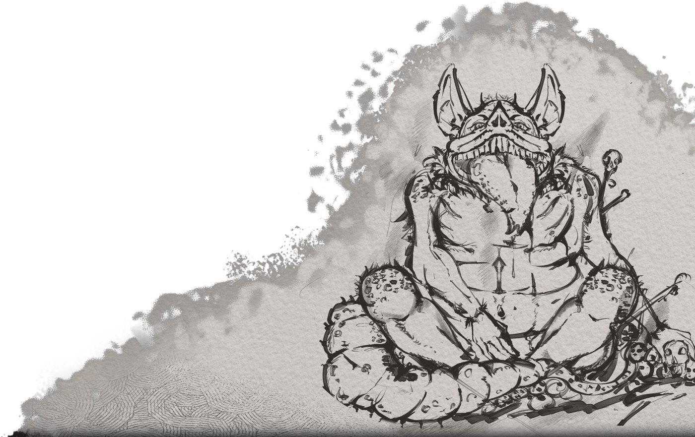
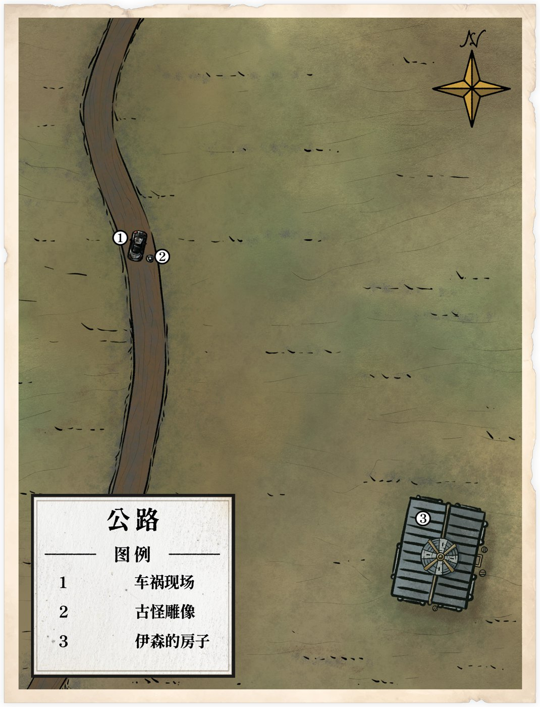
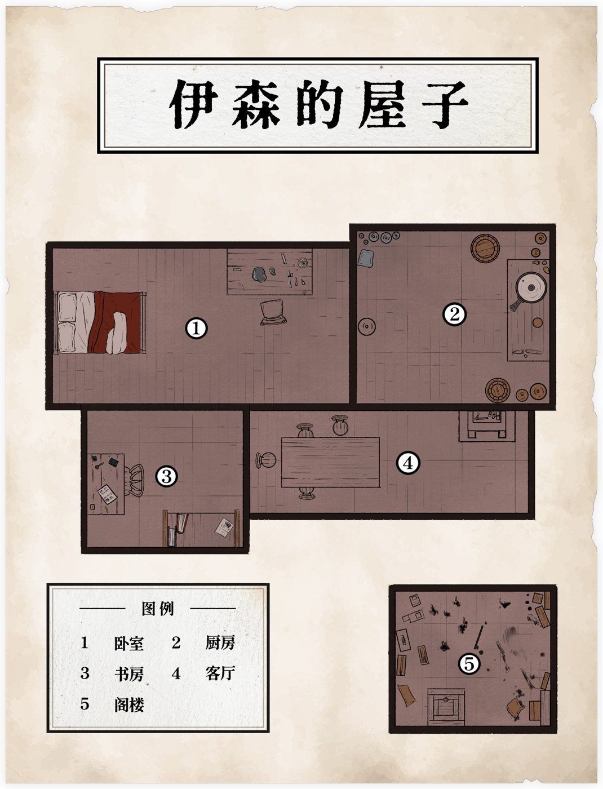
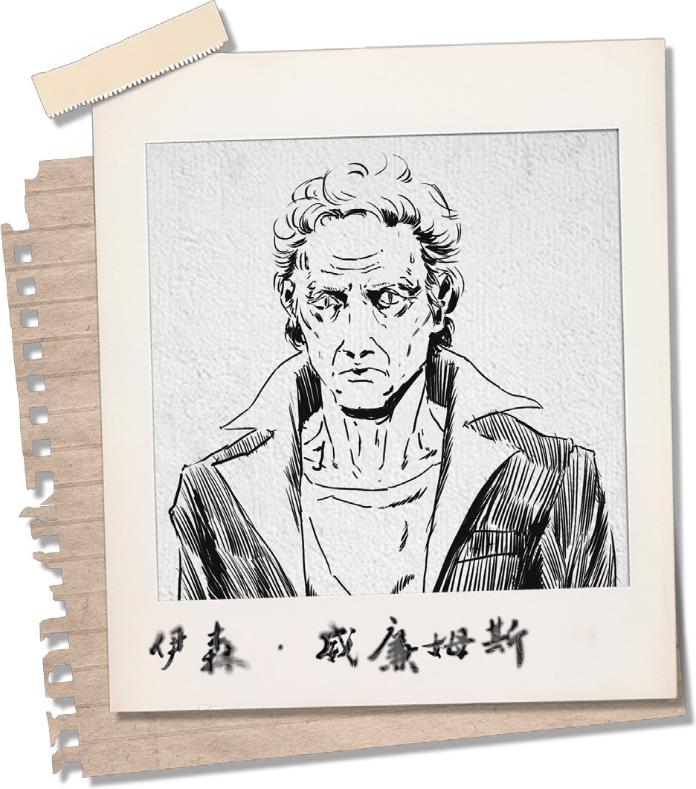
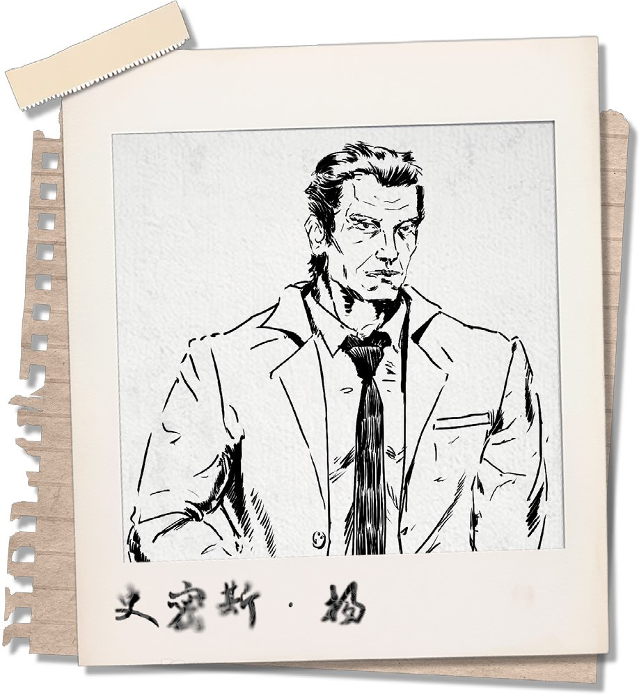

# 擦枪走火

守秘人：qwi　|　调查员：艾迪安·多雷　|　舞台：美国，1981 年 9 月 28 日，暴风雨之夜

**体例**：正文为戏内叙事与对白；`反引号` 为检定记录；`::: 文件` 为戏内出现的文件。

**来源**：QQ 机器人框架导出的 txt（含图片与文件的引用），骰娘「芯傅」的 log 导出作对照。

**模组**：《擦枪走火》，作者 逆光の白羊。文中插图为团中展示过的模组图，取自模组 PDF。

---

## 第一章 · 暴雨　九月二十九日

**qwi**
1981年9月28日，这是一个闷热的夏夜，云层遮挡了月光，漆黑的夜空之中只能看到云层碰撞所发出的闪电。你们此时正驾车行驶在公路上，细密的雨点打在车窗上，汽车上的广播如同这一望无际的公路般无趣，连女主播的声音都提不起劲。

在这枯燥无味的行车过程中，你们开始有些昏昏欲睡，似乎是因为你们开到了郊外的缘故，广播的信号突然变得很差，女主播的声音在信号干扰下，逐渐变得尖锐而刺耳，最终完全听不清在讲什么了。

几乎是与此同时，打在车窗上的雨点开始变大，雷声变得频繁，原本的细雨在短短几分钟内变成了暴雨，随着远方传来的一声炸雷，你们听到了“砰”的一声，似乎是汽车的底盘撞到了什么东西，很快，汽车的发动机便停止了工作，而汽车的车灯、广播也通通失灵，你们立刻意识到你们的车抛锚了。

**艾迪安·多雷**
“怎么回事？”天气情况算不得好，但这样困在路中间，不下车也不行了。披上大衣，拿好车钥匙，下车查看车的受损情况，看看底盘磕到了什么东西。

**qwi**
雨胡乱地拍打在艾迪安的身上。艾迪安发现，车底盘严重受损，而你们缺乏用于更换受损零件的必要材料，根本无法修好这辆车。

艾迪安在汽车后方找到了一个顶部有些磨损的岩石雕塑，从地面留下的车辙痕迹来看，你们的车刚刚正是撞上了这个雕塑，雕塑的顶端与车的底盘发生了激烈的碰撞，导致车底盘严重受损……

`艾迪安·多雷　侦查　10/70　极难成功`

**qwi**
雕塑高约20厘米，呈球形，看上去像是某种体型肥胖的动物。雕塑的做工十分粗糙，似乎是不专业的人士凭感觉手工雕成的。这个雕塑有一种奇特的不协调感，甚至……还让人感受到轻微的恶心。

`艾迪安·多雷　理智检定　93/75　失败　SAN 75→74（1=1）`

**qwi**
暴雨不歇，而雨夜寒冷刺骨。你们的身体难以忍受这股寒冷，需要一处干燥温暖的歇息处。

**艾迪安·多雷**
把雕像收好，回到车上拿上必要物品，环顾四周观察有没有能落脚的避雨处。

**qwi**
艾迪安环顾四周，突然发现车上的同伴安宁，似乎安静地睡着了。

**艾迪安·多雷**
难以置信地看了看他。年轻就是好，这情况还能睡得着。在雨幕中寻找能躲雨取暖的地方。

**qwi**
公路的旁边是一片一望无际的原野，云层在原野的上空互相碰撞着，不断发出沉闷的雷声，闪电如同一条条白蛇一般，在云层中不断穿梭，偶尔从云层中钻出，砸在地面上，一瞬间照亮周围的一切，狂风吹拂，无数绿草在风的压迫下不断涌动着，形成一股又一股如同海浪一般的浪潮。这些浪潮连绵不绝，指向了同一个方向……

艾迪安顺着方向看去，注意到了那屹立在原野上的唯一的一栋小木屋，闪电于木屋的后方落下，在这黑暗的荒野浪潮上留下了巨大的影子。

安宁恬静地睡着了。尽管车子的暖气坏了，但艾迪安及时关上了车门，兴许安宁还能在车里再睡一会。

小木屋是十公里内唯一的一栋建筑。再远远望去，甚至看不清木屋的位置。

**艾迪安·多雷**
“唉……”探险多年，这种突发情况也不是第一次了，但有一个睡着的同伴还真是头一次。把车钥匙留在车上，车门仔细关好，将大衣遮在头上匆忙跑向房子：“您好，请问有人么？”

**qwi**
狂风不歇，骤雨不止，艾迪安决定迎着风雨向那间木屋走去……

……如果他没能看清前往木屋的路，很可能在荒原上浪费时间。

**艾迪安·多雷**
运用多年的探险经验，谨慎地在风雨与荒草间行走，尝试分辨出前往木屋的道路。

`艾迪安·多雷　追踪　20/50　困难成功`

**qwi**
哪怕没有照明，艾迪安准确分辨出了前往木屋的方向。他大步向前，路上似乎隐约察觉了什么……

`艾迪安·多雷　侦查　95/70　失败`

**qwi**
……有东西从草丛中一闪而过，难以捕捉影子——某种危险的目光在黑暗中窥视着艾迪安。

艾迪安终于靠近了木屋，木屋的周围有数个相当眼熟的雕塑。
这栋木屋并没有打开电灯照明，仅有少许昏暗的烛光从玻璃中透出来。破旧的屋子与漆黑的夜幕融为一体，仅当闪电撕破云际之际，才能瞬息间一瞥木屋的轮廓。

艾迪安清晰的记得，这附近的居民都会给自己的屋子通电。

艾迪安顺利的站在了木屋的门前。木门看上去相当老旧，甚至有些划痕，门缝有苔藓。

木门的后面隐约有一个沉重的呼吸声。木屋的玻璃非常脆弱，可屋内实在太昏暗了，几乎什么都看不见。

**艾迪安·多雷**
看到那一排雕像，衣袋里的那只怪物雕像忽然有了存在感。过去探险时，许多地方也有自己的地方民俗，希望这大概只是美国特色吧。

**qwi**
难以想象艾迪安携带一只如此沉重的雕像耗了多少力气。说不定，他在路上就感到吃力，而放下了怀里的雕像……

`艾迪安·多雷　幸运　96/70　大失败`

**qwi**
……艾迪安有着常人难比的坚韧意志。迎着风和雨，他坚持抓着那一只奇特的雕像。木屋比周围高出几个台阶，上完楼梯的艾迪安一时手滑，竟然让雕像径直砸落在木台阶上。台阶顿时被砸坏了，出现一个巨大的圆坑。现在，要想进出木屋，恐怕得有惊人的弹跳力来越过这个坑。

这动静引起了某人的注意，木屋的门被从内打开了

开门的老人约莫70岁，身形消瘦，苍白的额角淌着汗珠，花白的头发，看上去似乎已经很久没有打理过了。

尽管现在正值盛夏时节，老人却仍然穿着一袭黑色的风衣。在用浑浊的双眼打探艾迪安许久之后，老人那毫无血色的脸部肌肉稍微颤动，从嘴唇里蠕动出几个单词。

“我是伊森，你是谁？”

老人的目光直勾勾地盯着艾迪安。

**艾迪安·多雷**
虽然天气湿冷，但还是感觉冷汗直流。“额，您好……我是艾迪安•多雷，法国人，来美国旅游的，我的车在路上撞到了一个雕像，抛锚了。”

目光忍不住飘回地上的巨坑。“那个，对不起砸坏了您的地板，等天气好了我会帮您修好的。”撩起袖子展示自己木工本事，尝试说服老人自己真的能行。“现在，请问我能进去避雨一会儿吗？”

**qwi**
“你撞了什么？！”伊森的脸皱了起来，问完这一句，他忽然沉默了，眼神躲闪，转过头去看了眼屋内，才对艾迪安缓缓说道，“没必要修。进来吧。”

伊森侧开身子，让出了可以进门的位置。

**艾迪安·多雷**
“感谢！”对他露出一个笑容，暗中记下：他刚才对雕像的反应有些不对劲。走到门口打量屋子里的陈设。

**qwi**
伊森关上了门，迟缓地挪动着脚步。屋内没有通电，整个屋子主要是由客厅内的壁炉照明的。

只是炉火的灯光太过昏暗，不足以看清屋内的东西。

“拿去吧。”伊森从房间里拿出了一张毯子，递向艾迪安。

**艾迪安·多雷**
“嗯……请问您介意我开手电筒么？”想起口袋里的小型手电筒，讪笑两声，在黑暗里询问伊森，“你看我这人大手大脚的，再撞到点东西就不好了。”

“谢谢！”一面接过毯子。

**qwi**
伊森皱了下眉头，没有回应。他的影子在灯光下格外瘦长。

随后，伊森又走向了另一个房间。他似乎要在里面待一会儿。

虽然光源不太稳定，但艾迪安还是大概看清了这个木屋的情况。（你现在在④客厅）

**qwi**
客厅的壁炉旁里有一张沙发和一张餐桌，餐桌旁有几把椅子。除此之外，还有通往三个房间的三扇门以及进来的大门。木屋唯一一扇窗户就在客厅。

---

## 第二章 · 肉汤　十月一日

**艾迪安·多雷**
掏出手电筒打开，小心地查看四周，看看有没有什么值得注意的摆件

**qwi**
艾迪安找到了可以铺开毯子的地方，是位于客厅的沙发。沙发对于两个想要躺在一起的成年人来说太过狭窄，但足以让两个人坐下来歇会。与此同时，沙发底下一个黑色的把柄吸引了艾迪安的注意……

**艾迪安·多雷**
这是什么？尽量安静地握住把柄小心抽出，看看是什么东西。

**qwi**
艾迪安在沙发下面找到一把手枪，枪身沾染了血污和灰尘。它只剩一发子弹。

而餐桌上除了油污，什么也没有。附近的墙角有一些不明显的血迹，似乎经历过一场激烈的搏斗，但被刻意打扫过了。

**艾迪安·多雷**
轻手轻脚地走到厨房门边，尝试探听房主在里面有什么动静……如果他不巧打开门，就说自己饿了吧。

**qwi**
从伊森所在的房间里传出了香气。厨房内没有太多厨具和餐具，只有一口巨大的锅，此时这口锅正在炖煮着汤。

**艾迪安·多雷**
“您一定是个大厨。”走进厨房，来到伊森身边，一边留意周围刀具的位置，一边和他搭话。“您这是在做什么汤？和我做的闻起来简直是一个天堂一个地狱。”这句是实话，我做的只能说是生命体征维持剂。

**qwi**
伊森先是拿起了勺子，但又换成了叉子，用蹩脚的手法搅动着锅内的汤。锅内蒸腾的热气扑在他的脸上，他完全没有躲避的意思。

“再等等。”伊森头也不抬地回道。此时已然是深夜，显然早就过了晚餐的点。

闻得出来，锅里是肉汤——被宰杀后的牲畜。艾迪安没有携带雨具，在暴雨中还行走了一段路程，当然，会因疲惫而渴望食物。

**艾迪安·多雷**
好像听见自己的胃发出了一声抱怨。见他没什么聊天的意思，也只能悄悄退出厨房，回到客厅。想到餐桌周围的血迹，还是有点不详的预感……检查外门门锁和窗户，看看是否能正常打开。

**qwi**
一扇简单的木门，不存在门锁这种东西。

尽管木屋的玻璃窗非常脆弱，但仍然挡住了风雨。

那是一扇固定窗，无法被推开。门仍然能运行。

`艾迪安·多雷　灵感　95/80　失败`

**qwi**
艾迪安盯着这扇固定窗思索……只知道这扇窗质量不错，不会漏水。

**艾迪安·多雷**
万一有什么事，以自己宽阔的臂膀，说不定可以像电影特工一样一肘子肘碎玻璃跳出去呢……不过心里又松了口气：好歹不会有什么密室谋杀之类的剧情。

想到伊森还在厨房，轻步走到他的卧室旁边，手扶上门把，看看能不能打开。

**qwi**
这是一间有些漏风的房间，内部只有一张略显破旧的床和一张木桌，看得出来床上曾摆放着一层薄薄的破旧毯子。

艾迪安在桌子上找到了手锤、凿子等工具，以及一个已经打磨完毕的雕像——正是先前遇到的那个。这尊雕像看上去和汽车撞上的雕塑几乎一模一样，似乎是最近才刚刚制作完成的。

桌子上除了这些，还有一盏油灯，在油灯的光照下，艾迪安看不清自己的影子

突然间，艾迪安隐约又瞥到了什么……

`艾迪安·多雷　侦查　49/70　失败`

**qwi**
……艾迪安看见了床底那些碎片——原来是一些硬化的鳞片，鳞片后似乎还有一条东西？

**艾迪安·多雷**
在床边蹲下伸长手，尝试把那东西拽出来。

**qwi**
一条霉灰的软布，也许这软布在很久以前曾经是白色的。这条软布细长，上面布满了霉斑，裹足了灰尘。

**艾迪安·多雷**
实在不想把这东西放进口袋里——要是把整件衣服感染上霉菌就麻烦了。把它踹回床底，回到客厅，尝试打开书房的门。

**qwi**
艾迪安的考虑不无道理。那么手里的那些鳞片呢？

**艾迪安·多雷**
走到门口的脚步停下了。仔细打量手上的鳞片，思考这是哪种动物身上的，鱼类或是爬行类？

`艾迪安·多雷　博物学　66/50　失败`

**qwi**
这不是件难事，但艾迪安花了点时间分辨——这是蛇的鳞片，一种毒蛇的鳞片。根据鳞片的大小来判断，这些鳞片的原主人应该很消瘦。

思考过后，艾迪安才进入书房。

它比起其他的房间要小上不少，内部有一个不算太陈旧的书桌与一排书架，看上去经常使用的样子。桌子上有一盏油灯，艾迪安在书桌上找到一份前几天的报纸，报纸上刊登了亚利桑那博物馆的失窃案。

::: 文件　Arizona Morning News
亚利桑那历史博物馆发生离奇案件！

一具珍贵的木乃伊于昨夜神秘消失。监控显示，凌晨 3 点，木乃伊展室警报骤响，但抵达现场的安保仅见空置的展示柜。警方已介入，初步判断为高技术盗窃。此事件令全球震惊，博物馆承诺加强安保，呼吁公众协助提供线索。案件调查中，敬请关注后续报道！
:::

**qwi**
书架上的书籍大部分关于大麻、罂粟等植物。这是些内容相当**敏感**的书籍。

**艾迪安·多雷**
联想到卧室里的发霉的白布……想什么呢，这又不是印第安纳琼斯。检查一下书桌书架上有哪些属于伊森的个人物件——希望能找到一些他的个人信息。

**qwi**
伊森没有写日记的习惯。艾迪安经过一番搜寻，发现那些书籍内尽是内容工整的笔记。

笔记内容围绕书籍补充。

艾迪安突然闻到一股来自头顶的刺鼻味道……

`艾迪安·多雷　侦查　81/70　失败`

**qwi**
……那味道盘桓在头顶，久久不去。

也许艾迪安能找到什么……

`艾迪安·多雷　幸运　86/70　失败`

**qwi**
……伊森的书房看来收拾得相当干净。艾迪安望着貌似没有缝隙的天花板，似乎得另寻他法

**艾迪安·多雷**
盯着天花板，还是没有头绪，又被气味熏的有些头晕。噢，美国人。他最好没在这书房里捣鼓过什么炼金术。

捂着鼻子把书籍还原回书架上，退回到客厅。看看有没有能用的梯子或者阁楼口。

**qwi**
客厅并没有梯子。以艾迪安的身高而言，或许只差一根木棍便可以碰到天花板。

**艾迪安·多雷**
走进厨房，观察一下伊森煮汤的进度，顺便找找有没有趁手的木棍、木铲、长柄汤勺，什么都行，只要伊森没在用。

**qwi**
伊森还在那里，原地搅着那锅汤，闻起来煮的差不多了。伊森没有管艾迪安的东张西望，手中的叉子在和锅里的肉搏斗。

艾迪安找到了一柄空闲的铁勺，有些短，但踮起脚来就足够碰到书房的天花板了。

**艾迪安·多雷**
把铁勺收进衣兜，不动声色地挪出厨房，尝试回到书房把天花板撬开。

**qwi**
艾迪安在书房的天花板上找到一个隐藏的下拉式楼梯。

楼梯上方貌似会通向一处相当漆黑的地方

**艾迪安·多雷**
将书房门掩好，把楼梯拉下来，打起手电筒，小心地爬上去。

**qwi**
阁楼内一片狼藉，各种玻璃设备和纸张散落了一地，地面上到处都是各种散发着刺鼻味道的化学试剂，而在这些化学试剂的中央，则有着少许已经开始发臭的生物组织，似乎是内脏和少部分肢体。

地上有一张纸张，吸引了艾迪安的注意……

`艾迪安·多雷　教育　97/65　大失败`

**qwi**
……艾迪安努力辨认着纸张上的符号和文字，但看得实在有些头昏脑胀。兴许是阁楼内部空间过于狭窄，他挪动脚步时不小心把几管化学试剂踢下了楼。

玻璃管摔裂在地……

`艾迪安·多雷　幸运　24/70　困难成功`

**qwi**
……伊森在厨房里寻找着碗碟，乒乒乓乓的声音很响。

**艾迪安·多雷**
强忍住不适，忍着气味把纸张捡起收入口袋，最后调查一下周围还有没有值得注意的物品，或能用上的工具。听伊森的声音，他的肉汤估计快要出锅了。如果待会儿他找不到人就麻烦了。

`艾迪安·多雷　医学　57/1　失败`

**qwi**
从腐烂程度上来看生物组织，已经死亡了三天。

**艾迪安·多雷**
盯着生物组织，一时间也看不出所以然，索性把注意力移到周围的器皿和纸张上来，尝试研究它们的作用。这些玻璃仪器的功能一定与处理这些组织有关。

`艾迪安·多雷　博物学　77/50　失败`

**qwi**
通过比对，可以勉强看出纸张上的符号与试剂有所对应。至于生物组织，它的来源似乎不太妙。

**艾迪安·多雷**
想起自己看过的无数美国杀人狂电影。要么这伊森是个疯狂人体实验科学家，要么……想起伊森面对汤锅的反应，那人真的是人类么？该不会真正的伊森已经成了这些东西吧。

但一时间也没办法多调查，只能先爬下楼梯，把楼梯收回去。走到书房门边观察伊森的动静。

**qwi**
“汤好了。”伊森语气沉重地说。

**艾迪安·多雷**
走到餐桌边，在他对面坐下，等待食物，一面说：“这汤闻起来真不错，您用哪些食材做的？”

**qwi**
伊森的额头冒着冷汗，把锅端上了餐桌。他的双手死死地抓在锅的边缘，触碰锅的皮肤可以看见水泡。锅内的热汤蒸气滚滚，直喷他的面门。

“肉。”伊森回应道。

伊森拿出了些瓢盆放到餐桌上。一眼便能看出来你们各自的汤量不过一盆，每人各一碟捞出来的肉。

**艾迪安·多雷**
端起碗闻下汤的味道，轻抿一口，端详里面肉的纹理，尝试分辨这是什么动物的肉。

**qwi**
汤有些咸，表面飘着些油脂。也许是牛肉。

**艾迪安·多雷**
用叉子戳戳弄弄，装作很忙的样子，还是没放进口，喝了些汤。一面和伊森说：“您还做了这么多食物，真是麻烦您了！刚才累的要命，都忘了和您聊聊天。看您年纪应该已经退休了。您以前是做什么工作的？”

**qwi**
“我曾在附近的一座小镇内当语文老师……后来我实在没法理解那些年轻人弄的什么**嬉皮士**……至今已经几十年了，我一个人住在这里，全靠附近城镇的亲戚朋友救助。”伊森流利地答道。

**艾迪安·多雷**
“噢，您是位值得尊敬的老师。”冲他点点头，大拇指指向自己。“我是做地理考察的，不过我更愿意被叫探险家。这次来美国，也是为了来考察这里的山脉地质和人文风俗。”手里继续拿勺子搅动着汤。“说到这个，您这附近最近有没有什么有趣的新闻？”

**qwi**
伊森默不作声的喝着汤。他大概难以回答这个问题。

“我……不懂这些。”老人缓缓摇了摇头。

**艾迪安·多雷**
“哈哈没事，随口问问，我也不怎么看报纸。”他家好像也没看到电视，但刚才那份报纸……干笑两声，一时也不知道说什么。手里有一搭没一搭地搅动着汤，等待他吃完。

**qwi**
他看样子没什么胃口，有一下没一下的咀嚼着。喝这份汤对他来说未尝不是件消遣事。

`艾迪安·多雷　幸运　26/70　困难成功`

**艾迪安·多雷**
状作担忧地询问伊森：“我刚在这等您的时候，注意到这墙角似乎有些血迹。这里发生什么了？您没事吧？”

**qwi**
伊森的神情烦躁起来，“没什么……肉而已，有点血。”

说伊森看了几眼门和窗，才缓缓地说，“等雨停了，你就赶紧走吧。”

**艾迪安·多雷**
“您放心，雨停了我一定不多留。您刚说血和肉，是之前磕碰到了吗？有没有做过医疗处理？需要我帮您再看一下吗？”急切地把一连串问题抛给他，试图绕晕他的头脑。“话又说回来，您是语文老师，但是不是对医药也挺有了解的？我刚路过您的书房外边，看到里面书架上好像全是化学和医药的书。”

**qwi**
“不用你做这些。医药的事我一概不知。”伊森的语气尖锐了点，“你……你是不是上阁楼了？”

这是个上了年纪的老人，眼珠浑浊，但艾迪安能感受到伊森刺骨的视线。

**艾迪安·多雷**
“什么阁楼？”装作愣了一下，转移话题，作出一副真诚的模样。“不好意思，我只是想万一您受伤了，我能帮您处理一下，刚才问您那些问题也是想多聊聊天。”有些愧赧地挠挠头。“我绝对没有冒犯您隐私的意思……只是您这么好心收留我，我就忍不住想多聊几句。”希望这些足够把他绕晕了。

**qwi**
伊森的眼皮动也没动，沉默地注视艾迪安

**qwi**
他没有接艾迪安的话，也没有继续喝汤。

就在这时……

远方的天边响起滚滚惊雷，刺眼的车灯如同闪电一般，透过窗户从房间的一端照到了另一端，将整个屋子照得宛若白昼。随着一声刺耳的刹车声，一辆小轿车似乎停在了屋子的门口。

---

## 第三章 · 来客　十月二日

**qwi**
伊森被这刺眼的光吓到般站了起身。他立即伸手挡住面前的光。

**艾迪安·多雷**
“好像又有人来了。”天赐良机，不过伊森怎么反应这么大？“是您的客人吗？”打量伊森。

`艾迪安·多雷　侦查　64/70　成功`

**qwi**
透过窗子，艾迪安看见屋子外有个一闪而过的人影，伊森同样也看见了。光消失后，伊森才小声地回答，“我不确定，也许是客人吧。”

没给你们反应的时间，你们清楚地听见了门外的敲门声。

“你们好，我本来要去前面的镇上，但我的车没油了，可以在这里借住一晚吗？”门外的声音说。

**艾迪安·多雷**
“来了！”转头问伊森：“那我去开门了？”一面起身走到门边去开门。不能再和伊森独处了，他看起来不太对劲。

**qwi**
见艾迪安抢先自己一步要去开门，伊森稍显疑虑地站在餐桌旁，对艾迪安点了点头。

艾迪安主动拉开了木屋的门。

门外是一名高大壮硕的中年白人男子。他的眼神锐利，肌肉紧紧地撑着衣服，仿佛随时都会爆开来。

**qwi**
“你们好。”他显然看见了你们，“我是史密斯。”说话的时候他几乎没有表情，眼神如同猎鹰般锐利。听得出来，他的声音沉稳有力。

艾迪安还能看见台阶上那个圆形的坑，想必此人一定花了一番功夫跳到木屋门前。

**艾迪安·多雷**
想到门口的坑有些心虚。“您好，我是艾迪安·多雷。”向他伸出手，“我是法国来的，车抛锚了，也在这歇脚，里面坐着的是房主伊森。”

**qwi**
“进来吧。”伊森错开了史密斯的视线，有些紧张地说。

“史密斯·杨。”史密斯步伐有力的走了进来，略过伊森，向艾迪安伸出一只手。

他自我介绍完，自顾自地点了点头。

伊森扭头便进了那个漏风的房间，不久，伊森又走了出来，手上空空的看向艾迪安——伊森把毛毯给了艾迪安。

**艾迪安·多雷**
好问题……刚才的紧张气氛好像被来客打断了，一时间也想不起自己把毛毯放哪了。从不知道哪里翻出毛毯递给史密斯。

**qwi**
“我不用，先生。”史密斯摆了摆手。他身上的衣服很干燥。

“老先生，我忘了问您贵姓。”杨和艾迪安握完便抽出了手，转头看向伊森。

“伊森·威廉姆斯。”伊森的回答像是练习了很多遍。

杨似乎完全没注意到餐桌上的肉汤，径直走向沙发，自己坐了上去。对此，伊森的呼吸更沉重了些。

伊森短暂的思索了下，对艾迪安问道:“你……还需要毛毯吗？”

**艾迪安·多雷**
“噢，不用了，谢谢您。”一时搞不清伊森的态度。“我也吃好了，需要我帮您洗碗么？时间不早了，您可以先去休息。”

**qwi**
“不需要那些碗了。”他的语气冷淡。伊森的目光在杨和艾迪安之间游移片刻，最后才接过了毯子，走向漏风的房间。

伊森把房门半掩着，貌似要在里面待一会

杨背靠在沙发上，看上去闭起了眼睛，没有盖毯子。

**艾迪安·多雷**
转向杨，语气轻松地说，“那么，您上这来是做什么的？”声音放低。“不得不说，您帮大忙了。”

**qwi**
“我并没有做什么，你为什么这么说呢？”杨仍然闭着眼睛，回道。

**艾迪安·多雷**
“要我说，您进这就和进自己家一样。普通人随便走进别人家歇脚，怎么也会和主人寒暄一会儿，或者有些手忙脚乱吧。”哂笑两声，“而且，您大衣上一点雨都没有。如果是我车没油了，怎么说也得下车折腾一段时间。”指向自己的大衣。“您看，还没干呢。”

“如果您问的是后面那句话的话……”压低声音，“我觉得，这位房主有点不太对劲。”

**qwi**
杨睁开了眼，似笑非笑地转头看向艾迪安的方向，声音压低了点，“你说的很不错。不过，你为什么这么说呢？”

接连被两次质询，艾迪安或许有所察觉……

`艾迪安·多雷　灵感　75/80　成功`

**qwi**
……艾迪安看见了，杨腰间那把手枪。

“那位老人家好心收留你。你这样说，是出于什么考虑呢？”杨轻轻地说，余光似乎一直在注意那扇半掩的房门。

**艾迪安·多雷**
走到桌边，拿起碗具做出收拾的模样，故意发出一些碰撞声，借着遮掩回复他：“那可多了。第一，我所站着的地方，之前一定发生过搏斗。”指向墙角的血迹，“这看起来可不妙。”

“第二，您现在坐着的沙发底下，我找到了一把手枪，只剩下一颗子弹。”

**qwi**
艾迪安能感受到，对话过程中，杨的审视没有消失过。

“这样一位独居的老人，带有一把……也未尝不可。”杨话是这么说，但艾迪安能从杨的脸上看出一点轻蔑的意味。杨大概很讨厌**让老人得到枪的途径**。

**艾迪安·多雷**
“我是个野外探险的人，您得理解，这些征兆在我看来，就像熊离开后的泥地一样，职业警觉。”朝他摊手，“如果这还不够的话……第三，”目光移向书房，“那边阁楼里摆着的东西可不太妙，看起来像什么生化实验。然而，这位伊森告诉我，他是一个语文老师。您不觉得奇怪么？”

**qwi**
杨一时没有回答，视线的中心放到了艾迪安的双手，才继续说:“我的确看到了血迹。关于**生化实验**……先生，你能证明吗？”

**艾迪安·多雷**
“我已经指给了您方向，证据嘛……在我拿出证据前，我想，您也得告诉我点东西才公平。”看他一直盯着自己的手，给他比了个大拇指……“您是做什么职业的？拜托，别和那位老先生一样告诉我您是个语文老师。”

**qwi**
杨极快地伸手挡了下自己的脸，放下手时又恢复了面无表情的状态，“我平时……会把人从这里送到那里。”说话的时候，杨的头小幅度摆动着，模拟车子的行驶方向。

**艾迪安·多雷**
“额……行吧。”发挥了一会儿想象力。从大衣口袋里掏出那张阁楼捡到的纸，打着手电筒举在他面前示意他阅读。“我捡到了这个。如果你还想要生化实验的证据，自己上书房的阁楼去看吧。”

**qwi**
杨默不作声地看着纸，没有伸手去接。没一会儿，艾迪安听到杨喃喃道:“……就是他。”

杨看待艾迪安的目光柔和下来，“你找到了有力的证据。干得好，多雷先生。”

**艾迪安·多雷**
“过奖了。”挠挠头，莫名想起了被爸妈夸奖的感觉。“那么，奖励时间……现在可以告诉我了吧，您到底来做什么的？”

**qwi**
“我尽力赶到了这里，在**他们**之前。”杨说起**他们**时，脸上的轻蔑再次出现了。

外面的雷声和雨声交加，可以看见劈落在原野上的闪电。

伊森大概是花时间收拾了下房间，脚步虚浮地走了出来。

**艾迪安·多雷**
见伊森出来，赶紧发出一连串健康爽朗的笑声。“噢先生，不知道您还遇到过这么好笑的事。如果是我遇到那些鹅，也得被吓惨了的！”装作在聊一些琐碎的笑话。

朝杨挤挤眼。快点配合一下啊。

**qwi**
杨矜持了下，而后干笑了几声

“我看这附近只有老先生，您一个人住，您平时吃点什么应该很不容易吧？”笑完，杨扭头看向伊森。

“还好……我曾在附近的一座小镇内当语文老师……后来我实在没法理解那些年轻人弄的什么**嬉皮士**……至今已经几十年了，我一个人住在这里，全靠附近城镇的亲戚朋友救助。”伊森答。

杨对老人的回答不予置否，毫不觉得自己的语调有什么不对，只是继续说，“威廉姆斯先生，那到底是哪座小镇呢？”

尽管说话的时候，杨的脸上依旧没有什么表情，但他那如刀锋一样的眼神和魁梧的身材，却像一尊巨人一样，给人极高的压迫感。

“我老了，记不住事。早就忘掉了。”伊森的态度强硬起来，只是语气虚弱。

“我向您直说吧。旁边这位——是您的同伴吗？”杨坐在沙发上，看向艾迪安。

`艾迪安·多雷　侦查　95/70　失败`

**qwi**
在杨看来，艾迪安毋庸置疑只是个毛头小子。杨问出这句话时，他的上身微微前倾，双腿处于适合发力的地方。

“不是。”伊森果断地答道

杨没管艾迪安的存在，继续对一旁的伊森说，“伊森·威廉姆斯，我只给你一次选择的机会。我会护送你，你愿不愿意跟我回去？”

**艾迪安·多雷**
“等等，等等，都冷静。”站到他们两个中间，感觉自己头上冒出一个巨大的问号。“首先，不，我不是谁的同伴。我真的就是个可怜的法国人。你要看我的护照吗？”

然后看向伊森。“然后呃，您也冷静，我确定这里面有些误会。”最后转回面对杨，“您这话说得像最后通牒似的，能不能先都坐下来，讲清楚前因后果？虽然确实他有点奇怪，但这位老先生到目前为止对我挺好的，能不能都放松一下，坐下来讲？”

**qwi**
杨冷哼了声。伊森叹了口气，说:“这事与你无关。”

**艾迪安·多雷**
上帝。怎么感觉自己站在一个巨大的火药桶里。这地方处处诡异，杨这样强硬没有一点好处。朝杨使个眼色，希望他能明白自己的意思。关于那些鳞片、报道和生物组织的事还没和他说呢

**qwi**
杨不解地看着艾迪安。当着伊森的面，杨没有轻易开口。

“我愿意和你回去。”伊森深深地吸了口气，“他们的事，我会交代清楚的。”

**艾迪安·多雷**
被面前的发展搞得有些不知所措，但这姑且是达成了一致？看向杨。“所以你们两个认识，而且看起来也达成了一致。现在您是想要我回避，还是告诉我到底是什么情况……?”

**qwi**
“也许认识吧，我们……聊过电话。”伊森神情紧张地看着门窗，说，“希望赶得上。”

风雨呼啸着，将屋内外划分为两个世界。屋内的空气凝滞了。屋外，又一辆车正疾速接近木屋……

`艾迪安·多雷　幸运　52/70　成功`

**qwi**
……猛烈的暴雨阻碍了它——这似乎为艾迪安争取了点时间，可以继续在伊森和杨之间周旋。

“你这话是什么意思，希望**他们**来接你吗？”杨皱起眉，沉声道。

**艾迪安·多雷**
“我相信他既然答应你了，应该不是这个意思。不过，我好像听到了什么不太妙的声音。”有点力竭的感觉，朝他们两人说，“我不知道你们要做什么，但好像又有人来了，这次是不是你们的同伴？不是的话，我建议我们找个地方躲一下。”

**qwi**
“我们走吧。”伊森有些焦急地说，“晚了就走不了。”

**艾迪安·多雷**
给杨添柴加火：“这次总不是又抛锚的人了。这轮胎听起来老带劲了。”

**qwi**
“多雷先生，你愿意和我也走一趟吗？”杨把手按在腰间，神情严肃地问。

**艾迪安·多雷**
“走，当然走！”朝他比个大拇指。“不走留着给他们当房东吗？快带上我。我车还坏了呢。”想起车上的安宁。他自求多福吧……

**qwi**
杨让艾迪安走在最后面，而伊森跟在自己后面。

你们没有太多犹豫，跟着杨在路边找到了一辆古董车。

杨熟练地拉开车门，请伊森坐在后面。然后才拉开了副驾驶门，让艾迪安上车。

现在，杨转动了车钥匙。打火费了点力气，杨坐在驾驶位上，姿态放松地对艾迪安说:“史密斯·杨，很高兴能带您一程。”

杨轻松地找出了一本证件，递给艾迪安

**艾迪安·多雷**
朝他比了个敬礼的手势。“很高兴做您的乘客咯。”接过证件，看看这位先生到底什么来头。

**qwi**
证件上记着:史密斯·杨，联邦调查局探员，男，38岁。

**艾迪安·多雷**
“哇哦，FBI，”扬眉道，“探员先生，您应该不用我跟去做什么笔录吧？”

**qwi**
“哈哈，我说话可不算数。”杨意味深长地瞥了眼后视镜，“不过，多雷先生最近得和我们待一阵子了。”

杨顺利地启动了车，终点明确而清晰。这一夜过后，你们会迎来什么呢？
